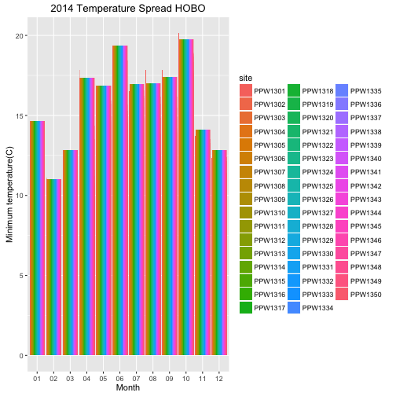

Microrefugia-To Be or Not to Be
========================================================
author: Aji John
date: 26th April 2016
autosize: true

Microrefugia
========================================================
 
For more details on authoring R presentations please visit <https://support.rstudio.com/hc/en-us/articles/200486468>.

- Bullet 1
- Bullet 2
- Bullet 3
Slide With Code
========================================================

Site Description
========================================================

<!--html_preserve-->

<!--/html_preserve--><!--html_preserve-->

<!--/html_preserve--><!--html_preserve-->

<!--/html_preserve--><!--html_preserve-->

<!--/html_preserve--><!--html_preserve-->

<!--/html_preserve--><!--html_preserve-->

<!--/html_preserve--><!--html_preserve-->

<script type="application/json" data-for="htmlwidget-8597">{"x":{"calls":[{"method":"addTiles","args":["http://{s}.tile.openstreetmap.org/{z}/{x}/{y}.png",null,null,{"minZoom":0,"maxZoom":18,"maxNativeZoom":null,"tileSize":256,"subdomains":"abc","errorTileUrl":"","tms":false,"continuousWorld":false,"noWrap":false,"zoomOffset":0,"zoomReverse":false,"opacity":1,"zIndex":null,"unloadInvisibleTiles":null,"updateWhenIdle":null,"detectRetina":false,"reuseTiles":false,"attribution":"&copy; <a href=\"http://openstreetmap.org\">OpenStreetMap\u003c/a> contributors, <a href=\"http://creativecommons.org/licenses/by-sa/2.0/\">CC-BY-SA\u003c/a>"}]},{"method":"addMarkers","args":[38.579208,-122.700962,null,null,null,{"clickable":true,"draggable":false,"keyboard":true,"title":"","alt":"","zIndexOffset":0,"opacity":1,"riseOnHover":false,"riseOffset":250},"Pepperwood Center",null,null]},{"method":"addGeoJSON","args":[{"type":"FeatureCollection","crs":{"type":"name","properties":{"name":"urn:ogc:def:crs:OGC:1.3:CRS84"}},"features":[{"type":"Feature","properties":{"Name":"GAR","Description":"<html xmlns:fo=\"http://www.w3.org/1999/XSL/Format\" xmlns:msxsl=\"urn:schemas-microsoft-com:xslt\"> <head> <META http-equiv=\"Content-Type\" content=\"text/html\"> <meta http-equiv=\"content-type\" content=\"text/html; charset=UTF-8\"> \u003c/head> <body style=\"margin:0px 0px 0px 0px;overflow:auto;background:#FFFFFF;\"> <table style=\"font-family:Arial,Verdana,Times;font-size:12px;text-align:left;width:100%;border-collapse:collapse;padding:3px 3px 3px 3px\"> <tr style=\"text-align:center;font-weight:bold;background:#9CBCE2\"> <td>Garrison Canyon\u003c/td> \u003c/tr> <tr> <td> <table style=\"font-family:Arial,Verdana,Times;font-size:12px;text-align:left;width:100%;border-spacing:0px; padding:3px 3px 3px 3px\"> <tr> <td>FID\u003c/td> <td>0\u003c/td> \u003c/tr> <tr bgcolor=\"#D4E4F3\"> <td>Id\u003c/td> <td>0\u003c/td> \u003c/tr> <tr> <td>Reg_Name\u003c/td> <td>Garrison Canyon\u003c/td> \u003c/tr> <tr bgcolor=\"#D4E4F3\"> <td>Reg_code\u003c/td> <td>GAR\u003c/td> \u003c/tr> <tr> <td>Descriptio\u003c/td> <td>\u003c/td> \u003c/tr> \u003c/table> \u003c/td> \u003c/tr> \u003c/table> \u003c/body> \u003c/html>"},"geometry":{"type":"MultiPolygon","coordinates":[[[[-122.728803293821,38.5690456950589,0],[-122.724813326537,38.5689301749346,0],[-122.724811993483,38.5689301334616,0],[-122.724755775594,38.5689283844377,0],[-122.724735862629,38.5689284284317,0],[-122.72474220124,38.5689338492016,0],[-122.724689419769,38.5689339348524,0],[-122.72697863102,38.5708678095278,0],[-122.729016141455,38.572645393669,0],[-122.729224872598,38.5759934420463,0],[-122.72903781925,38.5726643053538,0],[-122.731646840973,38.5726945509789,0],[-122.737776161221,38.572765377525,0],[-122.737529223024,38.5653842018992,0],[-122.737529012773,38.5653779167337,0],[-122.736735742831,38.5653703226929,0],[-122.735566180718,38.5653591165673,0],[-122.735069429977,38.5653506586054,0],[-122.731766783015,38.5653325357915,0],[-122.728665737318,38.5653154337827,0],[-122.728665780118,38.5653251008522,0],[-122.728803293821,38.5690456950589,0]]]]}},{"type":"Feature","properties":{"Name":"RGC","Description":"<html xmlns:fo=\"http://www.w3.org/1999/XSL/Format\" xmlns:msxsl=\"urn:schemas-microsoft-com:xslt\"> <head> <META http-equiv=\"Content-Type\" content=\"text/html\"> <meta http-equiv=\"content-type\" content=\"text/html; charset=UTF-8\"> \u003c/head> <body style=\"margin:0px 0px 0px 0px;overflow:auto;background:#FFFFFF;\"> <table style=\"font-family:Arial,Verdana,Times;font-size:12px;text-align:left;width:100%;border-collapse:collapse;padding:3px 3px 3px 3px\"> <tr style=\"text-align:center;font-weight:bold;background:#9CBCE2\"> <td>Rogers Canyon\u003c/td> \u003c/tr> <tr> <td> <table style=\"font-family:Arial,Verdana,Times;font-size:12px;text-align:left;width:100%;border-spacing:0px; padding:3px 3px 3px 3px\"> <tr> <td>FID\u003c/td> <td>1\u003c/td> \u003c/tr> <tr bgcolor=\"#D4E4F3\"> <td>Id\u003c/td> <td>0\u003c/td> \u003c/tr> <tr> <td>Reg_Name\u003c/td> <td>Rogers Canyon\u003c/td> \u003c/tr> <tr bgcolor=\"#D4E4F3\"> <td>Reg_code\u003c/td> <td>RGC\u003c/td> \u003c/tr> <tr> <td>Descriptio\u003c/td> <td>\u003c/td> \u003c/tr> \u003c/table> \u003c/td> \u003c/tr> \u003c/table> \u003c/body> \u003c/html>"},"geometry":{"type":"MultiPolygon","coordinates":[[[[-122.708886114969,38.5756530423657,0],[-122.708824294508,38.5757157725461,0],[-122.70879327704,38.5757464133677,0],[-122.708899767032,38.5757707948759,0],[-122.709989380467,38.576020261897,0],[-122.710000850123,38.5760228878118,0],[-122.710007904153,38.5760245027928,0],[-122.710009911613,38.5760249623893,0],[-122.710708316935,38.5761848559217,0],[-122.711202689862,38.5763475791497,0],[-122.711331086325,38.5763898404821,0],[-122.711353813312,38.5763973209859,0],[-122.711354016666,38.576397387919,0],[-122.711381399889,38.5764064009975,0],[-122.711399877362,38.5764124827792,0],[-122.711408986473,38.5764154810027,0],[-122.711434272897,38.5764238039126,0],[-122.711491746266,38.5764427209793,0],[-122.711514529188,38.5764502198513,0],[-122.711519332878,38.5764518009584,0],[-122.711713812028,38.5765158124355,0],[-122.711985664851,38.5766052901942,0],[-122.712102767741,38.5766438332281,0],[-122.71245955243,38.5769292445294,0],[-122.714481125303,38.578546346377,0],[-122.714802103026,38.5788030938233,0],[-122.714833776817,38.578828081407,0],[-122.714933617209,38.5788543977836,0],[-122.71493462409,38.5788546618535,0],[-122.715613623175,38.5790336046494,0],[-122.716772634961,38.5793390426213,0],[-122.717426843595,38.5795114420449,0],[-122.717676095827,38.5795771247157,0],[-122.717739669028,38.5795735688672,0],[-122.717898782998,38.5795646689711,0],[-122.717956153896,38.5795614599281,0],[-122.718739704301,38.5795053904264,0],[-122.719348134204,38.5794730087874,0],[-122.719356538807,38.5760952510214,0],[-122.724661776344,38.5762001227896,0],[-122.726337241769,38.5761971430912,0],[-122.72923771628,38.5762220204732,0],[-122.72923420539,38.5761595374565,0],[-122.729234516098,38.5761595394864,0],[-122.729227911792,38.5760421885209,0],[-122.729224872598,38.5759934420463,0],[-122.729016141455,38.572645393669,0],[-122.72697863102,38.5708678095278,0],[-122.724689419769,38.5689339348524,0],[-122.724558187333,38.5689341477058,0],[-122.724492180732,38.5689342547101,0],[-122.724536929196,38.5689785433102,0],[-122.724405104846,38.5692168267344,0],[-122.724314228288,38.5693267382702,0],[-122.724209253105,38.5694311188991,0],[-122.72392954779,38.5696893704404,0],[-122.723873578594,38.5697662903832,0],[-122.723754708095,38.5699915792352,0],[-122.723698757411,38.5701234726248,0],[-122.723670888999,38.5702663373896,0],[-122.723586968336,38.5704476402959,0],[-122.72341234612,38.5709915521292,0],[-122.723412343745,38.5710520229543,0],[-122.723384364395,38.5710739457002,0],[-122.723370387519,38.5711563726268,0],[-122.723188560485,38.571453066476,0],[-122.72311913279,38.5715551723925,0],[-122.722971864129,38.5717717563476,0],[-122.722720037619,38.5720905421507,0],[-122.722307380774,38.572557551476,0],[-122.722132533784,38.5727389061183,0],[-122.72198565761,38.5728708513471,0],[-122.721901660884,38.5729806872498,0],[-122.721789836392,38.5731620120336,0],[-122.721747854995,38.5732719484741,0],[-122.721517056397,38.5736125910791,0],[-122.721475120811,38.5736510620351,0],[-122.72133518501,38.5737389541793,0],[-122.721146318397,38.5738928770364,0],[-122.720936434362,38.5740192623503,0],[-122.72092245857,38.5740412181399,0],[-122.72085248982,38.5740852089546,0],[-122.720663566007,38.5742830195087,0],[-122.720607725465,38.5743545308792,0],[-122.720390764197,38.5744699034768,0],[-122.720292753742,38.5744919271694,0],[-122.72015985222,38.5745413534186,0],[-122.719963894978,38.5745689084552,0],[-122.719872980837,38.5745963561308,0],[-122.719719005631,38.5746624033077,0],[-122.719664277679,38.5746736256883,0],[-122.71967008012,38.574709809169,0],[-122.719619015963,38.5746829069236,0],[-122.71961374714,38.5746801311351,0],[-122.719579799013,38.5746559982817,0],[-122.719540973988,38.5746283985342,0],[-122.719519925563,38.5746134357168,0],[-122.719388415678,38.5745614196299,0],[-122.719144154456,38.5744722035773,0],[-122.718918507859,38.5744347308045,0],[-122.718720825523,38.5744637936389,0],[-122.718429063251,38.5744926289656,0],[-122.718184341807,38.5745215768296,0],[-122.718080623333,38.5745804087804,0],[-122.717816794722,38.5746831640168,0],[-122.717619025683,38.574734381658,0],[-122.717327146129,38.5747927552553,0],[-122.717157657744,38.5748292697558,0],[-122.71696932347,38.5748731237687,0],[-122.716837612028,38.5748728025143,0],[-122.716677531009,38.5749093399768,0],[-122.716526886661,38.5749385138469,0],[-122.71618822673,38.5749303015669,0],[-122.715915744889,38.5748410094566,0],[-122.715746429161,38.5748332094765,0],[-122.715568027166,38.5747441476888,0],[-122.715380421834,38.5746033641673,0],[-122.71521131198,38.5745438657317,0],[-122.715023270207,38.5745138631664,0],[-122.714929482303,38.5744397779277,0],[-122.714854569581,38.5743509688445,0],[-122.714741879011,38.5742989933832,0],[-122.714628925646,38.5743134869105,0],[-122.714422097379,38.5742760513496,0],[-122.714074120943,38.5742456533469,0],[-122.71382022533,38.5742154861663,0],[-122.713641739302,38.5741485772121,0],[-122.713576265483,38.5740524050736,0],[-122.71346369365,38.5739708873662,0],[-122.713285089995,38.5739335188844,0],[-122.713115836596,38.573910944601,0],[-122.712965752425,38.5737997922618,0],[-122.712758955918,38.5737549685135,0],[-122.712720912414,38.5738582706231,0],[-122.712715339035,38.5739249275271,0],[-122.712670711386,38.5739546160508,0],[-122.712667177003,38.5740543384984,0],[-122.712578764128,38.5741164098883,0],[-122.712352827633,38.5741527779123,0],[-122.712145971562,38.5741227235885,0],[-122.711995592442,38.5740854234476,0],[-122.711638536212,38.5739737554758,0],[-122.711337601959,38.5739434661206,0],[-122.711036342531,38.5739944155783,0],[-122.710857445214,38.5740308977314,0],[-122.710640619575,38.5741411391146,0],[-122.710414621602,38.5741922747963,0],[-122.710235871822,38.5741918288327,0],[-122.710224180462,38.5741801613725,0],[-122.70999165298,38.5740952084719,0],[-122.709690897275,38.5740206024706,0],[-122.709540639758,38.5739537572742,0],[-122.70948472797,38.5738206799492,0],[-122.709438283521,38.5736728545424,0],[-122.709288175777,38.5735690827599,0],[-122.709236781791,38.5735596366886,0],[-122.709138840101,38.5735651176999,0],[-122.708968808012,38.573649019372,0],[-122.708967981842,38.5736495204823,0],[-122.70888337075,38.5736345375907,0],[-122.70888033988,38.5736325420159,0],[-122.708845394111,38.5736095325366,0],[-122.708703677368,38.5735774468996,0],[-122.708574120134,38.5736070077279,0],[-122.708554186362,38.5736115559723,0],[-122.708528844535,38.5735954128553,0],[-122.708506478971,38.5735746232198,0],[-122.708554096848,38.5736337117278,0],[-122.708600748295,38.5737298398162,0],[-122.708666124541,38.5738481713691,0],[-122.708703249313,38.5739738170049,0],[-122.708711671684,38.5742175582134,0],[-122.708711105043,38.5743578806875,0],[-122.708644413451,38.5745645056088,0],[-122.708578020993,38.5746972770807,0],[-122.708652538532,38.5748821002038,0],[-122.708727354672,38.5749930698723,0],[-122.708726727255,38.5751481628253,0],[-122.708857813115,38.5753035861617,0],[-122.708979700253,38.5754072874082,0],[-122.708998039251,38.5755255008875,0],[-122.708886114969,38.5756530423657,0]]]]}},{"type":"Feature","properties":{"Name":"TEL","Description":"<html xmlns:fo=\"http://www.w3.org/1999/XSL/Format\" xmlns:msxsl=\"urn:schemas-microsoft-com:xslt\"> <head> <META http-equiv=\"Content-Type\" content=\"text/html\"> <meta http-equiv=\"content-type\" content=\"text/html; charset=UTF-8\"> \u003c/head> <body style=\"margin:0px 0px 0px 0px;overflow:auto;background:#FFFFFF;\"> <table style=\"font-family:Arial,Verdana,Times;font-size:12px;text-align:left;width:100%;border-collapse:collapse;padding:3px 3px 3px 3px\"> <tr style=\"text-align:center;font-weight:bold;background:#9CBCE2\"> <td>Telegraph Hill\u003c/td> \u003c/tr> <tr> <td> <table style=\"font-family:Arial,Verdana,Times;font-size:12px;text-align:left;width:100%;border-spacing:0px; padding:3px 3px 3px 3px\"> <tr> <td>FID\u003c/td> <td>2\u003c/td> \u003c/tr> <tr bgcolor=\"#D4E4F3\"> <td>Id\u003c/td> <td>0\u003c/td> \u003c/tr> <tr> <td>Reg_Name\u003c/td> <td>Telegraph Hill\u003c/td> \u003c/tr> <tr bgcolor=\"#D4E4F3\"> <td>Reg_code\u003c/td> <td>TEL\u003c/td> \u003c/tr> <tr> <td>Descriptio\u003c/td> <td>\u003c/td> \u003c/tr> \u003c/table> \u003c/td> \u003c/tr> \u003c/table> \u003c/body> \u003c/html>"},"geometry":{"type":"MultiPolygon","coordinates":[[[[-122.705432364096,38.5688196488615,0],[-122.705432372056,38.5688004632179,0],[-122.705432171133,38.5687939088457,0],[-122.697853059814,38.5687255267082,0],[-122.697852903576,38.5687260503686,0],[-122.697847264714,38.5687449500786,0],[-122.698037459875,38.5695560210555,0],[-122.697582989666,38.5702134441309,0],[-122.69758277759,38.5702640371711,0],[-122.697578530009,38.5712773188138,0],[-122.697961264716,38.5723421930324,0],[-122.698666042711,38.5735598789871,0],[-122.699051764413,38.5739154998919,0],[-122.699245365961,38.57391599749,0],[-122.699319702854,38.5744573376881,0],[-122.699326879415,38.5744584836611,0],[-122.699417444973,38.5744705724329,0],[-122.699482905714,38.5744667887568,0],[-122.699553449744,38.57445116102,0],[-122.699618959836,38.5744355203225,0],[-122.699719627281,38.5744397312707,0],[-122.699805108486,38.5744636628702,0],[-122.699845135386,38.574523048173,0],[-122.699874979414,38.5746100714502,0],[-122.699869665948,38.5746772448946,0],[-122.699864433547,38.5747246570605,0],[-122.699919481379,38.5748038414338,0],[-122.699959475685,38.5748711301234,0],[-122.699979283828,38.5749502241314,0],[-122.700009209225,38.575017486994,0],[-122.700054237686,38.5750847885509,0],[-122.70011440211,38.5751442253569,0],[-122.700184601708,38.575211591348,0],[-122.700274987717,38.5752671528187,0],[-122.700345188728,38.5753345196173,0],[-122.700400367725,38.5753820864413,0],[-122.700495674371,38.5754653253299,0],[-122.70058094378,38.5755406340523,0],[-122.700666345719,38.5755843263007,0],[-122.700777001991,38.5756083215653,0],[-122.700862468539,38.5756362059111,0],[-122.70101844958,38.5756563650153,0],[-122.701109000557,38.575672404197,0],[-122.701149242064,38.5756804113598,0],[-122.701150137806,38.5756362846554,0],[-122.701125682965,38.5755780588585,0],[-122.70110128727,38.5755052923674,0],[-122.701076852601,38.5754422190632,0],[-122.701064806021,38.5753694840991,0],[-122.701065026975,38.5753161688508,0],[-122.701077656045,38.5752483435488,0],[-122.701102592761,38.5751902438673,0],[-122.701127630998,38.5751079094044,0],[-122.701158781692,38.5750401322826,0],[-122.701183818665,38.5749577978022,0],[-122.701208896878,38.5748657701271,0],[-122.70122777992,38.5747785732791,0],[-122.701246662915,38.5746913764265,0],[-122.701265586011,38.5745944854768,0],[-122.701265987469,38.5744975472541,0],[-122.701266429069,38.574390915838,0],[-122.701273024439,38.5742891467723,0],[-122.701291968608,38.574187409218,0],[-122.701323178955,38.5741050904488,0],[-122.701397546932,38.574037423518,0],[-122.701471894716,38.5739746022337,0],[-122.701558549884,38.5739215073786,0],[-122.701639031119,38.5738683958206,0],[-122.701750342323,38.5738250569615,0],[-122.701861573265,38.5738011052833,0],[-122.701960375279,38.5737965102463,0],[-122.702071405925,38.5738210279397,0],[-122.702176141628,38.5738746102983,0],[-122.702287052445,38.57392820917,0],[-122.702397982279,38.573976960436,0],[-122.70250885344,38.5740402531925,0],[-122.702564159191,38.5741034037616,0],[-122.702588634685,38.5741567826787,0],[-122.702594588705,38.5742101136315,0],[-122.702569593577,38.5742827543374,0],[-122.702526115673,38.5743456547725,0],[-122.702482637697,38.5744085542893,0],[-122.702469970118,38.5744860729512,0],[-122.702494326876,38.5745685332676,0],[-122.702543358059,38.5746559029308,0],[-122.702598664309,38.5747190534789,0],[-122.702678666201,38.574782267633,0],[-122.702733972666,38.5748454181167,0],[-122.702801527173,38.5749328347088,0],[-122.702856734029,38.5750202199162,0],[-122.702911921056,38.5751124516929,0],[-122.702973282143,38.5752047000107,0],[-122.703077900815,38.5752873629382,0],[-122.70316409764,38.5753457449226,0],[-122.703281105641,38.5754187457922,0],[-122.70334057316,38.5754616061309,0],[-122.703391998576,38.5754771902086,0],[-122.703460777023,38.5755048672533,0],[-122.70353077419,38.5755153542764,0],[-122.703633587801,38.5755293606218,0],[-122.703703585018,38.5755398475417,0],[-122.703799874464,38.5755435275134,0],[-122.703909275896,38.575552396332,0],[-122.704040607465,38.5755510098859,0],[-122.704123764952,38.5755546563869,0],[-122.704222257771,38.5755549053103,0],[-122.704296625387,38.5755671215051,0],[-122.704384117986,38.5755810884853,0],[-122.704473722424,38.5756139615717,0],[-122.704539279167,38.5756399013497,0],[-122.7046135836,38.5756675808513,0],[-122.704672594965,38.5756883491805,0],[-122.704755675278,38.5757108967785,0],[-122.704836637863,38.5757162549215,0],[-122.704928537354,38.5757233600667,0],[-122.705057713958,38.5757133759207,0],[-122.705156257314,38.5757015967885,0],[-122.705252589185,38.5756949659597,0],[-122.705377389505,38.5756849704407,0],[-122.705473694418,38.5756852128042,0],[-122.705555662032,38.5756880463402,0],[-122.705489098485,38.5743521713103,0],[-122.705492654908,38.5734816419115,0],[-122.705403308732,38.5725533846425,0],[-122.705376514568,38.5723202888929,0],[-122.705389766796,38.5714896783887,0],[-122.705400482562,38.5708180289282,0],[-122.705401635835,38.5707457424218,0],[-122.705401638671,38.5707455646837,0],[-122.705432364096,38.5688196488615,0]]]]}},{"type":"Feature","properties":{"Name":"TIS","Description":"<html xmlns:fo=\"http://www.w3.org/1999/XSL/Format\" xmlns:msxsl=\"urn:schemas-microsoft-com:xslt\"> <head> <META http-equiv=\"Content-Type\" content=\"text/html\"> <meta http-equiv=\"content-type\" content=\"text/html; charset=UTF-8\"> \u003c/head> <body style=\"margin:0px 0px 0px 0px;overflow:auto;background:#FFFFFF;\"> <table style=\"font-family:Arial,Verdana,Times;font-size:12px;text-align:left;width:100%;border-collapse:collapse;padding:3px 3px 3px 3px\"> <tr style=\"text-align:center;font-weight:bold;background:#9CBCE2\"> <td>Tower in the Saddle\u003c/td> \u003c/tr> <tr> <td> <table style=\"font-family:Arial,Verdana,Times;font-size:12px;text-align:left;width:100%;border-spacing:0px; padding:3px 3px 3px 3px\"> <tr> <td>FID\u003c/td> <td>3\u003c/td> \u003c/tr> <tr bgcolor=\"#D4E4F3\"> <td>Id\u003c/td> <td>0\u003c/td> \u003c/tr> <tr> <td>Reg_Name\u003c/td> <td>Tower in the Saddle\u003c/td> \u003c/tr> <tr bgcolor=\"#D4E4F3\"> <td>Reg_code\u003c/td> <td>TIS\u003c/td> \u003c/tr> <tr> <td>Descriptio\u003c/td> <td>\u003c/td> \u003c/tr> \u003c/table> \u003c/td> \u003c/tr> \u003c/table> \u003c/body> \u003c/html>"},"geometry":{"type":"MultiPolygon","coordinates":[[[[-122.712582475407,38.57702613217,0],[-122.712449410542,38.5769211315333,0],[-122.71245955243,38.5769292445294,0],[-122.712147666926,38.5770153096363,0],[-122.712035720323,38.5770757731998,0],[-122.711832776982,38.5771252865911,0],[-122.711769869026,38.5771527072951,0],[-122.711706894695,38.577196709934,0],[-122.711650879705,38.5772516343724,0],[-122.711536923305,38.5773904031125,0],[-122.711596452838,38.5774374281991,0],[-122.711718229443,38.5775706684822,0],[-122.71176041583,38.577583206638,0],[-122.711736958327,38.5775928714741,0],[-122.71170861466,38.5776223429537,0],[-122.711670803768,38.5776665617489,0],[-122.711594856997,38.5778362388373,0],[-122.711556543818,38.5780060086173,0],[-122.711583793828,38.5782497967621,0],[-122.711592404686,38.5784492252404,0],[-122.71153500761,38.5786854167539,0],[-122.711521446573,38.5787531910208,0],[-122.71147740334,38.5789733058584,0],[-122.711438557379,38.5792760127066,0],[-122.711362431,38.5794900019677,0],[-122.711257870777,38.5797556182631,0],[-122.71120999944,38.579962291786,0],[-122.711167453524,38.580045025808,0],[-122.711153102724,38.580072932069,0],[-122.711011261985,38.5802498295889,0],[-122.710906907734,38.5804637479157,0],[-122.710878177691,38.5805892291562,0],[-122.71086240153,38.5806641001585,0],[-122.710820628459,38.5808623473392,0],[-122.71071606537,38.5811279630756,0],[-122.710667661561,38.5812150689299,0],[-122.710564426361,38.5814008467193,0],[-122.710485406007,38.5815307284008,0],[-122.710459749047,38.5815431724185,0],[-122.7104885916,38.5815409810826,0],[-122.710826866068,38.581652605167,0],[-122.711071497377,38.5816532138026,0],[-122.711513596161,38.5816838545689,0],[-122.711556083726,38.581682790102,0],[-122.712049962553,38.5816704155195,0],[-122.712313234535,38.5817153802173,0],[-122.712548750633,38.5816421092945,0],[-122.712746337416,38.5816425979828,0],[-122.712770060985,38.5816406971787,0],[-122.713085655977,38.5815726033824,0],[-122.71343844416,38.5814685529727,0],[-122.713827607736,38.5813836658327,0],[-122.714119148995,38.581403453669,0],[-122.714531857736,38.581509375637,0],[-122.714883625442,38.5816628362021,0],[-122.715065622924,38.5817300432736,0],[-122.715295847307,38.5818927443473,0],[-122.715428753277,38.5820838214859,0],[-122.715475776092,38.5824845190378,0],[-122.715364949904,38.5828562197004,0],[-122.715181254142,38.5832182052386,0],[-122.714923364296,38.5836589292848,0],[-122.715601615256,38.5836681106715,0],[-122.716429643725,38.5836793142442,0],[-122.717040495289,38.5836875755655,0],[-122.718293943889,38.5837045175547,0],[-122.718690316607,38.5837098722528,0],[-122.719367261575,38.5837194523597,0],[-122.719362082814,38.5832550991759,0],[-122.719362002828,38.5832529481998,0],[-122.719354864596,38.5829934735413,0],[-122.719355132096,38.5824524972905,0],[-122.719356501697,38.5796817835659,0],[-122.719356599249,38.5794843770755,0],[-122.719324702624,38.5794849016881,0],[-122.717956153896,38.5795614599281,0],[-122.717898782998,38.5795646689711,0],[-122.717739669028,38.5795735688672,0],[-122.717676095827,38.5795771247157,0],[-122.717426843595,38.5795114420449,0],[-122.716772634961,38.5793390426213,0],[-122.715613623175,38.5790336046493,0],[-122.714934624573,38.578854660724,0],[-122.714933617944,38.5788543960648,0],[-122.714833776817,38.578828081407,0],[-122.714802103026,38.5788030938233,0],[-122.714481125303,38.578546346377,0],[-122.714481468183,38.5785461011969,0],[-122.712582475407,38.57702613217,0]]]]}},{"type":"Feature","properties":{"Name":"BCL","Description":"<html xmlns:fo=\"http://www.w3.org/1999/XSL/Format\" xmlns:msxsl=\"urn:schemas-microsoft-com:xslt\"> <head> <META http-equiv=\"Content-Type\" content=\"text/html\"> <meta http-equiv=\"content-type\" content=\"text/html; charset=UTF-8\"> \u003c/head> <body style=\"margin:0px 0px 0px 0px;overflow:auto;background:#FFFFFF;\"> <table style=\"font-family:Arial,Verdana,Times;font-size:12px;text-align:left;width:100%;border-collapse:collapse;padding:3px 3px 3px 3px\"> <tr style=\"text-align:center;font-weight:bold;background:#9CBCE2\"> <td>Bechtel Hill\u003c/td> \u003c/tr> <tr> <td> <table style=\"font-family:Arial,Verdana,Times;font-size:12px;text-align:left;width:100%;border-spacing:0px; padding:3px 3px 3px 3px\"> <tr> <td>FID\u003c/td> <td>4\u003c/td> \u003c/tr> <tr bgcolor=\"#D4E4F3\"> <td>Id\u003c/td> <td>0\u003c/td> \u003c/tr> <tr> <td>Reg_Name\u003c/td> <td>Bechtel Hill\u003c/td> \u003c/tr> <tr bgcolor=\"#D4E4F3\"> <td>Reg_code\u003c/td> <td>BCL\u003c/td> \u003c/tr> <tr> <td>Descriptio\u003c/td> <td>\u003c/td> \u003c/tr> \u003c/table> \u003c/td> \u003c/tr> \u003c/table> \u003c/body> \u003c/html>"},"geometry":{"type":"MultiPolygon","coordinates":[[[[-122.697654573928,38.5687237292844,0],[-122.696227668938,38.5687107977859,0],[-122.696238695781,38.5689151511998,0],[-122.696083251365,38.5689285392958,0],[-122.695134546822,38.5690440725655,0],[-122.691823131145,38.5690378499981,0],[-122.691821207781,38.5690694295982,0],[-122.691773422104,38.569854133652,0],[-122.691748269927,38.5702001892252,0],[-122.691748070687,38.5702312368123,0],[-122.691772985884,38.5702401182437,0],[-122.691779643428,38.5702424914335,0],[-122.69178850116,38.5702456489152,0],[-122.691889010357,38.5702854347067,0],[-122.69199953628,38.5703371038467,0],[-122.692110028633,38.5703966763111,0],[-122.692225537933,38.5704602145218,0],[-122.692295793025,38.5705117774906,0],[-122.692371116708,38.5705554484181,0],[-122.6924212026,38.5706148627218,0],[-122.692476390751,38.5706584815719,0],[-122.692541679946,38.5706942216083,0],[-122.69261707017,38.5707220855176,0],[-122.69272773195,38.5707421366525,0],[-122.692853495885,38.5707622273109,0],[-122.692999378823,38.5707863223601,0],[-122.693130260618,38.570786665549,0],[-122.693251090768,38.5707830304928,0],[-122.693407259527,38.5707557746218,0],[-122.693558344162,38.5707403614091,0],[-122.693729547687,38.5707289533027,0],[-122.693855362198,38.5707371868406,0],[-122.693981076156,38.570769132334,0],[-122.69405638322,38.5708167556945,0],[-122.694131624511,38.5708801867695,0],[-122.694171544239,38.5709632861117,0],[-122.694216430724,38.5710622063485,0],[-122.694256199905,38.5711808746956,0],[-122.694275882417,38.5712876343907,0],[-122.694305534191,38.5714181324674,0],[-122.694324966799,38.5715841741762,0],[-122.694359751813,38.5716909723864,0],[-122.694374418784,38.5717937663009,0],[-122.694374067179,38.5718767604083,0],[-122.694348529013,38.5719636414094,0],[-122.69433319223,38.5720189313767,0],[-122.694339372042,38.5720473887416,0],[-122.694352943203,38.5721098823899,0],[-122.694392947568,38.572173221271,0],[-122.694463239355,38.5722168786082,0],[-122.694558668829,38.5722685050149,0],[-122.694619010404,38.5722844712871,0],[-122.694724590071,38.5723163634484,0],[-122.694815069695,38.5723482170476,0],[-122.694905531539,38.572384022288,0],[-122.695016112975,38.5724238316391,0],[-122.695091472562,38.5724595973859,0],[-122.695196936951,38.5725191547276,0],[-122.695272080851,38.5726062971484,0],[-122.695337072759,38.5727131745876,0],[-122.695377011568,38.5727923208875,0],[-122.695421884138,38.5728951941588,0],[-122.695481808208,38.5730099618406,0],[-122.69555176903,38.5731326609115,0],[-122.695606576297,38.5732671758041,0],[-122.695646365632,38.573381891935,0],[-122.695696423985,38.5734492082578,0],[-122.695766617796,38.5735165777956,0],[-122.69582172572,38.5735799545298,0],[-122.695937261198,38.5736395373671,0],[-122.696067898435,38.573699158402,0],[-122.696238942189,38.5737272682996,0],[-122.696364794354,38.5737275948273,0],[-122.696500749787,38.5737200430015,0],[-122.696651788995,38.5737164818659,0],[-122.696742420764,38.5737127649502,0],[-122.696853005257,38.5737525725695,0],[-122.696918332634,38.5737804067386,0],[-122.69701893145,38.5738004277588,0],[-122.697114530791,38.5738125322426,0],[-122.697235349252,38.5738128448092,0],[-122.697346099987,38.5738131312203,0],[-122.697421579376,38.5738212307713,0],[-122.697517127955,38.5738451900655,0],[-122.697592541124,38.5738690981644,0],[-122.69769297463,38.5739286393503,0],[-122.697788441801,38.5739723596997,0],[-122.697873790527,38.5740279100258,0],[-122.697964173267,38.5740834732788,0],[-122.698089762566,38.5741470316886,0],[-122.698150055744,38.574174852185,0],[-122.698265627173,38.5742265284007,0],[-122.698356109625,38.5742583783644,0],[-122.698421520658,38.5742664513243,0],[-122.698496982981,38.5742785018946,0],[-122.698582563814,38.5742787223017,0],[-122.698698300797,38.5742908773463,0],[-122.698798884327,38.5743148485539,0],[-122.69889941958,38.574350676623,0],[-122.699035160432,38.5743944995455,0],[-122.699186776085,38.574434608725,0],[-122.699191144039,38.5744357642423,0],[-122.699201107193,38.574438399937,0],[-122.699214401726,38.5744405228589,0],[-122.699319654202,38.5744569833909,0],[-122.699245365961,38.57391599749,0],[-122.699051764413,38.5739154998919,0],[-122.698666042711,38.5735598789871,0],[-122.697961264716,38.5723421930324,0],[-122.697578530009,38.5712773188138,0],[-122.69758277759,38.5702640371711,0],[-122.697582989666,38.5702134441309,0],[-122.698037459875,38.5695560210555,0],[-122.697847264714,38.5687449500786,0],[-122.697852903576,38.5687260503686,0],[-122.697811305952,38.5687253616435,0],[-122.697654573928,38.5687237292844,0]]]]}},{"type":"Feature","properties":{"Name":"BHS","Description":"<html xmlns:fo=\"http://www.w3.org/1999/XSL/Format\" xmlns:msxsl=\"urn:schemas-microsoft-com:xslt\"> <head> <META http-equiv=\"Content-Type\" content=\"text/html\"> <meta http-equiv=\"content-type\" content=\"text/html; charset=UTF-8\"> \u003c/head> <body style=\"margin:0px 0px 0px 0px;overflow:auto;background:#FFFFFF;\"> <table style=\"font-family:Arial,Verdana,Times;font-size:12px;text-align:left;width:100%;border-collapse:collapse;padding:3px 3px 3px 3px\"> <tr style=\"text-align:center;font-weight:bold;background:#9CBCE2\"> <td>Bechtel House\u003c/td> \u003c/tr> <tr> <td> <table style=\"font-family:Arial,Verdana,Times;font-size:12px;text-align:left;width:100%;border-spacing:0px; padding:3px 3px 3px 3px\"> <tr> <td>FID\u003c/td> <td>5\u003c/td> \u003c/tr> <tr bgcolor=\"#D4E4F3\"> <td>Id\u003c/td> <td>0\u003c/td> \u003c/tr> <tr> <td>Reg_Name\u003c/td> <td>Bechtel House\u003c/td> \u003c/tr> <tr bgcolor=\"#D4E4F3\"> <td>Reg_code\u003c/td> <td>BHS\u003c/td> \u003c/tr> <tr> <td>Descriptio\u003c/td> <td>\u003c/td> \u003c/tr> \u003c/table> \u003c/td> \u003c/tr> \u003c/table> \u003c/body> \u003c/html>"},"geometry":{"type":"MultiPolygon","coordinates":[[[[-122.693018016718,38.570879178461,0],[-122.692999356182,38.5708814727125,0],[-122.692976821368,38.571392806266,0],[-122.693162390924,38.5720631279635,0],[-122.693188276774,38.5720595711583,0],[-122.693320130585,38.572397885144,0],[-122.693399546195,38.572359210171,0],[-122.693434305584,38.5722737945526,0],[-122.693503652026,38.5721434672183,0],[-122.693641462736,38.5720898263356,0],[-122.693756172257,38.5720766274406,0],[-122.693778968743,38.5721081902932,0],[-122.693801707945,38.5721532538534,0],[-122.693789936617,38.5722252288596,0],[-122.693852765351,38.5722793984503,0],[-122.693950219296,38.5722796550959,0],[-122.694013450202,38.5722393187176,0],[-122.694105610146,38.5721360523821,0],[-122.694266147209,38.5720834841614,0],[-122.694339372042,38.5720473887416,0],[-122.69433319223,38.5720189313767,0],[-122.694348529013,38.5719636414094,0],[-122.694374067179,38.5718767604083,0],[-122.694374418784,38.5717937663009,0],[-122.694359751813,38.5716909723864,0],[-122.694324966799,38.5715841741762,0],[-122.694305534191,38.5714181324674,0],[-122.694275882417,38.5712876343907,0],[-122.694256199905,38.5711808746956,0],[-122.694216430724,38.5710622063485,0],[-122.694171544239,38.5709632861117,0],[-122.694131624511,38.5708801867695,0],[-122.69405638322,38.5708167556945,0],[-122.693981076156,38.570769132334,0],[-122.693855362198,38.5707371868406,0],[-122.693729547687,38.5707289533027,0],[-122.693558344162,38.5707403614091,0],[-122.693407259527,38.5707557746218,0],[-122.693251090768,38.5707830304928,0],[-122.693130260618,38.570786665549,0],[-122.693003077055,38.5707863320594,0],[-122.693018016718,38.570879178461,0]]]]}},{"type":"Feature","properties":{"Name":"40P","Description":"<html xmlns:fo=\"http://www.w3.org/1999/XSL/Format\" xmlns:msxsl=\"urn:schemas-microsoft-com:xslt\"> <head> <META http-equiv=\"Content-Type\" content=\"text/html\"> <meta http-equiv=\"content-type\" content=\"text/html; charset=UTF-8\"> \u003c/head> <body style=\"margin:0px 0px 0px 0px;overflow:auto;background:#FFFFFF;\"> <table style=\"font-family:Arial,Verdana,Times;font-size:12px;text-align:left;width:100%;border-collapse:collapse;padding:3px 3px 3px 3px\"> <tr style=\"text-align:center;font-weight:bold;background:#9CBCE2\"> <td>40 Acres\u003c/td> \u003c/tr> <tr> <td> <table style=\"font-family:Arial,Verdana,Times;font-size:12px;text-align:left;width:100%;border-spacing:0px; padding:3px 3px 3px 3px\"> <tr> <td>FID\u003c/td> <td>6\u003c/td> \u003c/tr> <tr bgcolor=\"#D4E4F3\"> <td>Id\u003c/td> <td>0\u003c/td> \u003c/tr> <tr> <td>Reg_Name\u003c/td> <td>40 Acres\u003c/td> \u003c/tr> <tr bgcolor=\"#D4E4F3\"> <td>Reg_code\u003c/td> <td>40P\u003c/td> \u003c/tr> <tr> <td>Descriptio\u003c/td> <td>\u003c/td> \u003c/tr> \u003c/table> \u003c/td> \u003c/tr> \u003c/table> \u003c/body> \u003c/html>"},"geometry":{"type":"MultiPolygon","coordinates":[[[[-122.691833308946,38.5690378692671,0],[-122.695134546822,38.5690440725655,0],[-122.696083251365,38.5689285392958,0],[-122.696238695781,38.5689151511998,0],[-122.696227668938,38.5687107977859,0],[-122.696072772165,38.5687093929684,0],[-122.696075050343,38.5671273729455,0],[-122.696077715242,38.5652765821417,0],[-122.692095634508,38.5658437072247,0],[-122.692092997535,38.5658394931643,0],[-122.692072870162,38.5658621095742,0],[-122.692044736044,38.5661192189322,0],[-122.692029710569,38.5662565315129,0],[-122.691951441687,38.5669717947357,0],[-122.691914109767,38.5673991228993,0],[-122.691885226216,38.5679263622219,0],[-122.691824339746,38.5690179979541,0],[-122.691823131145,38.5690378499981,0],[-122.691833308946,38.5690378692671,0]]]]}},{"type":"Feature","properties":{"Name":"TTH","Description":"<html xmlns:fo=\"http://www.w3.org/1999/XSL/Format\" xmlns:msxsl=\"urn:schemas-microsoft-com:xslt\"> <head> <META http-equiv=\"Content-Type\" content=\"text/html\"> <meta http-equiv=\"content-type\" content=\"text/html; charset=UTF-8\"> \u003c/head> <body style=\"margin:0px 0px 0px 0px;overflow:auto;background:#FFFFFF;\"> <table style=\"font-family:Arial,Verdana,Times;font-size:12px;text-align:left;width:100%;border-collapse:collapse;padding:3px 3px 3px 3px\"> <tr style=\"text-align:center;font-weight:bold;background:#9CBCE2\"> <td>Three Tree Hill\u003c/td> \u003c/tr> <tr> <td> <table style=\"font-family:Arial,Verdana,Times;font-size:12px;text-align:left;width:100%;border-spacing:0px; padding:3px 3px 3px 3px\"> <tr> <td>FID\u003c/td> <td>7\u003c/td> \u003c/tr> <tr bgcolor=\"#D4E4F3\"> <td>Id\u003c/td> <td>0\u003c/td> \u003c/tr> <tr> <td>Reg_Name\u003c/td> <td>Three Tree Hill\u003c/td> \u003c/tr> <tr bgcolor=\"#D4E4F3\"> <td>Reg_code\u003c/td> <td>TTH\u003c/td> \u003c/tr> <tr> <td>Descriptio\u003c/td> <td>\u003c/td> \u003c/tr> \u003c/table> \u003c/td> \u003c/tr> \u003c/table> \u003c/body> \u003c/html>"},"geometry":{"type":"MultiPolygon","coordinates":[[[[-122.713943419968,38.581391526467,0],[-122.713827607736,38.5813836658327,0],[-122.71343844416,38.5814685529727,0],[-122.713085655977,38.5815726033824,0],[-122.712770060985,38.5816406971787,0],[-122.712746337416,38.5816425979828,0],[-122.712548750633,38.5816421092945,0],[-122.712313234535,38.5817153802173,0],[-122.712049962553,38.5816704155195,0],[-122.711556083726,38.581682790102,0],[-122.711513596161,38.5816838545689,0],[-122.711071497377,38.5816532138026,0],[-122.710826866068,38.581652605167,0],[-122.7104885916,38.5815409810826,0],[-122.710459749047,38.5815431724185,0],[-122.710206237012,38.5815624328843,0],[-122.709970628568,38.5816578557124,0],[-122.709697533404,38.5817162567109,0],[-122.709283363548,38.5817595334211,0],[-122.708925287657,38.581891573767,0],[-122.708708375713,38.5820165827023,0],[-122.708416369995,38.5820970895863,0],[-122.708199934695,38.5821039319132,0],[-122.707938253611,38.582169465322,0],[-122.707830287248,38.5822445473945,0],[-122.70768710835,38.5821959559908,0],[-122.707428177645,38.5822587542612,0],[-122.706959023094,38.5823337128789,0],[-122.706442038335,38.5822435755169,0],[-122.70574716477,38.5821656767555,0],[-122.705575328109,38.582121841687,0],[-122.705575489221,38.5821301478928,0],[-122.705560947804,38.5823608512576,0],[-122.705560704144,38.582364844493,0],[-122.705546293011,38.5826010205057,0],[-122.705517824877,38.582893505555,0],[-122.705507714173,38.5831432244834,0],[-122.705559896944,38.5837213360632,0],[-122.705592381342,38.5846704461835,0],[-122.705571913992,38.5858401404357,0],[-122.70791839107,38.5857159725091,0],[-122.708620044398,38.5849130784333,0],[-122.710049955588,38.5846450852051,0],[-122.710639865189,38.5845359168095,0],[-122.711293825049,38.5844319330266,0],[-122.711742832818,38.5843073208698,0],[-122.711794050263,38.584317506164,0],[-122.712256052617,38.5841476622884,0],[-122.71312831106,38.5839285405127,0],[-122.713583580474,38.5838391401017,0],[-122.714237868667,38.5836496458324,0],[-122.714923364296,38.5836589292848,0],[-122.715181254142,38.5832182052386,0],[-122.715364949904,38.5828562197004,0],[-122.715475776092,38.5824845190378,0],[-122.715428753277,38.5820838214859,0],[-122.715295847307,38.5818927443473,0],[-122.715065622924,38.5817300432736,0],[-122.714883625442,38.5816628362021,0],[-122.714531857736,38.581509375637,0],[-122.714119148995,38.581403453669,0],[-122.713964330513,38.581392945736,0],[-122.713943419968,38.581391526467,0]]]]}},{"type":"Feature","properties":{"Name":"SVC","Description":"<html xmlns:fo=\"http://www.w3.org/1999/XSL/Format\" xmlns:msxsl=\"urn:schemas-microsoft-com:xslt\"> <head> <META http-equiv=\"Content-Type\" content=\"text/html\"> <meta http-equiv=\"content-type\" content=\"text/html; charset=UTF-8\"> \u003c/head> <body style=\"margin:0px 0px 0px 0px;overflow:auto;background:#FFFFFF;\"> <table style=\"font-family:Arial,Verdana,Times;font-size:12px;text-align:left;width:100%;border-collapse:collapse;padding:3px 3px 3px 3px\"> <tr style=\"text-align:center;font-weight:bold;background:#9CBCE2\"> <td>Shriver Canyon\u003c/td> \u003c/tr> <tr> <td> <table style=\"font-family:Arial,Verdana,Times;font-size:12px;text-align:left;width:100%;border-spacing:0px; padding:3px 3px 3px 3px\"> <tr> <td>FID\u003c/td> <td>8\u003c/td> \u003c/tr> <tr bgcolor=\"#D4E4F3\"> <td>Id\u003c/td> <td>0\u003c/td> \u003c/tr> <tr> <td>Reg_Name\u003c/td> <td>Shriver Canyon\u003c/td> \u003c/tr> <tr bgcolor=\"#D4E4F3\"> <td>Reg_code\u003c/td> <td>SVC\u003c/td> \u003c/tr> <tr> <td>Descriptio\u003c/td> <td>\u003c/td> \u003c/tr> \u003c/table> \u003c/td> \u003c/tr> \u003c/table> \u003c/body> \u003c/html>"},"geometry":{"type":"MultiPolygon","coordinates":[[[[-122.719370426813,38.5838979243437,0],[-122.719368104659,38.5837190255493,0],[-122.719166475675,38.583716303029,0],[-122.718690316607,38.5837098722528,0],[-122.718293943889,38.5837045175548,0],[-122.717040495289,38.5836875755655,0],[-122.716429643725,38.5836793142442,0],[-122.715601615256,38.5836681106715,0],[-122.714923364296,38.5836589292848,0],[-122.714237868667,38.5836496458324,0],[-122.713583580474,38.5838391401017,0],[-122.71312831106,38.5839285405127,0],[-122.712256052617,38.5841476622884,0],[-122.711794050263,38.584317506164,0],[-122.711742832818,38.5843073208698,0],[-122.711293825049,38.5844319330266,0],[-122.710639865189,38.5845359168095,0],[-122.710049955588,38.5846450852051,0],[-122.708911274181,38.5848584978764,0],[-122.70888645316,38.5848555137457,0],[-122.708895564999,38.5848614420186,0],[-122.708921682625,38.5848784344531,0],[-122.708977227813,38.5849474294587,0],[-122.709048797874,38.5849976851247,0],[-122.709128343109,38.5850479605666,0],[-122.709199938619,38.5850919564865,0],[-122.709243699443,38.5851171040701,0],[-122.70932330803,38.5851517302456,0],[-122.709422865883,38.5851832760376,0],[-122.709534361244,38.5852211119884,0],[-122.709617982844,38.5852494882061,0],[-122.709749389821,38.5852936321657,0],[-122.709833010443,38.5853220082272,0],[-122.709992140601,38.5854131685118,0],[-122.710099523227,38.5854822914121,0],[-122.710198994974,38.5855357453359,0],[-122.710274528884,38.5855922706811,0],[-122.710365924047,38.585670743333,0],[-122.710457307989,38.5857523457428,0],[-122.710508867739,38.5858213301549,0],[-122.710564214152,38.585940402534,0],[-122.710599559973,38.5860750738199,0],[-122.71063108276,38.5861690474908,0],[-122.710674731707,38.5862223629788,0],[-122.710742404504,38.5862506989641,0],[-122.710810227989,38.5862414769909,0],[-122.710894052067,38.5862197750721,0],[-122.710949989128,38.5861917445104,0],[-122.711021887939,38.586160623475,0],[-122.711109674378,38.5861451908997,0],[-122.711213359881,38.5861423169196,0],[-122.711332845407,38.5861770401099,0],[-122.711472216666,38.5862243316325,0],[-122.711603652746,38.5862622147646,0],[-122.711751012077,38.5863063957801,0],[-122.711898309061,38.5863662257446,0],[-122.712005782447,38.5864134381093,0],[-122.71212523132,38.5864575499728,0],[-122.712220729644,38.586507862543,0],[-122.712312179186,38.586573815272,0],[-122.712347840738,38.5866302403587,0],[-122.712347640955,38.586680317588,0],[-122.712339479545,38.5867272453919,0],[-122.712327304367,38.5867804230445,0],[-122.712335042382,38.5868399093547,0],[-122.712366742561,38.586890064982,0],[-122.712398529027,38.5869183118108,0],[-122.71245825398,38.5869403684587,0],[-122.712522016533,38.5869499146628,0],[-122.712589790552,38.5869532109682,0],[-122.71267752774,38.5869502965285,0],[-122.712749314349,38.5869473428771,0],[-122.712841051633,38.5869413082747,0],[-122.712944663458,38.5869572117263,0],[-122.713028288425,38.586985585512,0],[-122.713139749979,38.5870328066112,0],[-122.713239238575,38.5870831281272,0],[-122.713342676486,38.5871428488031,0],[-122.713430139058,38.587208789988,0],[-122.71353755253,38.5872716509832,0],[-122.713664755365,38.5873721176807,0],[-122.713779957114,38.5874819444623,0],[-122.713871309957,38.5875729336854,0],[-122.713938761762,38.5876576056084,0],[-122.713974302106,38.5877453284658,0],[-122.713993966258,38.5878142333743,0],[-122.714005668619,38.587879988967,0],[-122.71400528375,38.587977014493,0],[-122.71401296005,38.5880521498158,0],[-122.714012674511,38.5881241358259,0],[-122.714044301939,38.5881930699534,0],[-122.71408397933,38.5882432445965,0],[-122.714155556227,38.5882934971378,0],[-122.714219233365,38.5883249512056,0],[-122.714270972197,38.5883501172821,0],[-122.71433467309,38.5883753116315,0],[-122.714422325167,38.5883943046763,0],[-122.71449796454,38.5884257877796,0],[-122.714613455329,38.5884636277268,0],[-122.714689045317,38.5885076300127,0],[-122.714756659932,38.5885516128127,0],[-122.714824300536,38.5885893359234,0],[-122.714915766331,38.5886521558836,0],[-122.714983419483,38.5886867499771,0],[-122.71507892276,38.5887370602149,0],[-122.715206265173,38.5888030971363,0],[-122.715305770017,38.5888502870689,0],[-122.715389298123,38.5889036977793,0],[-122.715504691347,38.5889665754603,0],[-122.715612059866,38.5890419538556,0],[-122.715751230863,38.5891424473436,0],[-122.715842710505,38.5892021367528,0],[-122.715906253521,38.5892680179943,0],[-122.715969870635,38.5893151202427,0],[-122.716065276821,38.5893904691882,0],[-122.7161408317,38.5894438600157,0],[-122.716192473446,38.5894940629533,0],[-122.716236102731,38.5895536360103,0],[-122.716295658623,38.5896195073704,0],[-122.716323264143,38.5896978206876,0],[-122.716342869488,38.5897823752215,0],[-122.716346574062,38.5898543708897,0],[-122.71635425414,38.5899295060477,0],[-122.716369994904,38.5899827517469,0],[-122.716425563455,38.5900486133737,0],[-122.716485181469,38.5900988355035,0],[-122.716560638955,38.5901772655675,0],[-122.716707875213,38.5902558684444,0],[-122.71684317288,38.5903281825406,0],[-122.716914692323,38.5903940825222,0],[-122.717002163249,38.5904600219325,0],[-122.717073670685,38.5905290516425,0],[-122.717192919622,38.5906263653806,0],[-122.717238836159,38.5906495085542,0],[-122.717245132894,38.5906552463765,0],[-122.717276017295,38.5906576697084,0],[-122.719458211973,38.5907488719678,0],[-122.719370426813,38.5838979243437,0]]]]}},{"type":"Feature","properties":{"Name":"MCU","Description":"<html xmlns:fo=\"http://www.w3.org/1999/XSL/Format\" xmlns:msxsl=\"urn:schemas-microsoft-com:xslt\"> <head> <META http-equiv=\"Content-Type\" content=\"text/html\"> <meta http-equiv=\"content-type\" content=\"text/html; charset=UTF-8\"> \u003c/head> <body style=\"margin:0px 0px 0px 0px;overflow:auto;background:#FFFFFF;\"> <table style=\"font-family:Arial,Verdana,Times;font-size:12px;text-align:left;width:100%;border-collapse:collapse;padding:3px 3px 3px 3px\"> <tr style=\"text-align:center;font-weight:bold;background:#9CBCE2\"> <td>Martin Creek Upper\u003c/td> \u003c/tr> <tr> <td> <table style=\"font-family:Arial,Verdana,Times;font-size:12px;text-align:left;width:100%;border-spacing:0px; padding:3px 3px 3px 3px\"> <tr> <td>FID\u003c/td> <td>9\u003c/td> \u003c/tr> <tr bgcolor=\"#D4E4F3\"> <td>Id\u003c/td> <td>0\u003c/td> \u003c/tr> <tr> <td>Reg_Name\u003c/td> <td>Martin Creek Upper\u003c/td> \u003c/tr> <tr bgcolor=\"#D4E4F3\"> <td>Reg_code\u003c/td> <td>MCU\u003c/td> \u003c/tr> <tr> <td>Descriptio\u003c/td> <td>\u003c/td> \u003c/tr> \u003c/table> \u003c/td> \u003c/tr> \u003c/table> \u003c/body> \u003c/html>"},"geometry":{"type":"MultiPolygon","coordinates":[[[[-122.716686082088,38.5902442340887,0],[-122.716679185284,38.5902405521978,0],[-122.716560638955,38.5901772655675,0],[-122.716485181469,38.5900988355035,0],[-122.716425563455,38.5900486133737,0],[-122.716369994904,38.5899827517469,0],[-122.71635425414,38.5899295060477,0],[-122.716346574062,38.5898543708897,0],[-122.716342869488,38.5897823752215,0],[-122.716323264143,38.5896978206876,0],[-122.716295658623,38.5896195073704,0],[-122.716236102731,38.5895536360103,0],[-122.716192473446,38.5894940629533,0],[-122.7161408317,38.5894438600157,0],[-122.716065276821,38.5893904691882,0],[-122.715969870635,38.5893151202427,0],[-122.715906253521,38.5892680179943,0],[-122.715842710505,38.5892021367528,0],[-122.715751230863,38.5891424473436,0],[-122.715612059866,38.5890419538556,0],[-122.715504691347,38.5889665754603,0],[-122.715389298123,38.5889036977793,0],[-122.715305770017,38.5888502870689,0],[-122.715206265173,38.5888030971363,0],[-122.71507892276,38.5887370602149,0],[-122.714983419483,38.5886867499771,0],[-122.714915766331,38.5886521558836,0],[-122.714824300536,38.5885893359234,0],[-122.714756659932,38.5885516128127,0],[-122.714689045317,38.5885076300127,0],[-122.714613455329,38.5884636277268,0],[-122.71449796454,38.5884257877796,0],[-122.714422325167,38.5883943046763,0],[-122.71433467309,38.5883753116315,0],[-122.714270972197,38.5883501172821,0],[-122.714219233365,38.5883249512056,0],[-122.714155556227,38.5882934971378,0],[-122.71408397933,38.5882432445965,0],[-122.714044301939,38.5881930699534,0],[-122.714012674511,38.5881241358259,0],[-122.71401296005,38.5880521498158,0],[-122.71400528375,38.587977014493,0],[-122.714005668619,38.587879988967,0],[-122.713993966258,38.5878142333743,0],[-122.713974302106,38.5877453284658,0],[-122.713938761762,38.5876576056084,0],[-122.713871309957,38.5875729336854,0],[-122.713779957114,38.5874819444623,0],[-122.713664755365,38.5873721176807,0],[-122.71353755253,38.5872716509832,0],[-122.713430139058,38.587208789988,0],[-122.713342676486,38.5871428488031,0],[-122.713239238575,38.5870831281272,0],[-122.713139749979,38.5870328066112,0],[-122.713028288425,38.586985585512,0],[-122.712944663458,38.5869572117263,0],[-122.712841051633,38.5869413082747,0],[-122.712749314349,38.5869473428771,0],[-122.71267752774,38.5869502965285,0],[-122.712589790552,38.5869532109682,0],[-122.712522016533,38.5869499146628,0],[-122.71245825398,38.5869403684587,0],[-122.712398529027,38.5869183118108,0],[-122.712366742561,38.586890064982,0],[-122.712335042382,38.5868399093547,0],[-122.712327304367,38.5867804230445,0],[-122.712339479545,38.5867272453919,0],[-122.712347640955,38.586680317588,0],[-122.712347840738,38.5866302403587,0],[-122.712312179186,38.586573815272,0],[-122.712220729644,38.586507862543,0],[-122.71212523132,38.5864575499728,0],[-122.712005782447,38.5864134381093,0],[-122.711898309061,38.5863662257446,0],[-122.711751012077,38.5863063957801,0],[-122.711603652746,38.5862622147646,0],[-122.711472216666,38.5862243316325,0],[-122.711332845407,38.5861770401099,0],[-122.711213359881,38.5861423169196,0],[-122.711109674378,38.5861451908997,0],[-122.711021887939,38.586160623475,0],[-122.710949989128,38.5861917445104,0],[-122.710894052067,38.5862197750721,0],[-122.710810227989,38.5862414769909,0],[-122.710742404504,38.5862506989641,0],[-122.710674731707,38.5862223629788,0],[-122.71063108276,38.5861690474908,0],[-122.710599559973,38.5860750738199,0],[-122.710564214152,38.585940402534,0],[-122.710508867739,38.5858213301549,0],[-122.710457307989,38.5857523457428,0],[-122.710365924047,38.585670743333,0],[-122.710274528884,38.5855922706811,0],[-122.710198994974,38.5855357453359,0],[-122.710099523227,38.5854822914121,0],[-122.709992140601,38.5854131685118,0],[-122.709833010443,38.5853220082272,0],[-122.709749389821,38.5852936321657,0],[-122.709617982844,38.5852494882061,0],[-122.709534361244,38.5852211119884,0],[-122.709422865883,38.5851832760376,0],[-122.70932330803,38.5851517302456,0],[-122.709243699443,38.5851171040701,0],[-122.709199938619,38.5850919564865,0],[-122.709128343109,38.5850479605666,0],[-122.709048797874,38.5849976851247,0],[-122.708977227813,38.5849474294587,0],[-122.708921682625,38.5848784344531,0],[-122.708895564999,38.5848614420186,0],[-122.708620044398,38.5849130784333,0],[-122.70791839107,38.5857159725091,0],[-122.705571913992,38.5858401404357,0],[-122.705533074223,38.5880596809608,0],[-122.705537965701,38.5890872115885,0],[-122.705760435574,38.5904431722505,0],[-122.70576351294,38.5904619285367,0],[-122.705786202539,38.5906002194126,0],[-122.705786273447,38.5906006515889,0],[-122.705795581479,38.5906573829716,0],[-122.714923023444,38.5906018150271,0],[-122.717244110982,38.5906550134136,0],[-122.717239064881,38.5906500622924,0],[-122.717192919622,38.5906263653806,0],[-122.717179017202,38.590615020255,0],[-122.717167144802,38.5906053317324,0],[-122.717073670685,38.5905290516425,0],[-122.717002163249,38.5904600219325,0],[-122.716914692323,38.5903940825222,0],[-122.71684317288,38.5903281825406,0],[-122.716707875213,38.5902558684444,0],[-122.716686082088,38.5902442340887,0]]]]}},{"type":"Feature","properties":{"Name":"DBP","Description":"<html xmlns:fo=\"http://www.w3.org/1999/XSL/Format\" xmlns:msxsl=\"urn:schemas-microsoft-com:xslt\"> <head> <META http-equiv=\"Content-Type\" content=\"text/html\"> <meta http-equiv=\"content-type\" content=\"text/html; charset=UTF-8\"> \u003c/head> <body style=\"margin:0px 0px 0px 0px;overflow:auto;background:#FFFFFF;\"> <table style=\"font-family:Arial,Verdana,Times;font-size:12px;text-align:left;width:100%;border-collapse:collapse;padding:3px 3px 3px 3px\"> <tr style=\"text-align:center;font-weight:bold;background:#9CBCE2\"> <td>Double Ponds\u003c/td> \u003c/tr> <tr> <td> <table style=\"font-family:Arial,Verdana,Times;font-size:12px;text-align:left;width:100%;border-spacing:0px; padding:3px 3px 3px 3px\"> <tr> <td>FID\u003c/td> <td>10\u003c/td> \u003c/tr> <tr bgcolor=\"#D4E4F3\"> <td>Id\u003c/td> <td>0\u003c/td> \u003c/tr> <tr> <td>Reg_Name\u003c/td> <td>Double Ponds\u003c/td> \u003c/tr> <tr bgcolor=\"#D4E4F3\"> <td>Reg_code\u003c/td> <td>DBP\u003c/td> \u003c/tr> <tr> <td>Descriptio\u003c/td> <td>\u003c/td> \u003c/tr> \u003c/table> \u003c/td> \u003c/tr> \u003c/table> \u003c/body> \u003c/html>"},"geometry":{"type":"MultiPolygon","coordinates":[[[[-122.70162891867,38.5846272872055,0],[-122.701647609562,38.5845528111734,0],[-122.701655905668,38.5845040262317,0],[-122.701660550343,38.5844618333562,0],[-122.701662203409,38.5844223431331,0],[-122.7016608656,38.5843855347566,0],[-122.701656537048,38.5843514248018,0],[-122.701649379,38.5843217214752,0],[-122.70163831094,38.5842912191257,0],[-122.701623244722,38.5842596653054,0],[-122.701603953418,38.5842265810665,0],[-122.701556385274,38.5841597226582,0],[-122.70146338158,38.5840457261998,0],[-122.701405971835,38.5839804539411,0],[-122.701342934979,38.5839212363339,0],[-122.701269873415,38.5838634734077,0],[-122.701163350881,38.5837886065731,0],[-122.701087074345,38.5837337954287,0],[-122.700994092922,38.5836592862929,0],[-122.700809436204,38.5835099457033,0],[-122.700790731891,38.5834957770996,0],[-122.700766882907,38.5834805983953,0],[-122.700703831191,38.5834472598292,0],[-122.700620501677,38.5834100486388,0],[-122.700517375576,38.5833691805661,0],[-122.700392954386,38.5833241728837,0],[-122.700250736152,38.5832763826111,0],[-122.700092702528,38.5832265313552,0],[-122.699935803105,38.5831799703235,0],[-122.699753804207,38.583144810242,0],[-122.699670180208,38.5831393073715,0],[-122.699593387967,38.5831372593876,0],[-122.699532028202,38.5831388956854,0],[-122.699486482554,38.5831441241946,0],[-122.699275799205,38.5831841031919,0],[-122.699209925171,38.5831984455802,0],[-122.699164810248,38.5832101693663,0],[-122.699109350336,38.5832285810496,0],[-122.699035125589,38.58325610454,0],[-122.69885221984,38.5833302197492,0],[-122.698680386488,38.5834063203386,0],[-122.698615939807,38.5834375227496,0],[-122.698570708788,38.5834618357833,0],[-122.698470081436,38.5835414970752,0],[-122.698415557772,38.5835703715262,0],[-122.698405655412,38.5835808099424,0],[-122.698388928601,38.5836044015948,0],[-122.698347269036,38.5836727446575,0],[-122.698330551647,38.5837062097606,0],[-122.698316419759,38.5837395073896,0],[-122.69829574347,38.5838051264293,0],[-122.698280422545,38.5838849612828,0],[-122.69823882707,38.5841116381724,0],[-122.698231405518,38.5841776959768,0],[-122.698229623534,38.5842354895838,0],[-122.698234174283,38.5842926639017,0],[-122.698245698664,38.5843435087686,0],[-122.698264359152,38.5843887236773,0],[-122.698276410019,38.5844093257306,0],[-122.698290299017,38.5844286350575,0],[-122.698310141153,38.5844514173961,0],[-122.698333691448,38.5844744180164,0],[-122.698360972955,38.5844976598283,0],[-122.698392036832,38.5845211866169,0],[-122.698465560262,38.584569178349,0],[-122.698556827978,38.5846200755862,0],[-122.698618134821,38.5846512360117,0],[-122.698698772497,38.584689115599,0],[-122.698766486985,38.5847249338463,0],[-122.698841706525,38.5847615231546,0],[-122.698934377619,38.5848001259521,0],[-122.699026604941,38.5848333212408,0],[-122.699114789712,38.5848599535045,0],[-122.699322563568,38.5849193150788,0],[-122.699406343705,38.5849416875378,0],[-122.699495412074,38.5849618918749,0],[-122.699576061245,38.5849755906636,0],[-122.700219802222,38.585044005061,0],[-122.700306712447,38.5850539038151,0],[-122.700395099106,38.5850610680668,0],[-122.700484633482,38.5850654710981,0],[-122.700574960763,38.5850670953815,0],[-122.700665733331,38.5850659337461,0],[-122.700756547432,38.5850619904328,0],[-122.700847012158,38.5850552823932,0],[-122.700936729249,38.5850458391228,0],[-122.701068432635,38.5850278247164,0],[-122.701120525464,38.5850185136619,0],[-122.701167762174,38.5850082784662,0],[-122.701255399071,38.5849863673736,0],[-122.701319985797,38.5849670657211,0],[-122.701375644135,38.5849461500361,0],[-122.701423294914,38.5849230914094,0],[-122.701464905014,38.5849007165768,0],[-122.701484209282,38.5848850960297,0],[-122.701515337279,38.5848448892529,0],[-122.701543979988,38.5848004584011,0],[-122.701602443143,38.5846929740076,0],[-122.701619781883,38.5846546905274,0],[-122.70162891867,38.5846272872055,0]]]]}},{"type":"Feature","properties":{"Name":"H15","Description":"<html xmlns:fo=\"http://www.w3.org/1999/XSL/Format\" xmlns:msxsl=\"urn:schemas-microsoft-com:xslt\"> <head> <META http-equiv=\"Content-Type\" content=\"text/html\"> <meta http-equiv=\"content-type\" content=\"text/html; charset=UTF-8\"> \u003c/head> <body style=\"margin:0px 0px 0px 0px;overflow:auto;background:#FFFFFF;\"> <table style=\"font-family:Arial,Verdana,Times;font-size:12px;text-align:left;width:100%;border-collapse:collapse;padding:3px 3px 3px 3px\"> <tr style=\"text-align:center;font-weight:bold;background:#9CBCE2\"> <td>Hill 1524\u003c/td> \u003c/tr> <tr> <td> <table style=\"font-family:Arial,Verdana,Times;font-size:12px;text-align:left;width:100%;border-spacing:0px; padding:3px 3px 3px 3px\"> <tr> <td>FID\u003c/td> <td>11\u003c/td> \u003c/tr> <tr bgcolor=\"#D4E4F3\"> <td>Id\u003c/td> <td>0\u003c/td> \u003c/tr> <tr> <td>Reg_Name\u003c/td> <td>Hill 1524\u003c/td> \u003c/tr> <tr bgcolor=\"#D4E4F3\"> <td>Reg_code\u003c/td> <td>H15\u003c/td> \u003c/tr> <tr> <td>Descriptio\u003c/td> <td>\u003c/td> \u003c/tr> \u003c/table> \u003c/td> \u003c/tr> \u003c/table> \u003c/body> \u003c/html>"},"geometry":{"type":"MultiPolygon","coordinates":[[[[-122.699753804207,38.583144810242,0],[-122.699935803105,38.5831799703235,0],[-122.700092702528,38.5832265313553,0],[-122.700250736152,38.5832763826111,0],[-122.700392954386,38.5833241728836,0],[-122.700517375576,38.5833691805661,0],[-122.700620501677,38.5834100486388,0],[-122.700703831191,38.5834472598292,0],[-122.700766882907,38.5834805983953,0],[-122.700790731891,38.5834957770996,0],[-122.700809436204,38.5835099457033,0],[-122.700994092922,38.5836592862929,0],[-122.701087074345,38.5837337954287,0],[-122.701163350881,38.5837886065731,0],[-122.701260148023,38.5838563392399,0],[-122.701327208305,38.5839080237896,0],[-122.701384842259,38.5839593357283,0],[-122.70143667496,38.584013833258,0],[-122.70146338158,38.5840457261998,0],[-122.701556385274,38.5841597226582,0],[-122.701603953418,38.5842265810665,0],[-122.701623244722,38.5842596653054,0],[-122.70163831094,38.5842912191257,0],[-122.701649379,38.5843217214752,0],[-122.701656537048,38.5843514248018,0],[-122.7016608656,38.5843855347566,0],[-122.701662203409,38.5844223431331,0],[-122.701660550343,38.5844618333562,0],[-122.701655905668,38.5845040262317,0],[-122.701647609562,38.5845528111734,0],[-122.70162891867,38.5846272872055,0],[-122.703296602235,38.5845134187667,0],[-122.703733689737,38.5843495192019,0],[-122.704354556085,38.5843215270021,0],[-122.704866735489,38.5844700450866,0],[-122.7049294489,38.5845109672028,0],[-122.704987345187,38.5845423063227,0],[-122.704995850772,38.5845470471658,0],[-122.704997343657,38.584547848497,0],[-122.705000744606,38.5845490314196,0],[-122.705070191276,38.5845808671499,0],[-122.705110455612,38.5845986058651,0],[-122.705145745597,38.5846117748945,0],[-122.705220559427,38.5846361269133,0],[-122.705225111604,38.5846376922613,0],[-122.705226976882,38.5846382552569,0],[-122.705232643647,38.5846397354042,0],[-122.705311073038,38.5846625013339,0],[-122.705339793737,38.5846704118149,0],[-122.705389565708,38.5846792251021,0],[-122.705401995583,38.5846814235747,0],[-122.70545452664,38.5846907278204,0],[-122.705501185693,38.5846938979929,0],[-122.705525416579,38.5846961316455,0],[-122.705569307627,38.5846992838258,0],[-122.705591930553,38.5846962089066,0],[-122.705592381342,38.5846704461835,0],[-122.705579400215,38.5842911739649,0],[-122.705559896944,38.5837213360632,0],[-122.705555612376,38.5836738694239,0],[-122.705507714173,38.5831432244834,0],[-122.705509604267,38.5830965421954,0],[-122.705517824877,38.582893505555,0],[-122.705546293011,38.5826010205057,0],[-122.705549703987,38.5825451200634,0],[-122.705560704144,38.582364844493,0],[-122.705560947804,38.5823608512576,0],[-122.705575489221,38.5821301478928,0],[-122.705575328109,38.582121841687,0],[-122.705294954681,38.5820503185262,0],[-122.704954819019,38.5817571725989,0],[-122.704949772445,38.5817528231837,0],[-122.704948671412,38.5817333565453,0],[-122.704828281703,38.5817633863038,0],[-122.704678138843,38.5817630039651,0],[-122.704648735751,38.5817552277113,0],[-122.7043525234,38.5817288935431,0],[-122.70372970222,38.581403416472,0],[-122.702379850258,38.5806961852751,0],[-122.702018809391,38.5805162275094,0],[-122.702018041207,38.580504013909,0],[-122.701886904087,38.5805036776923,0],[-122.701755043028,38.5806211932185,0],[-122.701698252459,38.580738900841,0],[-122.70167875347,38.5809156310071,0],[-122.701621717589,38.5810922654803,0],[-122.701545975676,38.5812541194426,0],[-122.701413930849,38.581415829735,0],[-122.701188227671,38.5815331024668,0],[-122.700943756938,38.5816503277107,0],[-122.70066193287,38.5817232603826,0],[-122.700417951381,38.5817226307519,0],[-122.700117603539,38.5817365880878,0],[-122.699967399509,38.5817509314272,0],[-122.699835533042,38.581868444744,0],[-122.699703482114,38.5820301521656,0],[-122.699608966799,38.5821919566733,0],[-122.699570632751,38.5823833699713,0],[-122.699551249683,38.5825306371727,0],[-122.699569342771,38.5826927324419,0],[-122.699568666512,38.5828547795282,0],[-122.699474333981,38.5829723896497,0],[-122.699248787772,38.5830503749049,0],[-122.699023323058,38.5831087174348,0],[-122.699082771171,38.5832381791446,0],[-122.699164810248,38.5832101693663,0],[-122.699209925171,38.5831984455802,0],[-122.699275799206,38.5831841031918,0],[-122.699486482554,38.5831441241946,0],[-122.699532028202,38.5831388956854,0],[-122.699593387967,38.5831372593875,0],[-122.699670180208,38.5831393073715,0],[-122.699753804207,38.583144810242,0]]]]}},{"type":"Feature","properties":{"Name":"BGM","Description":"<html xmlns:fo=\"http://www.w3.org/1999/XSL/Format\" xmlns:msxsl=\"urn:schemas-microsoft-com:xslt\"> <head> <META http-equiv=\"Content-Type\" content=\"text/html\"> <meta http-equiv=\"content-type\" content=\"text/html; charset=UTF-8\"> \u003c/head> <body style=\"margin:0px 0px 0px 0px;overflow:auto;background:#FFFFFF;\"> <table style=\"font-family:Arial,Verdana,Times;font-size:12px;text-align:left;width:100%;border-collapse:collapse;padding:3px 3px 3px 3px\"> <tr style=\"text-align:center;font-weight:bold;background:#9CBCE2\"> <td>Badger Meadows\u003c/td> \u003c/tr> <tr> <td> <table style=\"font-family:Arial,Verdana,Times;font-size:12px;text-align:left;width:100%;border-spacing:0px; padding:3px 3px 3px 3px\"> <tr> <td>FID\u003c/td> <td>12\u003c/td> \u003c/tr> <tr bgcolor=\"#D4E4F3\"> <td>Id\u003c/td> <td>0\u003c/td> \u003c/tr> <tr> <td>Reg_Name\u003c/td> <td>Badger Meadows\u003c/td> \u003c/tr> <tr bgcolor=\"#D4E4F3\"> <td>Reg_code\u003c/td> <td>BGM\u003c/td> \u003c/tr> <tr> <td>Descriptio\u003c/td> <td>\u003c/td> \u003c/tr> \u003c/table> \u003c/td> \u003c/tr> \u003c/table> \u003c/body> \u003c/html>"},"geometry":{"type":"MultiPolygon","coordinates":[[[[-122.700284866606,38.5853989576451,0],[-122.700266559912,38.5854239131532,0],[-122.700257400887,38.5854381771693,0],[-122.700240062046,38.5854730580002,0],[-122.700233205881,38.5854879769678,0],[-122.700211240712,38.5855281786511,0],[-122.70020732219,38.5855579426598,0],[-122.70019807628,38.5855956247005,0],[-122.700194586857,38.5856182556977,0],[-122.700199276456,38.5856845153729,0],[-122.700200967702,38.5857083917453,0],[-122.700203412116,38.5857356830885,0],[-122.700204617721,38.5857701768742,0],[-122.700207415136,38.5857985279617,0],[-122.700211454314,38.5858324514556,0],[-122.700213140397,38.5858533575602,0],[-122.700217646825,38.5858886738692,0],[-122.700220184554,38.5859297633791,0],[-122.700219750735,38.5859380294742,0],[-122.700222829376,38.5859788068423,0],[-122.700210226468,38.5860123109267,0],[-122.700167278718,38.5860653051987,0],[-122.700165371318,38.5860672887322,0],[-122.700162831775,38.5860687728537,0],[-122.700098775306,38.5861050906022,0],[-122.700052219746,38.5861232081089,0],[-122.700026189595,38.5861381604299,0],[-122.699944957114,38.5861583341961,0],[-122.699940576819,38.5861609384398,0],[-122.699937237158,38.58616271203,0],[-122.699896964698,38.5862168984108,0],[-122.699836762297,38.5862481764655,0],[-122.699831080877,38.5862552630011,0],[-122.699821991209,38.5862654458104,0],[-122.699802475863,38.5863230791814,0],[-122.699793144937,38.5863381842896,0],[-122.699783503838,38.5863680326098,0],[-122.699778840618,38.5863948216858,0],[-122.699764124926,38.5864282295421,0],[-122.699753948026,38.5864655708744,0],[-122.699743154945,38.5864893217155,0],[-122.699733191682,38.5865182698775,0],[-122.699737252289,38.5865427958865,0],[-122.699745374037,38.586577417424,0],[-122.699749891182,38.586608432407,0],[-122.699755614308,38.5866477176884,0],[-122.699757682373,38.58665764584,0],[-122.69976299916,38.5866985857197,0],[-122.699775692742,38.5867334279997,0],[-122.699778146441,38.5867559339626,0],[-122.699786853841,38.5867887665956,0],[-122.699794149607,38.5868088620213,0],[-122.699803895253,38.5868666914469,0],[-122.699807386814,38.5868789389458,0],[-122.699808936408,38.5868871578707,0],[-122.699817406327,38.5869677807158,0],[-122.699817625154,38.5869690848882,0],[-122.699817694284,38.5869701549066,0],[-122.69981888794,38.5870108449364,0],[-122.699822434042,38.5870562851535,0],[-122.699822650616,38.5870623389749,0],[-122.699822301418,38.5871462147275,0],[-122.69982241807,38.5871493365427,0],[-122.699825135814,38.5871547174709,0],[-122.699855681468,38.5872100122624,0],[-122.699868838666,38.5872395752686,0],[-122.699895800672,38.5872685548681,0],[-122.699919974362,38.5873200572318,0],[-122.699925918528,38.587329841304,0],[-122.699928716804,38.5873327142225,0],[-122.699932353763,38.5873361365877,0],[-122.699965876939,38.5873563212414,0],[-122.699993454768,38.5873720600187,0],[-122.700046837279,38.5874170476606,0],[-122.700049158122,38.5874184507275,0],[-122.700051957228,38.5874202840565,0],[-122.700128211096,38.5874466341805,0],[-122.70016146389,38.5874636113122,0],[-122.700197828698,38.5874821750403,0],[-122.700245942372,38.5875109007107,0],[-122.700267144042,38.5875179516046,0],[-122.700276046531,38.5875207878925,0],[-122.700293113597,38.587524428904,0],[-122.700359696479,38.5875356085722,0],[-122.700390773135,38.5875433640325,0],[-122.70044461696,38.587559216692,0],[-122.700458596138,38.5875647474377,0],[-122.700505435711,38.5875813714603,0],[-122.700524176466,38.5875870051402,0],[-122.700588743214,38.5876018978359,0],[-122.700613934291,38.5876068411922,0],[-122.70062014186,38.587608914246,0],[-122.700632429646,38.5876116629079,0],[-122.700705527219,38.5876252462459,0],[-122.700734863565,38.5876327303918,0],[-122.700775679624,38.5876603700935,0],[-122.700813442193,38.5876925921163,0],[-122.700825941828,38.5877110038829,0],[-122.700849209368,38.5877471629297,0],[-122.70086339389,38.5877716267635,0],[-122.700870982622,38.5877828588634,0],[-122.700887462709,38.5878131398059,0],[-122.700898568017,38.587834025962,0],[-122.700920600602,38.5878731053367,0],[-122.700936115119,38.5878945748048,0],[-122.700963246607,38.5879360791552,0],[-122.700977258571,38.5879523193339,0],[-122.700986810267,38.5879633941773,0],[-122.701028283968,38.5880023581835,0],[-122.701069421065,38.5880473003237,0],[-122.701075452897,38.5880537402761,0],[-122.701076553337,38.588054546155,0],[-122.701077573663,38.5880552363194,0],[-122.701083471906,38.5880584004014,0],[-122.701146723918,38.5880896560737,0],[-122.701192111127,38.5881237153459,0],[-122.701207174401,38.5881323455331,0],[-122.701226751386,38.588144246268,0],[-122.701278487637,38.5881665644636,0],[-122.701306696356,38.5881807176554,0],[-122.701356888045,38.588195256963,0],[-122.701382836052,38.5882044814491,0],[-122.701421367208,38.5882170878158,0],[-122.70143931368,38.5882208106602,0],[-122.701508109666,38.5882350838332,0],[-122.701531898951,38.5882384420322,0],[-122.70153609689,38.5882392750574,0],[-122.701542205133,38.5882399671915,0],[-122.701635585967,38.5882474163939,0],[-122.701650876899,38.5882493172818,0],[-122.701669854025,38.5882503942428,0],[-122.701741737317,38.5882544690297,0],[-122.701765671559,38.5882558253803,0],[-122.701793668009,38.5882577916271,0],[-122.701861113671,38.5882512088783,0],[-122.70188050329,38.5882533731984,0],[-122.701902596262,38.5882534294707,0],[-122.701983355072,38.5882457144598,0],[-122.701995356408,38.588245745018,0],[-122.702028893567,38.5882627883475,0],[-122.702058904856,38.5882766296703,0],[-122.702109900551,38.5883128920495,0],[-122.702566737358,38.5889067540438,0],[-122.702623871535,38.5889136262973,0],[-122.702624288259,38.5889136906115,0],[-122.702681505514,38.5889199634971,0],[-122.702721293589,38.588927875229,0],[-122.702763669514,38.5889336483373,0],[-122.702796248204,38.588939360799,0],[-122.702816738115,38.5889432769066,0],[-122.702903341832,38.5889535708829,0],[-122.702911007117,38.5889548361963,0],[-122.702930589236,38.5889596603071,0],[-122.702996666258,38.5889826274428,0],[-122.703025683031,38.5889904732338,0],[-122.703081255353,38.5890064940787,0],[-122.70308635226,38.5890077281128,0],[-122.703140375933,38.5890220123537,0],[-122.703171265253,38.5890261335413,0],[-122.703231480501,38.5890319599727,0],[-122.703255145796,38.5890348774697,0],[-122.703274802452,38.5890352243315,0],[-122.703347667804,38.5890333298653,0],[-122.703369973522,38.5890336889259,0],[-122.703387377755,38.5890372670851,0],[-122.70344053796,38.5890510732087,0],[-122.70346737946,38.589064710871,0],[-122.70348461743,38.589077193851,0],[-122.703512448784,38.5891193951871,0],[-122.703526970424,38.5891414118402,0],[-122.703550884629,38.5891792523745,0],[-122.703567094123,38.5892066637554,0],[-122.703582234242,38.5892316714718,0],[-122.703589306477,38.5892391205142,0],[-122.703598743973,38.5892465755462,0],[-122.703645437221,38.589268549894,0],[-122.703658512707,38.5892749827953,0],[-122.703713357537,38.5892975800565,0],[-122.703737161353,38.5893034818101,0],[-122.703819898652,38.5893159517568,0],[-122.703828098389,38.5893176391485,0],[-122.70383172775,38.5893195679957,0],[-122.703836478085,38.5893224347589,0],[-122.703863247737,38.5893501945974,0],[-122.703883040845,38.5893693835524,0],[-122.70390960281,38.589412739429,0],[-122.703916263803,38.5894333060251,0],[-122.703931909349,38.5894948435754,0],[-122.704860889415,38.5894687414774,0],[-122.70490649131,38.5894509909467,0],[-122.704960607674,38.5894273818629,0],[-122.704975908609,38.5894209271321,0],[-122.704982134384,38.5894203322736,0],[-122.705080970144,38.589423350851,0],[-122.705090724985,38.5894226576203,0],[-122.705099705526,38.5894227930083,0],[-122.705196565796,38.5894230370253,0],[-122.705205546337,38.5894231724052,0],[-122.705215132065,38.5894235595799,0],[-122.70530054325,38.5894317833538,0],[-122.705320331755,38.5894324794838,0],[-122.70540301265,38.5894417056442,0],[-122.70543510291,38.589445284711,0],[-122.705477543168,38.5894500201608,0],[-122.705504367718,38.5894524968651,0],[-122.705549875027,38.589457864309,0],[-122.705599359909,38.5894614162263,0],[-122.705537965701,38.5890872115885,0],[-122.70553759415,38.5890091619419,0],[-122.705535556825,38.5885811911853,0],[-122.705533074223,38.5880596809608,0],[-122.705533888565,38.5880131461686,0],[-122.705552562771,38.5869460071669,0],[-122.705571913992,38.5858401404357,0],[-122.705578746342,38.5854496816116,0],[-122.705585393184,38.5850698194138,0],[-122.705591930553,38.5846962089066,0],[-122.705569307627,38.5846992838258,0],[-122.705525416579,38.5846961316455,0],[-122.705501185693,38.5846938979929,0],[-122.70545452664,38.5846907278204,0],[-122.705401995583,38.5846814235747,0],[-122.705389565708,38.5846792251021,0],[-122.705339793737,38.5846704118149,0],[-122.705311073038,38.5846625013339,0],[-122.705232643647,38.5846397354042,0],[-122.705226976882,38.5846382552569,0],[-122.705225111604,38.5846376922613,0],[-122.705220559427,38.5846361269133,0],[-122.705145745597,38.5846117748945,0],[-122.705110455612,38.5845986058651,0],[-122.705070191276,38.5845808671499,0],[-122.705000744606,38.5845490314196,0],[-122.704997343657,38.584547848497,0],[-122.704995850772,38.5845470471658,0],[-122.704987345187,38.5845423063227,0],[-122.7049294489,38.5845109672028,0],[-122.704866735489,38.5844700450866,0],[-122.704354556085,38.5843215270021,0],[-122.703733689737,38.5843495192019,0],[-122.703296602235,38.5845134187667,0],[-122.702721674678,38.5845526772032,0],[-122.702498339464,38.5845679266838,0],[-122.702464699666,38.5845702235946,0],[-122.70162891867,38.5846272872055,0],[-122.701619781883,38.5846546905274,0],[-122.701602443143,38.5846929740076,0],[-122.701543979988,38.5848004584011,0],[-122.701515337279,38.5848448892529,0],[-122.701484209282,38.5848850960297,0],[-122.701464905014,38.5849007165769,0],[-122.701423294914,38.5849230914094,0],[-122.701375644135,38.5849461500361,0],[-122.701319985797,38.5849670657211,0],[-122.701255399071,38.5849863673736,0],[-122.701167762174,38.5850082784662,0],[-122.701120525464,38.5850185136619,0],[-122.701068432635,38.5850278247164,0],[-122.701051547803,38.5850301342347,0],[-122.700936729249,38.5850458391228,0],[-122.700847012158,38.5850552823932,0],[-122.700845330436,38.5850554070951,0],[-122.700631886991,38.5851348563857,0],[-122.700546834552,38.5852232625343,0],[-122.700311017288,38.5853629780491,0],[-122.700309049827,38.5853641889922,0],[-122.700307859249,38.585366126458,0],[-122.700284866606,38.5853989576451,0]]]]}},{"type":"Feature","properties":{"Name":"WMW","Description":"<html xmlns:fo=\"http://www.w3.org/1999/XSL/Format\" xmlns:msxsl=\"urn:schemas-microsoft-com:xslt\"> <head> <META http-equiv=\"Content-Type\" content=\"text/html\"> <meta http-equiv=\"content-type\" content=\"text/html; charset=UTF-8\"> \u003c/head> <body style=\"margin:0px 0px 0px 0px;overflow:auto;background:#FFFFFF;\"> <table style=\"font-family:Arial,Verdana,Times;font-size:12px;text-align:left;width:100%;border-collapse:collapse;padding:3px 3px 3px 3px\"> <tr style=\"text-align:center;font-weight:bold;background:#9CBCE2\"> <td>Weimar West\u003c/td> \u003c/tr> <tr> <td> <table style=\"font-family:Arial,Verdana,Times;font-size:12px;text-align:left;width:100%;border-spacing:0px; padding:3px 3px 3px 3px\"> <tr> <td>FID\u003c/td> <td>13\u003c/td> \u003c/tr> <tr bgcolor=\"#D4E4F3\"> <td>Id\u003c/td> <td>0\u003c/td> \u003c/tr> <tr> <td>Reg_Name\u003c/td> <td>Weimar West\u003c/td> \u003c/tr> <tr bgcolor=\"#D4E4F3\"> <td>Reg_code\u003c/td> <td>WMW\u003c/td> \u003c/tr> <tr> <td>Descriptio\u003c/td> <td>\u003c/td> \u003c/tr> \u003c/table> \u003c/td> \u003c/tr> \u003c/table> \u003c/body> \u003c/html>"},"geometry":{"type":"MultiPolygon","coordinates":[[[[-122.703081255353,38.5890064940787,0],[-122.703025683031,38.5889904732338,0],[-122.702996666258,38.5889826274428,0],[-122.702930589236,38.5889596603072,0],[-122.702911007117,38.5889548361963,0],[-122.702903341832,38.5889535708829,0],[-122.702816738115,38.5889432769066,0],[-122.702796248204,38.588939360799,0],[-122.702763669514,38.5889336483373,0],[-122.702721293589,38.588927875229,0],[-122.702681505514,38.5889199634971,0],[-122.702624288259,38.5889136906115,0],[-122.702623871535,38.5889136262973,0],[-122.702566737358,38.5889067540438,0],[-122.702109900551,38.5883128920495,0],[-122.702058904856,38.5882766296703,0],[-122.702028893567,38.5882627883475,0],[-122.701995356408,38.588245745018,0],[-122.701983355072,38.5882457144598,0],[-122.701902596262,38.5882534294707,0],[-122.70188050329,38.5882533731984,0],[-122.701861113671,38.5882512088783,0],[-122.701793668009,38.5882577916271,0],[-122.701765671559,38.5882558253803,0],[-122.701741737317,38.5882544690297,0],[-122.701669854025,38.5882503942428,0],[-122.701650876899,38.5882493172818,0],[-122.701635585967,38.5882474163939,0],[-122.701542205133,38.5882399671915,0],[-122.70153609689,38.5882392750574,0],[-122.701531898951,38.5882384420322,0],[-122.701508109666,38.5882350838332,0],[-122.70143931368,38.5882208106602,0],[-122.701421367208,38.5882170878158,0],[-122.701382836052,38.5882044814491,0],[-122.701356888045,38.588195256963,0],[-122.701306696356,38.5881807176554,0],[-122.701278487637,38.5881665644636,0],[-122.701226751386,38.588144246268,0],[-122.701207174401,38.5881323455331,0],[-122.701192111127,38.5881237153459,0],[-122.701146723918,38.5880896560737,0],[-122.701083471906,38.5880584004014,0],[-122.701077573663,38.5880552363194,0],[-122.701076553337,38.588054546155,0],[-122.701075452897,38.5880537402761,0],[-122.701069421065,38.5880473003237,0],[-122.701028283968,38.5880023581835,0],[-122.700986810267,38.5879633941773,0],[-122.700977258571,38.5879523193339,0],[-122.700963246607,38.5879360791552,0],[-122.700936115119,38.5878945748048,0],[-122.700920600602,38.5878731053367,0],[-122.700898568017,38.587834025962,0],[-122.700887462709,38.587813139806,0],[-122.700870982622,38.5877828588634,0],[-122.70086339389,38.5877716267635,0],[-122.700849209368,38.5877471629297,0],[-122.700825941828,38.5877110038829,0],[-122.700813442193,38.5876925921163,0],[-122.700775679624,38.5876603700935,0],[-122.700734863565,38.5876327303918,0],[-122.700705527219,38.5876252462459,0],[-122.700632429646,38.5876116629079,0],[-122.70062014186,38.587608914246,0],[-122.700613934291,38.5876068411922,0],[-122.700588743214,38.5876018978359,0],[-122.700524176466,38.5875870051402,0],[-122.700505435711,38.5875813714603,0],[-122.700458596138,38.5875647474377,0],[-122.70044461696,38.587559216692,0],[-122.700390773135,38.5875433640325,0],[-122.700359696479,38.5875356085722,0],[-122.700293113597,38.587524428904,0],[-122.700276046531,38.5875207878925,0],[-122.700267144042,38.5875179516046,0],[-122.700245942372,38.5875109007107,0],[-122.700197828698,38.5874821750403,0],[-122.70016146389,38.5874636113122,0],[-122.700128211096,38.5874466341805,0],[-122.700051957228,38.5874202840565,0],[-122.700049158122,38.5874184507275,0],[-122.700046837279,38.5874170476606,0],[-122.699993454768,38.5873720600187,0],[-122.699965876939,38.5873563212414,0],[-122.699932353763,38.5873361365877,0],[-122.699928716804,38.5873327142225,0],[-122.699925918528,38.587329841304,0],[-122.699919974362,38.5873200572318,0],[-122.699895800672,38.5872685548681,0],[-122.699868838666,38.5872395752686,0],[-122.699855681468,38.5872100122624,0],[-122.699825135814,38.5871547174709,0],[-122.69982241807,38.5871493365427,0],[-122.699822301418,38.5871462147275,0],[-122.699822650616,38.5870623389749,0],[-122.699822434042,38.5870562851535,0],[-122.69981888794,38.5870108449364,0],[-122.699817694284,38.5869701549066,0],[-122.699817625154,38.5869690848882,0],[-122.699817406327,38.5869677807158,0],[-122.699808936408,38.5868871578707,0],[-122.699807386814,38.5868789389458,0],[-122.699803895253,38.5868666914469,0],[-122.699794149607,38.5868088620213,0],[-122.699786853841,38.5867887665957,0],[-122.699778146441,38.5867559339626,0],[-122.699775692742,38.5867334279997,0],[-122.69976299916,38.5866985857197,0],[-122.699757682373,38.58665764584,0],[-122.699755614308,38.5866477176884,0],[-122.699749891182,38.586608432407,0],[-122.699745374037,38.586577417424,0],[-122.699737252289,38.5865427958865,0],[-122.699733191682,38.5865182698775,0],[-122.699743154945,38.5864893217155,0],[-122.699753948026,38.5864655708744,0],[-122.699764124926,38.5864282295421,0],[-122.699778840618,38.5863948216858,0],[-122.699783503838,38.5863680326098,0],[-122.699793144937,38.5863381842896,0],[-122.699802475863,38.5863230791814,0],[-122.699821991209,38.5862654458104,0],[-122.699831080877,38.5862552630011,0],[-122.699836762297,38.5862481764655,0],[-122.699896964698,38.5862168984108,0],[-122.699937237158,38.58616271203,0],[-122.699940576819,38.5861609384398,0],[-122.699944957114,38.5861583341961,0],[-122.700026189595,38.5861381604299,0],[-122.700052219746,38.5861232081089,0],[-122.700098775306,38.5861050906022,0],[-122.700162831775,38.5860687728537,0],[-122.700165371318,38.5860672887322,0],[-122.700167278718,38.5860653051987,0],[-122.700210226468,38.5860123109267,0],[-122.700222829376,38.5859788068423,0],[-122.700219750735,38.5859380294742,0],[-122.700220184554,38.5859297633791,0],[-122.700217646825,38.5858886738692,0],[-122.700213140397,38.5858533575602,0],[-122.700211454314,38.5858324514556,0],[-122.700207415136,38.5857985279617,0],[-122.700204617721,38.5857701768742,0],[-122.700203412116,38.5857356830885,0],[-122.700200967702,38.5857083917453,0],[-122.700199276456,38.5856845153729,0],[-122.700194586857,38.5856182556977,0],[-122.70019807628,38.5855956247005,0],[-122.70020732219,38.5855579426598,0],[-122.700211240712,38.5855281786511,0],[-122.700233205881,38.5854879769678,0],[-122.700240062046,38.5854730580002,0],[-122.700257400887,38.5854381771693,0],[-122.700266559912,38.5854239131532,0],[-122.700284866606,38.5853989576451,0],[-122.700307859249,38.585366126458,0],[-122.700309049827,38.5853641889922,0],[-122.700131778129,38.5854732968143,0],[-122.699943129243,38.585583591179,0],[-122.699725820474,38.5857972069469,0],[-122.699631018505,38.585966826707,0],[-122.699470688786,38.5860550370439,0],[-122.699441998139,38.5861657448084,0],[-122.699413091888,38.5863281491712,0],[-122.699317948547,38.5865790079787,0],[-122.699270315596,38.5867192073574,0],[-122.699231936614,38.5868963588363,0],[-122.699193989955,38.5869701143953,0],[-122.698967821555,38.587050768585,0],[-122.698873014991,38.587220387678,0],[-122.698825010546,38.5874492113919,0],[-122.698701913059,38.5876335281441,0],[-122.698654802949,38.5876481765712,0],[-122.698635396386,38.5877884492357,0],[-122.698437204959,38.587928257772,0],[-122.698342644328,38.5880387936879,0],[-122.698229233469,38.58815666623,0],[-122.698096940182,38.5882892605658,0],[-122.697917597524,38.5884217315196,0],[-122.697757569847,38.5884360862823,0],[-122.697681919539,38.5885245145677,0],[-122.697530898366,38.5886349030586,0],[-122.697323323885,38.588767299226,0],[-122.697191431055,38.588803882786,0],[-122.69700308048,38.5888403191487,0],[-122.69679550444,38.58897271527,0],[-122.696475352878,38.589023576265,0],[-122.696183243026,38.5891188237107,0],[-122.696154577215,38.5892221444608,0],[-122.696078830718,38.5893327273575,0],[-122.695852494513,38.5894503024649,0],[-122.695682772768,38.5895310969292,0],[-122.695615936029,38.5897598702509,0],[-122.695596211127,38.5899739963613,0],[-122.695435649165,38.5901138985103,0],[-122.695247542904,38.5900912484402,0],[-122.695096327321,38.5902459450621,0],[-122.694982594066,38.5904376674908,0],[-122.69496327332,38.5905557837834,0],[-122.694878332551,38.5906146438902,0],[-122.694839596772,38.5908730320883,0],[-122.694932665241,38.5911169959949,0],[-122.695016574363,38.5913018517343,0],[-122.69494985884,38.5915010828095,0],[-122.694892240342,38.5917741923694,0],[-122.694890707564,38.5921360744271,0],[-122.694946105165,38.5923873235582,0],[-122.694729200005,38.5924975356962,0],[-122.694596767135,38.5926596667915,0],[-122.694479326025,38.5927626625481,0],[-122.69691810884,38.5929148455873,0],[-122.704323676328,38.593376620071,0],[-122.704528671262,38.5933874597115,0],[-122.705847921646,38.5934572030322,0],[-122.705795581479,38.5906573829716,0],[-122.705786273447,38.5906006515889,0],[-122.705786202539,38.5906002194126,0],[-122.70576351294,38.5904619285367,0],[-122.705760435574,38.5904431722505,0],[-122.705599359909,38.5894614162263,0],[-122.705549875027,38.589457864309,0],[-122.705504367718,38.5894524968652,0],[-122.705477543168,38.5894500201608,0],[-122.705435102909,38.589445284711,0],[-122.70540301265,38.5894417056442,0],[-122.705320331755,38.5894324794838,0],[-122.70530054325,38.5894317833538,0],[-122.705215132065,38.5894235595799,0],[-122.705205546337,38.5894231724052,0],[-122.705196565796,38.5894230370253,0],[-122.705099705526,38.5894227930083,0],[-122.705090724985,38.5894226576203,0],[-122.705080970144,38.589423350851,0],[-122.704982134384,38.5894203322736,0],[-122.704975908609,38.5894209271321,0],[-122.704960607674,38.5894273818629,0],[-122.70490649131,38.5894509909467,0],[-122.704860889415,38.5894687414774,0],[-122.703931909349,38.5894948435754,0],[-122.703916263803,38.5894333060251,0],[-122.70390960281,38.589412739429,0],[-122.703883040845,38.5893693835524,0],[-122.703863247737,38.5893501945975,0],[-122.703836478085,38.5893224347589,0],[-122.70383172775,38.5893195679957,0],[-122.703828098389,38.5893176391485,0],[-122.703819898652,38.5893159517568,0],[-122.703737161353,38.5893034818101,0],[-122.703713357537,38.5892975800565,0],[-122.703658512707,38.5892749827953,0],[-122.703645437221,38.589268549894,0],[-122.703598743973,38.5892465755462,0],[-122.703589306477,38.5892391205142,0],[-122.703582234242,38.5892316714718,0],[-122.703567094123,38.5892066637554,0],[-122.703550884629,38.5891792523745,0],[-122.703526970424,38.5891414118402,0],[-122.703512448784,38.5891193951871,0],[-122.70348461743,38.589077193851,0],[-122.70346737946,38.589064710871,0],[-122.70344053796,38.5890510732087,0],[-122.703387377755,38.5890372670851,0],[-122.703369973522,38.5890336889259,0],[-122.703347667804,38.5890333298653,0],[-122.703274802452,38.5890352243315,0],[-122.703255145796,38.5890348774697,0],[-122.703231480501,38.5890319599727,0],[-122.703081255353,38.5890064940787,0]]]]}},{"type":"Feature","properties":{"Name":"WME","Description":"<html xmlns:fo=\"http://www.w3.org/1999/XSL/Format\" xmlns:msxsl=\"urn:schemas-microsoft-com:xslt\"> <head> <META http-equiv=\"Content-Type\" content=\"text/html\"> <meta http-equiv=\"content-type\" content=\"text/html; charset=UTF-8\"> \u003c/head> <body style=\"margin:0px 0px 0px 0px;overflow:auto;background:#FFFFFF;\"> <table style=\"font-family:Arial,Verdana,Times;font-size:12px;text-align:left;width:100%;border-collapse:collapse;padding:3px 3px 3px 3px\"> <tr style=\"text-align:center;font-weight:bold;background:#9CBCE2\"> <td>Weimar East\u003c/td> \u003c/tr> <tr> <td> <table style=\"font-family:Arial,Verdana,Times;font-size:12px;text-align:left;width:100%;border-spacing:0px; padding:3px 3px 3px 3px\"> <tr> <td>FID\u003c/td> <td>14\u003c/td> \u003c/tr> <tr bgcolor=\"#D4E4F3\"> <td>Id\u003c/td> <td>0\u003c/td> \u003c/tr> <tr> <td>Reg_Name\u003c/td> <td>Weimar East\u003c/td> \u003c/tr> <tr bgcolor=\"#D4E4F3\"> <td>Reg_code\u003c/td> <td>WME\u003c/td> \u003c/tr> <tr> <td>Descriptio\u003c/td> <td>\u003c/td> \u003c/tr> \u003c/table> \u003c/td> \u003c/tr> \u003c/table> \u003c/body> \u003c/html>"},"geometry":{"type":"MultiPolygon","coordinates":[[[[-122.687948191082,38.5904395933852,0],[-122.687439122046,38.5906481799759,0],[-122.687411434979,38.5922358203794,0],[-122.687414009038,38.592321479309,0],[-122.68766611107,38.592337236427,0],[-122.694479326025,38.5927626625481,0],[-122.694596767135,38.5926596667915,0],[-122.694729200005,38.5924975356962,0],[-122.694946105165,38.5923873235582,0],[-122.694890707564,38.5921360744271,0],[-122.694892240342,38.5917741923694,0],[-122.69494985884,38.5915010828095,0],[-122.695016574363,38.5913018517343,0],[-122.694932665241,38.5911169959949,0],[-122.694839596772,38.5908730320883,0],[-122.694878332551,38.5906146438902,0],[-122.69496327332,38.5905557837834,0],[-122.694982594066,38.5904376674908,0],[-122.695096327321,38.5902459450621,0],[-122.695247542904,38.5900912484402,0],[-122.695435649165,38.5901138985104,0],[-122.695596211127,38.5899739963613,0],[-122.695615936029,38.5897598702509,0],[-122.695682772768,38.5895310969292,0],[-122.695852494513,38.5894503024649,0],[-122.696078830718,38.5893327273575,0],[-122.696154577215,38.5892221444608,0],[-122.696183243026,38.5891188237107,0],[-122.696475352878,38.589023576265,0],[-122.69679550444,38.58897271527,0],[-122.69700308048,38.5888403191487,0],[-122.697191431055,38.588803882786,0],[-122.697323323885,38.588767299226,0],[-122.697530898366,38.5886349030586,0],[-122.697681919539,38.5885245145677,0],[-122.697757569847,38.5884360862823,0],[-122.697917597524,38.5884217315196,0],[-122.698096940182,38.5882892605658,0],[-122.698229233469,38.58815666623,0],[-122.698342644328,38.5880387936879,0],[-122.698437204959,38.587928257772,0],[-122.698635396386,38.5877884492357,0],[-122.698654802949,38.5876481765712,0],[-122.698701913059,38.5876335281441,0],[-122.698825010546,38.5874492113919,0],[-122.698873014991,38.587220387678,0],[-122.698967821555,38.587050768585,0],[-122.699193989955,38.5869701143953,0],[-122.699231936614,38.5868963588363,0],[-122.699270315596,38.5867192073574,0],[-122.699317948547,38.5865790079787,0],[-122.699413091888,38.5863281491712,0],[-122.699441998139,38.5861657448084,0],[-122.699470688786,38.5860550370439,0],[-122.699631018505,38.585966826707,0],[-122.699725820474,38.5857972069469,0],[-122.699943129243,38.585583591179,0],[-122.700131778129,38.5854732968143,0],[-122.700309049827,38.5853641889922,0],[-122.700311017288,38.5853629780491,0],[-122.700546834552,38.5852232625343,0],[-122.700631886991,38.5851348563857,0],[-122.700845330436,38.5850554070951,0],[-122.700756547432,38.5850619904328,0],[-122.700665733331,38.5850659337461,0],[-122.700574960763,38.5850670953815,0],[-122.700484633482,38.5850654710981,0],[-122.700395099106,38.5850610680668,0],[-122.700306712447,38.5850539038152,0],[-122.700219802222,38.585044005061,0],[-122.699576061245,38.5849755906636,0],[-122.699495412074,38.5849618918749,0],[-122.699406343705,38.5849416875378,0],[-122.699322563568,38.5849193150788,0],[-122.699114789712,38.5848599535045,0],[-122.699026604941,38.5848333212408,0],[-122.698934377619,38.5848001259521,0],[-122.698841706524,38.5847615231546,0],[-122.698766486985,38.5847249338463,0],[-122.698698772497,38.584689115599,0],[-122.698618134821,38.5846512360117,0],[-122.698556827978,38.5846200755862,0],[-122.698465560262,38.584569178349,0],[-122.698392036832,38.5845211866169,0],[-122.698360972955,38.5844976598284,0],[-122.698333691448,38.5844744180164,0],[-122.698310141153,38.5844514173961,0],[-122.698290299017,38.5844286350575,0],[-122.698276410019,38.5844093257306,0],[-122.698264359152,38.5843887236773,0],[-122.698245698664,38.5843435087686,0],[-122.698234174283,38.5842926639017,0],[-122.698229623534,38.5842354895839,0],[-122.698231405518,38.5841776959768,0],[-122.69823882707,38.5841116381724,0],[-122.698280422545,38.5838849612828,0],[-122.69829574347,38.5838051264293,0],[-122.698316419758,38.5837395073897,0],[-122.698330551647,38.5837062097606,0],[-122.698347269036,38.5836727446576,0],[-122.698388928601,38.5836044015948,0],[-122.698405655412,38.5835808099424,0],[-122.698415557772,38.5835703715262,0],[-122.698470081436,38.5835414970752,0],[-122.698570708788,38.5834618357833,0],[-122.698615939807,38.5834375227496,0],[-122.698680386488,38.5834063203386,0],[-122.69885221984,38.5833302197493,0],[-122.699035125589,38.58325610454,0],[-122.699091542116,38.5832351845726,0],[-122.699082771171,38.5832381791446,0],[-122.699023323058,38.5831087174348,0],[-122.698897626671,38.5832458880258,0],[-122.698597499133,38.5832058251448,0],[-122.69837219773,38.5832248827434,0],[-122.698146978432,38.5832242976218,0],[-122.697971890396,38.5832041998427,0],[-122.697796307415,38.5833019546086,0],[-122.697596277149,38.5832621493677,0],[-122.697321257224,38.5832025064857,0],[-122.697195970992,38.5832414647177,0],[-122.697096534205,38.5830840665414,0],[-122.697047062954,38.582946441917,0],[-122.696847282961,38.5828477094493,0],[-122.696733419368,38.5828652753349,0],[-122.696604460314,38.5829457037099,0],[-122.696509685894,38.5831079357781,0],[-122.696302499915,38.5831517066409,0],[-122.695869059135,38.5832982820152,0],[-122.695378850098,38.5835185602615,0],[-122.694935840111,38.583702033816,0],[-122.694756815766,38.5837606468551,0],[-122.694454595196,38.5840257276867,0],[-122.69429360486,38.5842690234601,0],[-122.694076095414,38.5845269410052,0],[-122.693735981894,38.5848510042672,0],[-122.693443005112,38.5851530340602,0],[-122.69332030621,38.5852413354331,0],[-122.693103891661,38.5852407636683,0],[-122.692953656651,38.5851665120444,0],[-122.692765942852,38.5850552344048,0],[-122.692681132714,38.5850845520854,0],[-122.692577157926,38.5851950586699,0],[-122.692407790288,38.585194610083,0],[-122.692172841409,38.5851275192036,0],[-122.691665053658,38.5850523177912,0],[-122.691020030216,38.5856827174791,0],[-122.690333847246,38.5867262342651,0],[-122.690174155438,38.5871263943566,0],[-122.689572975921,38.5884600768827,0],[-122.689438524786,38.5886409361325,0],[-122.688975065699,38.5890307503259,0],[-122.688786774748,38.5891960918901,0],[-122.68864543868,38.5893827680396,0],[-122.68838698951,38.5901355568209,0],[-122.68814295635,38.590363811096,0],[-122.687948191082,38.5904395933852,0]]]]}},{"type":"Feature","properties":{"Name":"DEV","Description":"<html xmlns:fo=\"http://www.w3.org/1999/XSL/Format\" xmlns:msxsl=\"urn:schemas-microsoft-com:xslt\"> <head> <META http-equiv=\"Content-Type\" content=\"text/html\"> <meta http-equiv=\"content-type\" content=\"text/html; charset=UTF-8\"> \u003c/head> <body style=\"margin:0px 0px 0px 0px;overflow:auto;background:#FFFFFF;\"> <table style=\"font-family:Arial,Verdana,Times;font-size:12px;text-align:left;width:100%;border-collapse:collapse;padding:3px 3px 3px 3px\"> <tr style=\"text-align:center;font-weight:bold;background:#9CBCE2\"> <td>Devil's Kitchen\u003c/td> \u003c/tr> <tr> <td> <table style=\"font-family:Arial,Verdana,Times;font-size:12px;text-align:left;width:100%;border-spacing:0px; padding:3px 3px 3px 3px\"> <tr> <td>FID\u003c/td> <td>15\u003c/td> \u003c/tr> <tr bgcolor=\"#D4E4F3\"> <td>Id\u003c/td> <td>0\u003c/td> \u003c/tr> <tr> <td>Reg_Name\u003c/td> <td>Devil's Kitchen\u003c/td> \u003c/tr> <tr bgcolor=\"#D4E4F3\"> <td>Reg_code\u003c/td> <td>DEV\u003c/td> \u003c/tr> <tr> <td>Descriptio\u003c/td> <td>\u003c/td> \u003c/tr> \u003c/table> \u003c/td> \u003c/tr> \u003c/table> \u003c/body> \u003c/html>"},"geometry":{"type":"MultiPolygon","coordinates":[[[[-122.68626597101,38.575968552062,0],[-122.686263779462,38.5759811241513,0],[-122.686143665851,38.5759682214774,0],[-122.685974191371,38.5759973055068,0],[-122.685842734429,38.5759378674973,0],[-122.685683505711,38.5757749566855,0],[-122.685533749969,38.5755973013649,0],[-122.685214133566,38.5755373524868,0],[-122.685064024775,38.5754409350352,0],[-122.684942979725,38.575152574587,0],[-122.685019663442,38.5748278232452,0],[-122.684926649203,38.5745838519078,0],[-122.68479590798,38.5743619339639,0],[-122.684609043276,38.5740660096383,0],[-122.684543769835,38.573932894345,0],[-122.684535299973,38.5737186935708,0],[-122.684413644847,38.5735706546862,0],[-122.684282550317,38.5734299755351,0],[-122.684292799416,38.5732379820835,0],[-122.684312326712,38.5730755549402,0],[-122.684397804581,38.5728911514571,0],[-122.684530354036,38.5726994894527,0],[-122.684709131971,38.5726925894182,0],[-122.684981632247,38.5727671826394,0],[-122.685339156133,38.5727607652557,0],[-122.685612495316,38.5726433381438,0],[-122.685670068789,38.5723850028174,0],[-122.685648531905,38.5722636863508,0],[-122.683929850839,38.5718194910295,0],[-122.682989711007,38.5738585211545,0],[-122.68299305946,38.5738655825447,0],[-122.682330421557,38.5752883523112,0],[-122.681919625242,38.5761792340887,0],[-122.681915935576,38.5761872356519,0],[-122.681917118317,38.5762039930004,0],[-122.682175168978,38.5798599332908,0],[-122.68714544251,38.5798733238102,0],[-122.687132980272,38.57612693972,0],[-122.686258556799,38.5761398736989,0],[-122.68626597101,38.575968552062,0]]]]}},{"type":"Feature","properties":{"Name":"GHL","Description":"<html xmlns:fo=\"http://www.w3.org/1999/XSL/Format\" xmlns:msxsl=\"urn:schemas-microsoft-com:xslt\"> <head> <META http-equiv=\"Content-Type\" content=\"text/html\"> <meta http-equiv=\"content-type\" content=\"text/html; charset=UTF-8\"> \u003c/head> <body style=\"margin:0px 0px 0px 0px;overflow:auto;background:#FFFFFF;\"> <table style=\"font-family:Arial,Verdana,Times;font-size:12px;text-align:left;width:100%;border-collapse:collapse;padding:3px 3px 3px 3px\"> <tr style=\"text-align:center;font-weight:bold;background:#9CBCE2\"> <td>Grouse Hill\u003c/td> \u003c/tr> <tr> <td> <table style=\"font-family:Arial,Verdana,Times;font-size:12px;text-align:left;width:100%;border-spacing:0px; padding:3px 3px 3px 3px\"> <tr> <td>FID\u003c/td> <td>16\u003c/td> \u003c/tr> <tr bgcolor=\"#D4E4F3\"> <td>Id\u003c/td> <td>0\u003c/td> \u003c/tr> <tr> <td>Reg_Name\u003c/td> <td>Grouse Hill\u003c/td> \u003c/tr> <tr bgcolor=\"#D4E4F3\"> <td>Reg_code\u003c/td> <td>GHL\u003c/td> \u003c/tr> <tr> <td>Descriptio\u003c/td> <td>\u003c/td> \u003c/tr> \u003c/table> \u003c/td> \u003c/tr> \u003c/table> \u003c/body> \u003c/html>"},"geometry":{"type":"MultiPolygon","coordinates":[[[[-122.686263779462,38.5759811241513,0],[-122.686265419311,38.575981300304,0],[-122.686258556799,38.5761398736989,0],[-122.687132980272,38.57612693972,0],[-122.69174482029,38.5760586158135,0],[-122.691749219233,38.5745561844601,0],[-122.691886576571,38.5746159399842,0],[-122.691743975743,38.5745525604502,0],[-122.691745164052,38.5742747555915,0],[-122.691754999519,38.5741368788723,0],[-122.691757170288,38.5741064482563,0],[-122.691773049974,38.573883840383,0],[-122.691772194739,38.5738329400323,0],[-122.69160637374,38.5737673062485,0],[-122.691392070688,38.5736416090971,0],[-122.691035324821,38.5736155678143,0],[-122.690912675555,38.5736739643195,0],[-122.690756301235,38.573668212596,0],[-122.690546191013,38.573507512502,0],[-122.690380919863,38.5733619644382,0],[-122.69015294507,38.5732395641871,0],[-122.689860161725,38.573329537718,0],[-122.689560783854,38.5733714492198,0],[-122.689404892966,38.5732535968638,0],[-122.689480357205,38.5730989900594,0],[-122.689664504088,38.5729713621987,0],[-122.689746584299,38.5728594787633,0],[-122.689719958599,38.5727259541617,0],[-122.689618398008,38.5726242594839,0],[-122.689509461975,38.572530311685,0],[-122.68934008988,38.5725114201632,0],[-122.689143286906,38.5724201487632,0],[-122.688849200766,38.5722186019197,0],[-122.688647140743,38.5720588966882,0],[-122.688540273425,38.5719167582668,0],[-122.688459668948,38.5716870029879,0],[-122.688429020816,38.5715256064582,0],[-122.688345896041,38.5715067018538,0],[-122.688223631774,38.5714691720687,0],[-122.688073736484,38.5714284675027,0],[-122.687943654026,38.5713723140413,0],[-122.68780963515,38.5713130498121,0],[-122.687659686725,38.5712847468746,0],[-122.687521705936,38.5712285718683,0],[-122.687391651142,38.5711662167162,0],[-122.687261623451,38.5710976612423,0],[-122.687131582559,38.5710322066141,0],[-122.687025291217,38.5709544130421,0],[-122.686899280402,38.5708703654781,0],[-122.686804837271,38.5707926042968,0],[-122.686709814273,38.5708481558645,0],[-122.686551874092,38.570841532794,0],[-122.686413854591,38.570794657652,0],[-122.686295743627,38.5707106306006,0],[-122.686185518297,38.5706297255961,0],[-122.686071329728,38.5705519108842,0],[-122.686020233014,38.5704959670845,0],[-122.685965039092,38.5704741163478,0],[-122.685815039146,38.5704582114085,0],[-122.685653205104,38.5704391752742,0],[-122.685495279444,38.570429449792,0],[-122.685376872699,38.5704136291714,0],[-122.685377040324,38.5704115172113,0],[-122.685342570272,38.5703812415974,0],[-122.685329213114,38.5703585693723,0],[-122.68532164285,38.5703313841769,0],[-122.685319838572,38.5703042153829,0],[-122.685300637122,38.5702744845718,0],[-122.685309463245,38.5702337632854,0],[-122.685346557272,38.5701574665493,0],[-122.685359761667,38.5701048729141,0],[-122.685368720998,38.570033594119,0],[-122.685392855978,38.5699538668141,0],[-122.685384295311,38.5699334712972,0],[-122.685380177279,38.5698859246761,0],[-122.685393270554,38.5698587959212,0],[-122.685397757593,38.5698214586816,0],[-122.685402319802,38.5697671448532,0],[-122.685406851247,38.5697196214774,0],[-122.685396276008,38.5696652660637,0],[-122.685396542515,38.5696041492513,0],[-122.685386123914,38.569514142815,0],[-122.685395002857,38.5694615384454,0],[-122.685399519483,38.5694174098451,0],[-122.685408428017,38.5693580141154,0],[-122.685447534944,38.5693156772297,0],[-122.685495159192,38.5693039210797,0],[-122.685538442189,38.5692955489671,0],[-122.685596862539,38.5692872165955,0],[-122.685629357929,38.5692737227971,0],[-122.685661920715,38.5692580630165,0],[-122.685666345433,38.5692559351223,0],[-122.685698714895,38.5692365597399,0],[-122.685739888098,38.5692162977726,0],[-122.68580053754,38.5691926923507,0],[-122.685850367496,38.5691707557206,0],[-122.685880774061,38.5691402794537,0],[-122.685883068598,38.5691097268437,0],[-122.68587026507,38.5690706453217,0],[-122.685857430842,38.5690383542524,0],[-122.685835955771,38.5690043421317,0],[-122.685820937903,38.5689771387762,0],[-122.685810303311,38.5689363652086,0],[-122.685795315039,38.568902371392,0],[-122.685788983556,38.5688667020497,0],[-122.685780489445,38.568831027803,0],[-122.685769862292,38.5687885563911,0],[-122.685759249937,38.5687426901997,0],[-122.685746468726,38.568698515143,0],[-122.685738033814,38.5686492590753,0],[-122.685725199715,38.568616968891,0],[-122.68571244073,38.5685677012116,0],[-122.685698336974,38.5685366096376,0],[-122.685555832898,38.5685999932679,0],[-122.685417019992,38.5686663459892,0],[-122.685415794438,38.5686663384172,0],[-122.68534321301,38.5688190077893,0],[-122.685191395511,38.5691450343886,0],[-122.683944222564,38.5718232055476,0],[-122.685648531905,38.5722636863508,0],[-122.685670068789,38.5723850028174,0],[-122.685612495316,38.5726433381438,0],[-122.685339156133,38.5727607652557,0],[-122.684981632247,38.5727671826395,0],[-122.684709131971,38.5726925894182,0],[-122.684530354036,38.5726994894527,0],[-122.684397804581,38.5728911514571,0],[-122.684312326712,38.5730755549402,0],[-122.684292799416,38.5732379820835,0],[-122.684282550317,38.5734299755351,0],[-122.684413644847,38.5735706546862,0],[-122.684535299973,38.5737186935708,0],[-122.684543769835,38.573932894345,0],[-122.684609043276,38.5740660096383,0],[-122.68479590798,38.5743619339639,0],[-122.684926649203,38.5745838519078,0],[-122.685019663442,38.5748278232452,0],[-122.684942979725,38.575152574587,0],[-122.685064024775,38.5754409350352,0],[-122.685214133566,38.5755373524868,0],[-122.685533749969,38.5755973013649,0],[-122.685683505711,38.5757749566855,0],[-122.685842734429,38.5759378674973,0],[-122.685974191371,38.5759973055068,0],[-122.686143665851,38.5759682214774,0],[-122.686263779462,38.5759811241513,0]]]]}},{"type":"Feature","properties":{"Name":"DFH","Description":"<html xmlns:fo=\"http://www.w3.org/1999/XSL/Format\" xmlns:msxsl=\"urn:schemas-microsoft-com:xslt\"> <head> <META http-equiv=\"Content-Type\" content=\"text/html\"> <meta http-equiv=\"content-type\" content=\"text/html; charset=UTF-8\"> \u003c/head> <body style=\"margin:0px 0px 0px 0px;overflow:auto;background:#FFFFFF;\"> <table style=\"font-family:Arial,Verdana,Times;font-size:12px;text-align:left;width:100%;border-collapse:collapse;padding:3px 3px 3px 3px\"> <tr style=\"text-align:center;font-weight:bold;background:#9CBCE2\"> <td>Doug-fir Hill\u003c/td> \u003c/tr> <tr> <td> <table style=\"font-family:Arial,Verdana,Times;font-size:12px;text-align:left;width:100%;border-spacing:0px; padding:3px 3px 3px 3px\"> <tr> <td>FID\u003c/td> <td>17\u003c/td> \u003c/tr> <tr bgcolor=\"#D4E4F3\"> <td>Id\u003c/td> <td>0\u003c/td> \u003c/tr> <tr> <td>Reg_Name\u003c/td> <td>Doug-fir Hill\u003c/td> \u003c/tr> <tr bgcolor=\"#D4E4F3\"> <td>Reg_code\u003c/td> <td>DFH\u003c/td> \u003c/tr> <tr> <td>Descriptio\u003c/td> <td>\u003c/td> \u003c/tr> \u003c/table> \u003c/td> \u003c/tr> \u003c/table> \u003c/body> \u003c/html>"},"geometry":{"type":"MultiPolygon","coordinates":[[[[-122.693061165825,38.5716974802251,0],[-122.693049072525,38.5716537962632,0],[-122.692976821368,38.571392806266,0],[-122.692999356182,38.5708814727125,0],[-122.693018016718,38.570879178461,0],[-122.693003077055,38.5707863320594,0],[-122.692999378823,38.5707863223601,0],[-122.692853495885,38.5707622273109,0],[-122.69272773195,38.5707421366525,0],[-122.69261707017,38.5707220855176,0],[-122.692541679946,38.5706942216083,0],[-122.692476390751,38.5706584815719,0],[-122.6924212026,38.5706148627218,0],[-122.692371116708,38.5705554484181,0],[-122.692295793025,38.5705117774906,0],[-122.692225537933,38.5704602145218,0],[-122.692110028633,38.5703966763111,0],[-122.69199953628,38.5703371038467,0],[-122.691889010357,38.5702854347067,0],[-122.69178850116,38.5702456489152,0],[-122.691779643428,38.5702424914335,0],[-122.691772985884,38.5702401182437,0],[-122.691748070687,38.5702312368123,0],[-122.691687975187,38.570209814752,0],[-122.69158255087,38.5701423499216,0],[-122.691507229245,38.5700986784904,0],[-122.691421906987,38.570039170909,0],[-122.691356618944,38.5700034293477,0],[-122.691281213045,38.5699795181448,0],[-122.691190670297,38.5699634704792,0],[-122.691095078226,38.5699513611777,0],[-122.691009553365,38.5699392792739,0],[-122.69093413072,38.5699193195621,0],[-122.690878910202,38.5698836043151,0],[-122.690828775277,38.5698360462963,0],[-122.690773656511,38.5697766180109,0],[-122.690689444833,38.5697131980179,0],[-122.690565712301,38.5696699513846,0],[-122.690478375687,38.5696382460956,0],[-122.690365650892,38.5695778605097,0],[-122.690262383305,38.569533406909,0],[-122.690236392549,38.5696418632589,0],[-122.690147494806,38.5697590668635,0],[-122.690011229192,38.5698227642312,0],[-122.689807220491,38.569827562503,0],[-122.689556618511,38.569748647923,0],[-122.689532975824,38.569741203495,0],[-122.689236565782,38.5697086091289,0],[-122.688996448664,38.5697644675994,0],[-122.688828180544,38.5698036109977,0],[-122.688126745441,38.5700526381343,0],[-122.687935895454,38.5701588927633,0],[-122.687833093708,38.5703454543665,0],[-122.687893805366,38.5704577173208,0],[-122.687974942342,38.5706034367337,0],[-122.687995014197,38.5706394850296,0],[-122.688150204906,38.5709174832196,0],[-122.688305535188,38.5711634520493,0],[-122.688399831546,38.5713718917936,0],[-122.688429020816,38.5715256064582,0],[-122.688459668948,38.5716870029879,0],[-122.688540273425,38.5719167582668,0],[-122.688647140743,38.5720588966882,0],[-122.688849200766,38.5722186019197,0],[-122.689143286906,38.5724201487632,0],[-122.68934008988,38.5725114201632,0],[-122.689509461975,38.572530311685,0],[-122.689618398008,38.5726242594839,0],[-122.689719958599,38.5727259541617,0],[-122.689746584299,38.5728594787633,0],[-122.689664504088,38.5729713621987,0],[-122.689480357205,38.5730989900594,0],[-122.689404892966,38.5732535968638,0],[-122.689560783854,38.5733714492198,0],[-122.689860161725,38.573329537718,0],[-122.69015294507,38.5732395641871,0],[-122.690380919863,38.5733619644382,0],[-122.690546191013,38.573507512502,0],[-122.690756301235,38.573668212596,0],[-122.690912675555,38.5736739643195,0],[-122.691035324821,38.5736155678143,0],[-122.691392070688,38.5736416090971,0],[-122.69160637374,38.5737673062485,0],[-122.691771917909,38.573816464103,0],[-122.691789728775,38.5738348068225,0],[-122.69191555095,38.5738351380554,0],[-122.691947564478,38.5738352223109,0],[-122.691960128335,38.5738225178326,0],[-122.692041097423,38.5736562200036,0],[-122.69212200852,38.5735034219179,0],[-122.692168331888,38.57339553598,0],[-122.692300913281,38.5732248739926,0],[-122.692450557341,38.5730857589874,0],[-122.692646024585,38.5729557661911,0],[-122.692875982015,38.572803362431,0],[-122.692996847048,38.5726911729222,0],[-122.693066174389,38.5725653463954,0],[-122.693078061376,38.5724663700483,0],[-122.693164108402,38.5724530956763,0],[-122.693261677387,38.5724263514744,0],[-122.693320130585,38.572397885144,0],[-122.693188276774,38.5720595711583,0],[-122.693162390924,38.5720631279635,0],[-122.693061165825,38.5716974802251,0]]]]}},{"type":"Feature","properties":{"Name":"KCK","Description":"<html xmlns:fo=\"http://www.w3.org/1999/XSL/Format\" xmlns:msxsl=\"urn:schemas-microsoft-com:xslt\"> <head> <META http-equiv=\"Content-Type\" content=\"text/html\"> <meta http-equiv=\"content-type\" content=\"text/html; charset=UTF-8\"> \u003c/head> <body style=\"margin:0px 0px 0px 0px;overflow:auto;background:#FFFFFF;\"> <table style=\"font-family:Arial,Verdana,Times;font-size:12px;text-align:left;width:100%;border-collapse:collapse;padding:3px 3px 3px 3px\"> <tr style=\"text-align:center;font-weight:bold;background:#9CBCE2\"> <td>Kitchen Creek\u003c/td> \u003c/tr> <tr> <td> <table style=\"font-family:Arial,Verdana,Times;font-size:12px;text-align:left;width:100%;border-spacing:0px; padding:3px 3px 3px 3px\"> <tr> <td>FID\u003c/td> <td>18\u003c/td> \u003c/tr> <tr bgcolor=\"#D4E4F3\"> <td>Id\u003c/td> <td>0\u003c/td> \u003c/tr> <tr> <td>Reg_Name\u003c/td> <td>Kitchen Creek\u003c/td> \u003c/tr> <tr bgcolor=\"#D4E4F3\"> <td>Reg_code\u003c/td> <td>KCK\u003c/td> \u003c/tr> <tr> <td>Descriptio\u003c/td> <td>\u003c/td> \u003c/tr> \u003c/table> \u003c/td> \u003c/tr> \u003c/table> \u003c/body> \u003c/html>"},"geometry":{"type":"MultiPolygon","coordinates":[[[[-122.685666725852,38.5684602096241,0],[-122.685227149743,38.5684554948058,0],[-122.68514253691,38.5683575056925,0],[-122.684305126686,38.5681644960097,0],[-122.68426300364,38.5680737741263,0],[-122.68393608645,38.5676788234727,0],[-122.68392069817,38.5676902718641,0],[-122.683869208912,38.5677437843942,0],[-122.683607938142,38.5679229541646,0],[-122.683114273776,38.5681268064838,0],[-122.682625645053,38.5682949456848,0],[-122.682474252291,38.5684636033465,0],[-122.682372859238,38.568556554012,0],[-122.682361447476,38.5685892718434,0],[-122.682311448429,38.5686449723447,0],[-122.68234201863,38.5686449748017,0],[-122.685424156308,38.5686451815415,0],[-122.685414308771,38.568666329238,0],[-122.685415794438,38.5686663384172,0],[-122.685417019992,38.5686663459892,0],[-122.685555832898,38.5685999932679,0],[-122.685698336974,38.5685366096376,0],[-122.685693164318,38.5685252065684,0],[-122.685682492884,38.5684929212844,0],[-122.685666725852,38.5684602096241,0]]]]}},{"type":"Feature","properties":{"Name":"MNH","Description":"<html xmlns:fo=\"http://www.w3.org/1999/XSL/Format\" xmlns:msxsl=\"urn:schemas-microsoft-com:xslt\"> <head> <META http-equiv=\"Content-Type\" content=\"text/html\"> <meta http-equiv=\"content-type\" content=\"text/html; charset=UTF-8\"> \u003c/head> <body style=\"margin:0px 0px 0px 0px;overflow:auto;background:#FFFFFF;\"> <table style=\"font-family:Arial,Verdana,Times;font-size:12px;text-align:left;width:100%;border-collapse:collapse;padding:3px 3px 3px 3px\"> <tr style=\"text-align:center;font-weight:bold;background:#9CBCE2\"> <td>Mountain House\u003c/td> \u003c/tr> <tr> <td> <table style=\"font-family:Arial,Verdana,Times;font-size:12px;text-align:left;width:100%;border-spacing:0px; padding:3px 3px 3px 3px\"> <tr> <td>FID\u003c/td> <td>19\u003c/td> \u003c/tr> <tr bgcolor=\"#D4E4F3\"> <td>Id\u003c/td> <td>0\u003c/td> \u003c/tr> <tr> <td>Reg_Name\u003c/td> <td>Mountain House\u003c/td> \u003c/tr> <tr bgcolor=\"#D4E4F3\"> <td>Reg_code\u003c/td> <td>MNH\u003c/td> \u003c/tr> <tr> <td>Descriptio\u003c/td> <td>\u003c/td> \u003c/tr> \u003c/table> \u003c/td> \u003c/tr> \u003c/table> \u003c/body> \u003c/html>"},"geometry":{"type":"MultiPolygon","coordinates":[[[[-122.68530003051,38.5684562766267,0],[-122.685541757743,38.5684588694055,0],[-122.685666725852,38.5684602096241,0],[-122.685654634898,38.5684351246565,0],[-122.685628931027,38.5683790316662,0],[-122.685596770093,38.5683161298883,0],[-122.685587718051,38.5682918308675,0],[-122.68562729973,38.5682077598218,0],[-122.685646224112,38.5681742367539,0],[-122.685510302011,38.5681434780967,0],[-122.685413248886,38.5671703567084,0],[-122.68426932174,38.5672229659006,0],[-122.68409966385,38.5674756649712,0],[-122.684029484998,38.5675801931459,0],[-122.68399038985,38.5676384234205,0],[-122.68393608645,38.5676788234727,0],[-122.68426300364,38.5680737741263,0],[-122.684305126686,38.5681644960097,0],[-122.685098629633,38.5683473859405,0],[-122.68510296516,38.568348385194,0],[-122.68514253691,38.5683575056925,0],[-122.685227149743,38.5684554948058,0],[-122.68525319305,38.5684557741879,0],[-122.685299968326,38.5684562759597,0],[-122.68530003051,38.5684562766267,0]]]]}},{"type":"Feature","properties":{"Name":"FTP","Description":"<html xmlns:fo=\"http://www.w3.org/1999/XSL/Format\" xmlns:msxsl=\"urn:schemas-microsoft-com:xslt\"> <head> <META http-equiv=\"Content-Type\" content=\"text/html\"> <meta http-equiv=\"content-type\" content=\"text/html; charset=UTF-8\"> \u003c/head> <body style=\"margin:0px 0px 0px 0px;overflow:auto;background:#FFFFFF;\"> <table style=\"font-family:Arial,Verdana,Times;font-size:12px;text-align:left;width:100%;border-collapse:collapse;padding:3px 3px 3px 3px\"> <tr style=\"text-align:center;font-weight:bold;background:#9CBCE2\"> <td>Front Pasture\u003c/td> \u003c/tr> <tr> <td> <table style=\"font-family:Arial,Verdana,Times;font-size:12px;text-align:left;width:100%;border-spacing:0px; padding:3px 3px 3px 3px\"> <tr> <td>FID\u003c/td> <td>20\u003c/td> \u003c/tr> <tr bgcolor=\"#D4E4F3\"> <td>Id\u003c/td> <td>0\u003c/td> \u003c/tr> <tr> <td>Reg_Name\u003c/td> <td>Front Pasture\u003c/td> \u003c/tr> <tr bgcolor=\"#D4E4F3\"> <td>Reg_code\u003c/td> <td>FTP\u003c/td> \u003c/tr> <tr> <td>Descriptio\u003c/td> <td>\u003c/td> \u003c/tr> \u003c/table> \u003c/td> \u003c/tr> \u003c/table> \u003c/body> \u003c/html>"},"geometry":{"type":"MultiPolygon","coordinates":[[[[-122.692029710569,38.5662565315129,0],[-122.692044736044,38.5661192189322,0],[-122.692072870162,38.5658621095742,0],[-122.692092997535,38.5658394931643,0],[-122.691556272858,38.5649817595034,0],[-122.691415037138,38.564498143403,0],[-122.691361135631,38.5643136202346,0],[-122.691202062753,38.5637690541265,0],[-122.691131662896,38.5635837830706,0],[-122.690851061374,38.5634958206934,0],[-122.690670533337,38.563558471717,0],[-122.690188472728,38.564104571775,0],[-122.689874315751,38.5642217327703,0],[-122.689691309167,38.5642315051422,0],[-122.689508733591,38.5641725364747,0],[-122.689338939441,38.5641176956503,0],[-122.689207491642,38.5640493728523,0],[-122.689110745645,38.5639990868849,0],[-122.688999661673,38.5639987897491,0],[-122.688875479375,38.5639535775995,0],[-122.688823533308,38.5639674479055,0],[-122.688792524889,38.5639757275618,0],[-122.688753873346,38.5639860480195,0],[-122.688705203491,38.5639990434731,0],[-122.688648077658,38.5640097529475,0],[-122.688586440634,38.5640213081087,0],[-122.688458088979,38.5640453702236,0],[-122.688394345793,38.5640804424282,0],[-122.688305434029,38.5641293625525,0],[-122.6882329732,38.5641692311152,0],[-122.688094478789,38.5642025083245,0],[-122.687802675682,38.5642726216802,0],[-122.687436594953,38.564307550607,0],[-122.687270943064,38.5643071050941,0],[-122.687223613422,38.5643069777618,0],[-122.68690086508,38.564285587442,0],[-122.686586127018,38.5642073677799,0],[-122.686111769391,38.5639243331018,0],[-122.685523969531,38.5638560496543,0],[-122.685373567843,38.563881294603,0],[-122.685329278741,38.5639194749671,0],[-122.685346492531,38.5639303630797,0],[-122.685477063283,38.5639933568857,0],[-122.685641333282,38.5640530078793,0],[-122.685767547321,38.5641932914031,0],[-122.685909905624,38.5643702663521,0],[-122.685911198606,38.5643716865022,0],[-122.686023440537,38.5644657952801,0],[-122.686135910142,38.5646141153845,0],[-122.686200333294,38.5647757615078,0],[-122.686216647572,38.5648542679523,0],[-122.686273621479,38.5650005510289,0],[-122.686307440469,38.5650873825205,0],[-122.68646694688,38.5652008671808,0],[-122.686547264625,38.5652266418964,0],[-122.686592146519,38.5652410448838,0],[-122.686832180442,38.5653022502311,0],[-122.687150551594,38.5653973003456,0],[-122.687475966137,38.5654493081659,0],[-122.687677556088,38.5655312108164,0],[-122.687736020933,38.5655549640127,0],[-122.687791316399,38.5655816148431,0],[-122.688033617936,38.5656983967018,0],[-122.688194185469,38.5658062578771,0],[-122.688443467974,38.5659737122238,0],[-122.688495031324,38.5660083494972,0],[-122.688883188641,38.5663301305685,0],[-122.689130493299,38.5663018226238,0],[-122.689194570576,38.5665535237506,0],[-122.689213911357,38.5666351411521,0],[-122.689261223191,38.5667858845336,0],[-122.689323130223,38.5669743210729,0],[-122.689382258533,38.56695130602,0],[-122.689522575948,38.5669227133125,0],[-122.689622311164,38.5668940128416,0],[-122.689744007613,38.5669059214342,0],[-122.689828989901,38.566929269225,0],[-122.68983193156,38.5671515639791,0],[-122.689835653066,38.5671503820772,0],[-122.690248473784,38.5670192746191,0],[-122.690345012458,38.5669886146859,0],[-122.690345278552,38.566988640289,0],[-122.690566543766,38.5670099298296,0],[-122.690667152555,38.5670078751457,0],[-122.690906785628,38.5669981265231,0],[-122.691149527593,38.5669882509234,0],[-122.691552772989,38.5669792724421,0],[-122.691636656678,38.5669774045506,0],[-122.691708800141,38.566975798038,0],[-122.691951441687,38.5669717947357,0],[-122.692029710569,38.5662565315129,0]]]]}},{"type":"Feature","properties":{"Name":"SER","Description":"<html xmlns:fo=\"http://www.w3.org/1999/XSL/Format\" xmlns:msxsl=\"urn:schemas-microsoft-com:xslt\"> <head> <META http-equiv=\"Content-Type\" content=\"text/html\"> <meta http-equiv=\"content-type\" content=\"text/html; charset=UTF-8\"> \u003c/head> <body style=\"margin:0px 0px 0px 0px;overflow:auto;background:#FFFFFF;\"> <table style=\"font-family:Arial,Verdana,Times;font-size:12px;text-align:left;width:100%;border-collapse:collapse;padding:3px 3px 3px 3px\"> <tr style=\"text-align:center;font-weight:bold;background:#9CBCE2\"> <td>Serpentine Chaparral\u003c/td> \u003c/tr> <tr> <td> <table style=\"font-family:Arial,Verdana,Times;font-size:12px;text-align:left;width:100%;border-spacing:0px; padding:3px 3px 3px 3px\"> <tr> <td>FID\u003c/td> <td>21\u003c/td> \u003c/tr> <tr bgcolor=\"#D4E4F3\"> <td>Id\u003c/td> <td>0\u003c/td> \u003c/tr> <tr> <td>Reg_Name\u003c/td> <td>Serpentine Chaparral\u003c/td> \u003c/tr> <tr bgcolor=\"#D4E4F3\"> <td>Reg_code\u003c/td> <td>SER\u003c/td> \u003c/tr> <tr> <td>Descriptio\u003c/td> <td>\u003c/td> \u003c/tr> \u003c/table> \u003c/td> \u003c/tr> \u003c/table> \u003c/body> \u003c/html>"},"geometry":{"type":"MultiPolygon","coordinates":[[[[-122.691900805792,38.5676419742125,0],[-122.691901983188,38.5676204820476,0],[-122.691914109767,38.5673991228993,0],[-122.691951441687,38.5669717947357,0],[-122.691708800141,38.566975798038,0],[-122.691636656678,38.5669774045506,0],[-122.691552772989,38.5669792724421,0],[-122.691149527593,38.5669882509234,0],[-122.690906785628,38.5669981265231,0],[-122.690667152555,38.5670078751457,0],[-122.690566543766,38.5670099298296,0],[-122.690345278552,38.566988640289,0],[-122.690345012458,38.5669886146859,0],[-122.690248473784,38.5670192746191,0],[-122.689835653066,38.5671503820772,0],[-122.68983193156,38.5671515639791,0],[-122.689828989901,38.566929269225,0],[-122.689744007613,38.5669059214342,0],[-122.689622311164,38.5668940128416,0],[-122.689522575948,38.5669227133125,0],[-122.689382258533,38.56695130602,0],[-122.689323130223,38.5669743210729,0],[-122.689261223191,38.5667858845336,0],[-122.689213911357,38.5666351411521,0],[-122.689194570576,38.5665535237506,0],[-122.689130493299,38.5663018226238,0],[-122.688883188641,38.5663301305685,0],[-122.688606915217,38.5661011012834,0],[-122.688670760023,38.5661740231413,0],[-122.688773894134,38.5663752892764,0],[-122.688829136065,38.5665513043692,0],[-122.688788322831,38.5667396259234,0],[-122.688594449873,38.5671724990709,0],[-122.688562068941,38.5672603474813,0],[-122.688267480804,38.5673488146398,0],[-122.688115349611,38.5674568931153,0],[-122.687943548107,38.5675179195937,0],[-122.687712126328,38.5675639178851,0],[-122.68748431767,38.5676005619035,0],[-122.687193287259,38.5676378458296,0],[-122.686913256377,38.5676778629512,0],[-122.686577588808,38.5677298894331,0],[-122.686336305049,38.5677575741602,0],[-122.686040862924,38.5678111471058,0],[-122.685866357519,38.5678764656022,0],[-122.685798893717,38.5679412970706,0],[-122.685730264526,38.5680391615479,0],[-122.685668620123,38.5681345639211,0],[-122.685646224112,38.5681742367539,0],[-122.68562729973,38.5682077598218,0],[-122.685587718051,38.5682918308675,0],[-122.685596770093,38.5683161298883,0],[-122.685628931027,38.5683790316662,0],[-122.685654634898,38.5684351246565,0],[-122.685666725852,38.5684602096241,0],[-122.685682492884,38.5684929212844,0],[-122.685693164318,38.5685252065684,0],[-122.685698336974,38.5685366096376,0],[-122.68571244073,38.5685677012116,0],[-122.685725199715,38.568616968891,0],[-122.685738033814,38.5686492590753,0],[-122.685746468726,38.568698515143,0],[-122.685759249937,38.5687426901997,0],[-122.685769862292,38.5687885563911,0],[-122.685780489445,38.568831027803,0],[-122.685788983556,38.5688667020497,0],[-122.685795315039,38.568902371392,0],[-122.685810303311,38.5689363652086,0],[-122.685820937903,38.5689771387762,0],[-122.685835955771,38.5690043421317,0],[-122.685857430842,38.5690383542524,0],[-122.68587026507,38.5690706453217,0],[-122.685883068598,38.5691097268437,0],[-122.685880774061,38.5691402794537,0],[-122.685850367496,38.5691707557206,0],[-122.68580053754,38.5691926923507,0],[-122.685739888098,38.5692162977726,0],[-122.685698714895,38.5692365597399,0],[-122.685666345433,38.5692559351223,0],[-122.685661920715,38.5692580630165,0],[-122.685629357929,38.5692737227971,0],[-122.685596862539,38.5692872165955,0],[-122.685538442189,38.5692955489671,0],[-122.685495159192,38.5693039210797,0],[-122.685447534944,38.5693156772297,0],[-122.685408428017,38.5693580141154,0],[-122.685399519483,38.5694174098451,0],[-122.685395002857,38.5694615384454,0],[-122.685386123914,38.569514142815,0],[-122.685396542515,38.5696041492513,0],[-122.685396276008,38.5696652660637,0],[-122.685406851247,38.5697196214774,0],[-122.685402319802,38.5697671448532,0],[-122.685397757593,38.5698214586816,0],[-122.685393270554,38.5698587959212,0],[-122.685380177279,38.5698859246761,0],[-122.685384295311,38.5699334712972,0],[-122.685392855978,38.5699538668141,0],[-122.685368720998,38.570033594119,0],[-122.685359761667,38.5701048729141,0],[-122.685346557272,38.5701574665493,0],[-122.685309463245,38.5702337632854,0],[-122.685300637122,38.5702744845718,0],[-122.685319838572,38.5703042153829,0],[-122.68532164285,38.5703313841769,0],[-122.685329213114,38.5703585693723,0],[-122.685342570272,38.5703812415974,0],[-122.685377040324,38.5704115172113,0],[-122.685376872699,38.5704136291714,0],[-122.685495279444,38.570429449792,0],[-122.685653205104,38.5704391752742,0],[-122.685815039146,38.5704582114085,0],[-122.685965039092,38.5704741163478,0],[-122.686020233014,38.5704959670845,0],[-122.686071329728,38.5705519108842,0],[-122.686185518297,38.5706297255961,0],[-122.686295743627,38.5707106306006,0],[-122.686413854591,38.570794657652,0],[-122.686551874092,38.570841532794,0],[-122.686709814273,38.5708481558645,0],[-122.686804837271,38.5707926042968,0],[-122.686899280402,38.5708703654781,0],[-122.687025291217,38.5709544130421,0],[-122.687131582559,38.5710322066141,0],[-122.687261623451,38.5710976612423,0],[-122.687391651142,38.5711662167162,0],[-122.687521705936,38.5712285718683,0],[-122.687659686725,38.5712847468746,0],[-122.68780963515,38.5713130498121,0],[-122.687943654026,38.5713723140413,0],[-122.688073736484,38.5714284675027,0],[-122.688223631774,38.5714691720687,0],[-122.688345896041,38.5715067018538,0],[-122.688429020816,38.5715256064582,0],[-122.688399831546,38.5713718917936,0],[-122.688305535188,38.5711634520493,0],[-122.688150204906,38.5709174832196,0],[-122.687995014197,38.5706394850296,0],[-122.687974942342,38.5706034367337,0],[-122.687893805366,38.5704577173208,0],[-122.687833093708,38.5703454543665,0],[-122.687935895454,38.5701588927633,0],[-122.688126745441,38.5700526381343,0],[-122.688828180544,38.5698036109977,0],[-122.688996448664,38.5697644675994,0],[-122.689236565782,38.5697086091289,0],[-122.689532975824,38.569741203495,0],[-122.689556618511,38.569748647923,0],[-122.689807220491,38.569827562503,0],[-122.690011229192,38.5698227642312,0],[-122.690147494806,38.5697590668635,0],[-122.690236392549,38.5696418632589,0],[-122.690262383305,38.569533406909,0],[-122.690365650892,38.5695778605097,0],[-122.690478375687,38.5696382460956,0],[-122.690565712301,38.5696699513846,0],[-122.690689444833,38.5697131980179,0],[-122.690773656511,38.5697766180109,0],[-122.690828775277,38.5698360462963,0],[-122.690878910202,38.5698836043151,0],[-122.69093413072,38.5699193195621,0],[-122.691009553365,38.5699392792739,0],[-122.691095078226,38.5699513611777,0],[-122.691190670297,38.5699634704792,0],[-122.691281213045,38.5699795181448,0],[-122.691356618944,38.5700034293477,0],[-122.691421906987,38.570039170909,0],[-122.691507229245,38.5700986784904,0],[-122.69158255087,38.5701423499216,0],[-122.691687975187,38.570209814752,0],[-122.691748070687,38.5702312368123,0],[-122.691748269927,38.5702001892252,0],[-122.691773422104,38.569854133652,0],[-122.691821207781,38.5690694295982,0],[-122.691823131145,38.5690378499981,0],[-122.691824339746,38.5690179979541,0],[-122.691885226216,38.5679263622219,0],[-122.691900805792,38.5676419742125,0]]]]}},{"type":"Feature","properties":{"Name":"PIT","Description":"<html xmlns:fo=\"http://www.w3.org/1999/XSL/Format\" xmlns:msxsl=\"urn:schemas-microsoft-com:xslt\"> <head> <META http-equiv=\"Content-Type\" content=\"text/html\"> <meta http-equiv=\"content-type\" content=\"text/html; charset=UTF-8\"> \u003c/head> <body style=\"margin:0px 0px 0px 0px;overflow:auto;background:#FFFFFF;\"> <table style=\"font-family:Arial,Verdana,Times;font-size:12px;text-align:left;width:100%;border-collapse:collapse;padding:3px 3px 3px 3px\"> <tr style=\"text-align:center;font-weight:bold;background:#9CBCE2\"> <td>Pitts Canyon\u003c/td> \u003c/tr> <tr> <td> <table style=\"font-family:Arial,Verdana,Times;font-size:12px;text-align:left;width:100%;border-spacing:0px; padding:3px 3px 3px 3px\"> <tr> <td>FID\u003c/td> <td>22\u003c/td> \u003c/tr> <tr bgcolor=\"#D4E4F3\"> <td>Id\u003c/td> <td>0\u003c/td> \u003c/tr> <tr> <td>Reg_Name\u003c/td> <td>Pitts Canyon\u003c/td> \u003c/tr> <tr bgcolor=\"#D4E4F3\"> <td>Reg_code\u003c/td> <td>PIT\u003c/td> \u003c/tr> <tr> <td>Descriptio\u003c/td> <td>\u003c/td> \u003c/tr> \u003c/table> \u003c/td> \u003c/tr> \u003c/table> \u003c/body> \u003c/html>"},"geometry":{"type":"MultiPolygon","coordinates":[[[[-122.733261982626,38.5928297322638,0],[-122.733261599738,38.5918291250193,0],[-122.733261467235,38.5914828961791,0],[-122.733261339281,38.5911485750792,0],[-122.733261155377,38.5906681021295,0],[-122.733221181033,38.590668804703,0],[-122.732503759673,38.5906814114971,0],[-122.73174936686,38.5906946632186,0],[-122.730539198752,38.5907159109553,0],[-122.730149147289,38.5907227566821,0],[-122.728241855371,38.5907562124976,0],[-122.727633404849,38.5907668787841,0],[-122.726614628897,38.5907847310856,0],[-122.725996252009,38.5907955627504,0],[-122.72474476908,38.5908174740715,0],[-122.724302675532,38.5908252111696,0],[-122.723317806648,38.5908104491432,0],[-122.722956226298,38.5908050273977,0],[-122.722061278297,38.590791603221,0],[-122.721325444786,38.5907805606241,0],[-122.720496020865,38.5907681079732,0],[-122.719459408165,38.5907525364006,0],[-122.719459181741,38.5907350952802,0],[-122.719181622546,38.5907373145021,0],[-122.71891199346,38.590726047246,0],[-122.718155979328,38.5906944516086,0],[-122.717761153615,38.5906779489467,0],[-122.71773884272,38.5906770163708,0],[-122.717276017295,38.5906576697084,0],[-122.717276538253,38.5906578659617,0],[-122.717399887101,38.5907270206907,0],[-122.717487468117,38.5907647903996,0],[-122.717574927756,38.5908338592074,0],[-122.717650497523,38.5908841192312,0],[-122.717741847301,38.5909782352412,0],[-122.717845159788,38.5910723800191,0],[-122.717975801817,38.5911974485714,0],[-122.717976264102,38.5911978911335,0],[-122.718075577084,38.5912951559231,0],[-122.718178792578,38.5914143390118,0],[-122.718266192512,38.5914990555289,0],[-122.718337677726,38.5915743450157,0],[-122.718441028517,38.5916590997868,0],[-122.718528502377,38.591725037152,0],[-122.718631987983,38.5917753636705,0],[-122.718759339024,38.5918413967244,0],[-122.718763307964,38.5918442176409,0],[-122.718838874175,38.591897926115,0],[-122.71892244619,38.5919419448247,0],[-122.718986116436,38.5919765261253,0],[-122.719066374253,38.5920308540794,0],[-122.719315128204,38.5920411626513,0],[-122.719612493615,38.5921372522445,0],[-122.719932378788,38.5923177716547,0],[-122.720164404556,38.5926540530094,0],[-122.720348500049,38.5929665852696,0],[-122.720623033894,38.5932221955526,0],[-122.720960560999,38.5933607326361,0],[-122.72117365833,38.5934959115859,0],[-122.722065790906,38.5937723399583,0],[-122.722570901613,38.593850084662,0],[-122.723114351178,38.5941107964915,0],[-122.724162197512,38.5946779013761,0],[-122.72480183438,38.5952135171095,0],[-122.724943057236,38.5954017107608,0],[-122.725037002179,38.595410127894,0],[-122.725081754952,38.5954199980868,0],[-122.725224799563,38.5954515463429,0],[-122.725360542554,38.5954518676702,0],[-122.725538023362,38.5954604822056,0],[-122.725575846679,38.5954587168682,0],[-122.72570512375,38.5954526829934,0],[-122.725955852157,38.595420496571,0],[-122.7261021002,38.5954044524859,0],[-122.726154558779,38.5953390195449,0],[-122.726217583422,38.595240832095,0],[-122.726301428933,38.5951590833557,0],[-122.726395281559,38.5951920829093,0],[-122.726499823516,38.5951595507644,0],[-122.726540429255,38.5951160078049,0],[-122.726583699696,38.5950696073172,0],[-122.726667264926,38.5950616097407,0],[-122.72678215616,38.59505368524,0],[-122.726855310779,38.5950374686492,0],[-122.72692840328,38.595037640118,0],[-122.727032851675,38.5950296919058,0],[-122.727758954057,38.5948236658742,0],[-122.728259747089,38.5945430231355,0],[-122.728693095217,38.5943570900177,0],[-122.729057668033,38.5943617496674,0],[-122.729615117352,38.5944614359258,0],[-122.729795153034,38.5944319445957,0],[-122.730006426117,38.5942448836974,0],[-122.730303410353,38.5940212705576,0],[-122.730652836666,38.5937693022991,0],[-122.731205580698,38.593256516552,0],[-122.731590217544,38.5930933511958,0],[-122.731920969475,38.5930406982602,0],[-122.732834766691,38.5930656782517,0],[-122.733063125457,38.593088308105,0],[-122.733261982626,38.5928297322638,0]]]]}},{"type":"Feature","properties":{"Name":"SLH","Description":"<html xmlns:fo=\"http://www.w3.org/1999/XSL/Format\" xmlns:msxsl=\"urn:schemas-microsoft-com:xslt\"> <head> <META http-equiv=\"Content-Type\" content=\"text/html\"> <meta http-equiv=\"content-type\" content=\"text/html; charset=UTF-8\"> \u003c/head> <body style=\"margin:0px 0px 0px 0px;overflow:auto;background:#FFFFFF;\"> <table style=\"font-family:Arial,Verdana,Times;font-size:12px;text-align:left;width:100%;border-collapse:collapse;padding:3px 3px 3px 3px\"> <tr style=\"text-align:center;font-weight:bold;background:#9CBCE2\"> <td>Strebel Homestead\u003c/td> \u003c/tr> <tr> <td> <table style=\"font-family:Arial,Verdana,Times;font-size:12px;text-align:left;width:100%;border-spacing:0px; padding:3px 3px 3px 3px\"> <tr> <td>FID\u003c/td> <td>23\u003c/td> \u003c/tr> <tr bgcolor=\"#D4E4F3\"> <td>Id\u003c/td> <td>0\u003c/td> \u003c/tr> <tr> <td>Reg_Name\u003c/td> <td>Strebel Homestead\u003c/td> \u003c/tr> <tr bgcolor=\"#D4E4F3\"> <td>Reg_code\u003c/td> <td>SLH\u003c/td> \u003c/tr> <tr> <td>Descriptio\u003c/td> <td>\u003c/td> \u003c/tr> \u003c/table> \u003c/td> \u003c/tr> \u003c/table> \u003c/body> \u003c/html>"},"geometry":{"type":"MultiPolygon","coordinates":[[[[-122.724338877628,38.597909987119,0],[-122.724336145802,38.5976042210861,0],[-122.72418469551,38.5975788254324,0],[-122.724077149548,38.5975441435462,0],[-122.724013533012,38.5974939159027,0],[-122.723942058839,38.5974123711652,0],[-122.723942214679,38.5973716834505,0],[-122.723930502908,38.5973059289212,0],[-122.723918873934,38.5972182647162,0],[-122.723879173932,38.5971712232673,0],[-122.72379953306,38.5971397368122,0],[-122.723707891637,38.5971176115301,0],[-122.723500826094,38.5970357463323,0],[-122.723415104868,38.5970117738385,0],[-122.723464971472,38.5969060147018,0],[-122.723507147689,38.5967995849073,0],[-122.723497020179,38.5967176143508,0],[-122.723424273037,38.5966272994481,0],[-122.723361998214,38.5965288155819,0],[-122.723226724074,38.5964055726423,0],[-122.723153946107,38.5963234529694,0],[-122.723123154681,38.596184069674,0],[-122.723165395067,38.596061250994,0],[-122.723280539938,38.5959877739443,0],[-122.723374642691,38.5959552190143,0],[-122.723521018105,38.5959064001634,0],[-122.723625500689,38.5958902596011,0],[-122.723761338703,38.5958659992865,0],[-122.723876388482,38.595817105145,0],[-122.724043772221,38.5957355569055,0],[-122.72410658052,38.5956947330158,0],[-122.724221567087,38.5956622275328,0],[-122.724315543624,38.595662450745,0],[-122.724440940422,38.5956381650438,0],[-122.724608072643,38.5956221719981,0],[-122.724712679763,38.595573252458,0],[-122.724786116965,38.595483285754,0],[-122.724890847724,38.5954015871429,0],[-122.724943057236,38.5954017107608,0],[-122.72480183438,38.5952135171095,0],[-122.724162197512,38.5946779013761,0],[-122.723114351178,38.5941107964915,0],[-122.722570901613,38.593850084662,0],[-122.722065790906,38.5937723399583,0],[-122.72117365833,38.5934959115859,0],[-122.720960560999,38.5933607326361,0],[-122.720623033894,38.5932221955526,0],[-122.720348500049,38.5929665852696,0],[-122.720164404556,38.5926540530094,0],[-122.719932378788,38.5923177716547,0],[-122.719612493615,38.5921372522445,0],[-122.719315128204,38.5920411626513,0],[-122.719066374253,38.5920308540794,0],[-122.718986116436,38.5919765261253,0],[-122.71892244619,38.5919419448247,0],[-122.718838874175,38.591897926115,0],[-122.718763307964,38.5918442176409,0],[-122.718759339024,38.5918413967244,0],[-122.718631987983,38.5917753636705,0],[-122.718528502377,38.591725037152,0],[-122.718441028517,38.5916590997868,0],[-122.718337677726,38.5915743450157,0],[-122.718266192512,38.5914990555289,0],[-122.718178792578,38.5914143390118,0],[-122.718075577084,38.5912951559231,0],[-122.717976264102,38.5911978911335,0],[-122.717975801817,38.5911974485714,0],[-122.717845159788,38.5910723800192,0],[-122.717741847301,38.5909782352412,0],[-122.717650497523,38.5908841192312,0],[-122.717574927756,38.5908338592074,0],[-122.717487468117,38.5907647903996,0],[-122.717399887101,38.5907270206907,0],[-122.717244110982,38.5906550134137,0],[-122.714955258429,38.5906025541557,0],[-122.715088451892,38.5907999715798,0],[-122.715168502002,38.5979446983069,0],[-122.724338877628,38.597909987119,0]]]]}},{"type":"Feature","properties":{"Name":"MRU","Description":"<html xmlns:fo=\"http://www.w3.org/1999/XSL/Format\" xmlns:msxsl=\"urn:schemas-microsoft-com:xslt\"> <head> <META http-equiv=\"Content-Type\" content=\"text/html\"> <meta http-equiv=\"content-type\" content=\"text/html; charset=UTF-8\"> \u003c/head> <body style=\"margin:0px 0px 0px 0px;overflow:auto;background:#FFFFFF;\"> <table style=\"font-family:Arial,Verdana,Times;font-size:12px;text-align:left;width:100%;border-collapse:collapse;padding:3px 3px 3px 3px\"> <tr style=\"text-align:center;font-weight:bold;background:#9CBCE2\"> <td>Upper Madrone Ridge\u003c/td> \u003c/tr> <tr> <td> <table style=\"font-family:Arial,Verdana,Times;font-size:12px;text-align:left;width:100%;border-spacing:0px; padding:3px 3px 3px 3px\"> <tr> <td>FID\u003c/td> <td>24\u003c/td> \u003c/tr> <tr bgcolor=\"#D4E4F3\"> <td>Id\u003c/td> <td>0\u003c/td> \u003c/tr> <tr> <td>Reg_Name\u003c/td> <td>Upper Madrone Ridge\u003c/td> \u003c/tr> <tr bgcolor=\"#D4E4F3\"> <td>Reg_code\u003c/td> <td>MRU\u003c/td> \u003c/tr> <tr> <td>Descriptio\u003c/td> <td>\u003c/td> \u003c/tr> \u003c/table> \u003c/td> \u003c/tr> \u003c/table> \u003c/body> \u003c/html>"},"geometry":{"type":"MultiPolygon","coordinates":[[[[-122.733292269115,38.5961983892123,0],[-122.733287072193,38.595842844578,0],[-122.733262494049,38.5941613055689,0],[-122.732113561735,38.5942614051917,0],[-122.731461200642,38.5941775258581,0],[-122.731991146581,38.5939990059733,0],[-122.732941944766,38.5932458794076,0],[-122.733063125457,38.593088308105,0],[-122.732834766691,38.5930656782517,0],[-122.731920969475,38.5930406982602,0],[-122.731590217544,38.5930933511958,0],[-122.731205580698,38.593256516552,0],[-122.730652836666,38.5937693022991,0],[-122.730303410353,38.5940212705576,0],[-122.730006426117,38.5942448836974,0],[-122.729795153034,38.5944319445957,0],[-122.729615117352,38.5944614359258,0],[-122.729057668033,38.5943617496674,0],[-122.728693095217,38.5943570900177,0],[-122.728259747089,38.5945430231355,0],[-122.727758954057,38.5948236658742,0],[-122.727032851675,38.5950296919058,0],[-122.72692840328,38.595037640118,0],[-122.726855310779,38.5950374686492,0],[-122.72678215616,38.59505368524,0],[-122.726667264926,38.5950616097407,0],[-122.726583699696,38.5950696073172,0],[-122.726540429255,38.5951160078049,0],[-122.726499823516,38.5951595507644,0],[-122.726395281559,38.5951920829093,0],[-122.726301428933,38.5951590833557,0],[-122.726217583422,38.595240832095,0],[-122.726154558779,38.5953390195449,0],[-122.7261021002,38.5954044524859,0],[-122.725955852157,38.595420496571,0],[-122.72570512375,38.5954526829934,0],[-122.725575846679,38.5954587168682,0],[-122.725538023362,38.5954604822056,0],[-122.725360542554,38.5954518676702,0],[-122.725224799563,38.5954515463429,0],[-122.725081754952,38.5954199980868,0],[-122.725037002179,38.595410127894,0],[-122.724943057236,38.5954017107608,0],[-122.724890847724,38.5954015871429,0],[-122.724786116965,38.595483285754,0],[-122.724712679763,38.595573252458,0],[-122.724608072643,38.5956221719981,0],[-122.724440940422,38.5956381650438,0],[-122.724315543624,38.595662450745,0],[-122.724221567087,38.5956622275328,0],[-122.72410658052,38.5956947330158,0],[-122.724043772221,38.5957355569055,0],[-122.723876388482,38.595817105145,0],[-122.723761338703,38.5958659992865,0],[-122.723625500689,38.5958902596011,0],[-122.723521018105,38.5959064001634,0],[-122.723374642691,38.5959552190143,0],[-122.723280539938,38.5959877739444,0],[-122.723165395067,38.596061250994,0],[-122.723123154681,38.596184069674,0],[-122.723153946107,38.5963234529694,0],[-122.723226724074,38.5964055726423,0],[-122.723361998214,38.5965288155819,0],[-122.723424273037,38.5966272994481,0],[-122.723497020179,38.5967176143508,0],[-122.723507147689,38.5967995849073,0],[-122.723464971472,38.5969060147018,0],[-122.723415104868,38.5970117738385,0],[-122.723500826094,38.5970357463323,0],[-122.723707891637,38.5971176115301,0],[-122.72379953306,38.5971397368122,0],[-122.723879173932,38.5971712232673,0],[-122.723918873934,38.5972182647162,0],[-122.723930502908,38.5973059289212,0],[-122.723942214679,38.5973716834505,0],[-122.723942058839,38.5974123711652,0],[-122.724013533012,38.5974939159027,0],[-122.724077149548,38.5975441435462,0],[-122.72418469551,38.5975788254324,0],[-122.724336145802,38.5976042210861,0],[-122.724439812581,38.5976107258302,0],[-122.724583358315,38.5976173234375,0],[-122.724691072006,38.5976081873196,0],[-122.724838665741,38.5975991448743,0],[-122.725014093507,38.5976120766141,0],[-122.725109794678,38.5976154312943,0],[-122.725285258322,38.5976189731546,0],[-122.725424851688,38.5976161708949,0],[-122.725532624869,38.5975913848795,0],[-122.725668195347,38.5975979624521,0],[-122.725771813466,38.597616984411,0],[-122.725859456023,38.5976422285622,0],[-122.725939145961,38.5976611943198,0],[-122.726102478526,38.5977085244805,0],[-122.726202049228,38.5977431858481,0],[-122.726325381979,38.5978217206338,0],[-122.726405036598,38.5978500755486,0],[-122.726536655022,38.5978472533193,0],[-122.726660381171,38.597822503542,0],[-122.72681191591,38.597825987223,0],[-122.72690359363,38.5978387206018,0],[-122.72696723735,38.5978826879343,0],[-122.727022880932,38.5979328953753,0],[-122.727110382111,38.5979956964878,0],[-122.727217622231,38.5981117510339,0],[-122.727313004455,38.5981996091809,0],[-122.727456375258,38.5982531515426,0],[-122.727587899746,38.5982753667312,0],[-122.727707613206,38.5982568662131,0],[-122.727811386481,38.5982351986479,0],[-122.727947277378,38.5981572674139,0],[-122.728007429834,38.598069771365,0],[-122.728015759547,38.5979758951525,0],[-122.728016031201,38.5979039091781,0],[-122.72807611251,38.5978351920393,0],[-122.728108241705,38.5977757985889,0],[-122.728132429773,38.5977069980252,0],[-122.728216380087,38.5976539855208,0],[-122.72839610237,38.597585545997,0],[-122.728432125078,38.597551201213,0],[-122.728504145662,38.5974887712589,0],[-122.728556013955,38.5974826318688,0],[-122.728611776191,38.5975015403072,0],[-122.728651503038,38.5975423205093,0],[-122.728715171134,38.5975800263445,0],[-122.728778815741,38.5976239917957,0],[-122.728886199286,38.5977024869243,0],[-122.728989630122,38.5977715832426,0],[-122.729113107133,38.597812558099,0],[-122.729264442123,38.5978692456354,0],[-122.729356121491,38.5978819770973,0],[-122.729487681141,38.5978948006758,0],[-122.729671085864,38.5979077438742,0],[-122.729802657353,38.5979174372735,0],[-122.729974097422,38.5979303523729,0],[-122.730065776996,38.5979430832795,0],[-122.730209301665,38.5979559336439,0],[-122.730292980223,38.5979749056326,0],[-122.730448341017,38.5980222113583,0],[-122.730499952063,38.5980849272702,0],[-122.730527623027,38.5981507187911,0],[-122.730586987339,38.5982729197115,0],[-122.730610740369,38.5983199221759,0],[-122.730765681207,38.598479902097,0],[-122.730857138405,38.5985520990652,0],[-122.730984442567,38.5986368977764,0],[-122.731048054456,38.5986902514702,0],[-122.731095713231,38.598743568474,0],[-122.731143325373,38.5988094047595,0],[-122.731206949201,38.5988596294421,0],[-122.731346242592,38.5989381955885,0],[-122.731469629664,38.5990042056635,0],[-122.73158504147,38.5990701973166,0],[-122.731704615433,38.5990892506172,0],[-122.731824132378,38.5991239529251,0],[-122.731931683314,38.5991586277022,0],[-122.731998916796,38.5991966598358,0],[-122.732090329643,38.5992547961819,0],[-122.732202249952,38.5993282600555,0],[-122.732230120634,38.599340843236,0],[-122.732333568659,38.5994068067743,0],[-122.7324330413,38.59946963128,0],[-122.732504804792,38.5994760550358,0],[-122.732668145826,38.5995233769501,0],[-122.732723945549,38.5995328939561,0],[-122.732863426373,38.5995613810903,0],[-122.732935133154,38.599583453712,0],[-122.733010827182,38.5996055353863,0],[-122.733082544496,38.5996244780898,0],[-122.73314227476,38.59964965312,0],[-122.733261699513,38.5997093925626,0],[-122.733344469613,38.5997695016711,0],[-122.733292269115,38.5961983892123,0]]]]}},{"type":"Feature","properties":{"Name":"BOX","Description":"<html xmlns:fo=\"http://www.w3.org/1999/XSL/Format\" xmlns:msxsl=\"urn:schemas-microsoft-com:xslt\"> <head> <META http-equiv=\"Content-Type\" content=\"text/html\"> <meta http-equiv=\"content-type\" content=\"text/html; charset=UTF-8\"> \u003c/head> <body style=\"margin:0px 0px 0px 0px;overflow:auto;background:#FFFFFF;\"> <table style=\"font-family:Arial,Verdana,Times;font-size:12px;text-align:left;width:100%;border-collapse:collapse;padding:3px 3px 3px 3px\"> <tr style=\"text-align:center;font-weight:bold;background:#9CBCE2\"> <td>Box Elder Canyon\u003c/td> \u003c/tr> <tr> <td> <table style=\"font-family:Arial,Verdana,Times;font-size:12px;text-align:left;width:100%;border-spacing:0px; padding:3px 3px 3px 3px\"> <tr> <td>FID\u003c/td> <td>25\u003c/td> \u003c/tr> <tr bgcolor=\"#D4E4F3\"> <td>Id\u003c/td> <td>0\u003c/td> \u003c/tr> <tr> <td>Reg_Name\u003c/td> <td>Box Elder Canyon\u003c/td> \u003c/tr> <tr bgcolor=\"#D4E4F3\"> <td>Reg_code\u003c/td> <td>BOX\u003c/td> \u003c/tr> <tr> <td>Descriptio\u003c/td> <td>\u003c/td> \u003c/tr> \u003c/table> \u003c/td> \u003c/tr> \u003c/table> \u003c/body> \u003c/html>"},"geometry":{"type":"MultiPolygon","coordinates":[[[[-122.733310702266,38.6052558937476,0],[-122.733311354951,38.6051480785232,0],[-122.73329689171,38.6050878562111,0],[-122.733271646829,38.6050392586774,0],[-122.733238945632,38.6050077098533,0],[-122.733108225915,38.6048586242688,0],[-122.732984894957,38.604683803705,0],[-122.732926976842,38.6045692195858,0],[-122.732876606248,38.6043859814898,0],[-122.73279695884,38.6042312895132,0],[-122.732673566014,38.6040736362583,0],[-122.732495605848,38.6038815225591,0],[-122.732404744505,38.60380119845,0],[-122.732342841573,38.6037781664904,0],[-122.732138816199,38.6037319188854,0],[-122.731905535171,38.6037084943005,0],[-122.731813814416,38.6037189016397,0],[-122.731676750378,38.6036673011949,0],[-122.731670899937,38.6036326089928,0],[-122.731627285924,38.6035943583251,0],[-122.731559272953,38.6035639202488,0],[-122.731333445358,38.6034975921312,0],[-122.731074972052,38.6033854077732,0],[-122.730863837635,38.6032904995187,0],[-122.730395255591,38.6029946862848,0],[-122.730251505531,38.6029299965995,0],[-122.730098810802,38.6028094699544,0],[-122.729997357665,38.6026375579499,0],[-122.729888676797,38.6024484613725,0],[-122.729714191898,38.6023049935233,0],[-122.729430212267,38.6021898853066,0],[-122.729088086974,38.602023138412,0],[-122.728697682922,38.6018255847073,0],[-122.728274101093,38.6016717911475,0],[-122.727813036383,38.6014608910242,0],[-122.72755931485,38.6012821350701,0],[-122.727197254406,38.6010245395706,0],[-122.726876894135,38.6008902649973,0],[-122.726580756179,38.6007789365428,0],[-122.726250747444,38.600625562374,0],[-122.725946685935,38.6004473109692,0],[-122.725679412138,38.6002671342294,0],[-122.72530156289,38.5999114466444,0],[-122.724733987297,38.5995896473306,0],[-122.724384425395,38.5994641179681,0],[-122.724392256549,38.5997313179275,0],[-122.724396432858,38.599873813373,0],[-122.724396798272,38.5998862812468,0],[-122.724521370986,38.6041364601822,0],[-122.724542122041,38.6048441709293,0],[-122.724548251673,38.6050532670137,0],[-122.724555823887,38.6053115906617,0],[-122.732880322039,38.6052586396121,0],[-122.732883879448,38.6052586160426,0],[-122.733310702266,38.6052558937476,0]]]]}},{"type":"Feature","properties":{"Name":"MCM","Description":"<html xmlns:fo=\"http://www.w3.org/1999/XSL/Format\" xmlns:msxsl=\"urn:schemas-microsoft-com:xslt\"> <head> <META http-equiv=\"Content-Type\" content=\"text/html\"> <meta http-equiv=\"content-type\" content=\"text/html; charset=UTF-8\"> \u003c/head> <body style=\"margin:0px 0px 0px 0px;overflow:auto;background:#FFFFFF;\"> <table style=\"font-family:Arial,Verdana,Times;font-size:12px;text-align:left;width:100%;border-collapse:collapse;padding:3px 3px 3px 3px\"> <tr style=\"text-align:center;font-weight:bold;background:#9CBCE2\"> <td>Martin Creek Middle\u003c/td> \u003c/tr> <tr> <td> <table style=\"font-family:Arial,Verdana,Times;font-size:12px;text-align:left;width:100%;border-spacing:0px; padding:3px 3px 3px 3px\"> <tr> <td>FID\u003c/td> <td>26\u003c/td> \u003c/tr> <tr bgcolor=\"#D4E4F3\"> <td>Id\u003c/td> <td>0\u003c/td> \u003c/tr> <tr> <td>Reg_Name\u003c/td> <td>Martin Creek Middle\u003c/td> \u003c/tr> <tr bgcolor=\"#D4E4F3\"> <td>Reg_code\u003c/td> <td>MCM\u003c/td> \u003c/tr> <tr> <td>Descriptio\u003c/td> <td>\u003c/td> \u003c/tr> \u003c/table> \u003c/td> \u003c/tr> \u003c/table> \u003c/body> \u003c/html>"},"geometry":{"type":"MultiPolygon","coordinates":[[[[-122.729888676797,38.6024484613725,0],[-122.729934102753,38.6025274992694,0],[-122.729997357665,38.6026375579499,0],[-122.730098810802,38.6028094699544,0],[-122.730251505531,38.6029299965995,0],[-122.730395255591,38.6029946862848,0],[-122.730863837635,38.6032904995187,0],[-122.731074972052,38.6033854077732,0],[-122.731333445358,38.6034975921312,0],[-122.731391405268,38.6035146156651,0],[-122.731511237386,38.6034597947819,0],[-122.73187881871,38.6033203214947,0],[-122.732123908359,38.6032174922847,0],[-122.73218081773,38.603099456962,0],[-122.732360381289,38.6029004648675,0],[-122.732483282143,38.6027530400246,0],[-122.732465116159,38.6025757469628,0],[-122.732399783551,38.6024278881225,0],[-122.732249938534,38.6022281352562,0],[-122.732259982168,38.6020582937818,0],[-122.732335686788,38.6019476875528,0],[-122.73250523146,38.6019111514461,0],[-122.732891214982,38.601882499103,0],[-122.733126531424,38.6018756551753,0],[-122.733342778056,38.60193523587,0],[-122.733662715956,38.6019507422364,0],[-122.733963996045,38.6019218917492,0],[-122.734114962414,38.6018188425261,0],[-122.734360043783,38.6017160076755,0],[-122.734557849176,38.6016721483437,0],[-122.734717763291,38.6016946704394,0],[-122.73486851074,38.6016507020977,0],[-122.734972390484,38.6015549294683,0],[-122.735030082926,38.6015099192401,0],[-122.735095120949,38.6014591879638,0],[-122.735088753313,38.6014497954501,0],[-122.735049169328,38.6014490648708,0],[-122.734987660076,38.6013116323298,0],[-122.734981978414,38.6012989387454,0],[-122.734929229508,38.6011810788647,0],[-122.734925713217,38.601173222233,0],[-122.734575040299,38.6003896869995,0],[-122.733543174277,38.600000809307,0],[-122.733534155935,38.5999974105206,0],[-122.733346769132,38.5999267889089,0],[-122.733344469752,38.5997695016699,0],[-122.733261699513,38.5997093925626,0],[-122.73314227476,38.59964965312,0],[-122.733082544496,38.5996244780898,0],[-122.733010827182,38.5996055353863,0],[-122.732935133154,38.599583453712,0],[-122.732863426373,38.5995613810903,0],[-122.732723945549,38.5995328939561,0],[-122.732668145826,38.5995233769501,0],[-122.732504804792,38.5994760550358,0],[-122.7324330413,38.59946963128,0],[-122.732333568659,38.5994068067743,0],[-122.732230120634,38.599340843236,0],[-122.732202249952,38.5993282600555,0],[-122.732090329643,38.5992547961819,0],[-122.731998916796,38.5991966598358,0],[-122.731931683314,38.5991586277022,0],[-122.731824132378,38.5991239529251,0],[-122.731704615433,38.5990892506172,0],[-122.73158504147,38.5990701973166,0],[-122.731469629664,38.5990042056635,0],[-122.731346242592,38.5989381955885,0],[-122.731206949201,38.5988596294421,0],[-122.731143325373,38.5988094047595,0],[-122.731095713231,38.598743568474,0],[-122.731048054456,38.5986902514702,0],[-122.730984442567,38.5986368977764,0],[-122.730857138405,38.5985520990652,0],[-122.730765681207,38.598479902097,0],[-122.730610740369,38.5983199221759,0],[-122.730586987339,38.5982729197115,0],[-122.730527623027,38.5981507187911,0],[-122.730499952063,38.5980849272702,0],[-122.730448341017,38.5980222113583,0],[-122.730292980223,38.5979749056326,0],[-122.730209301665,38.5979559336439,0],[-122.730065776996,38.5979430832795,0],[-122.729974097422,38.5979303523729,0],[-122.729802657353,38.5979174372735,0],[-122.729671085864,38.5979077438742,0],[-122.729487681141,38.5978948006758,0],[-122.729356121491,38.5978819770973,0],[-122.729264442123,38.5978692456354,0],[-122.729113107133,38.597812558099,0],[-122.728989630122,38.5977715832426,0],[-122.728886199286,38.5977024869243,0],[-122.728778815741,38.5976239917957,0],[-122.728715171134,38.5975800263445,0],[-122.728651503038,38.5975423205093,0],[-122.728611776191,38.5975015403072,0],[-122.728556013955,38.5974826318688,0],[-122.728504145662,38.5974887712589,0],[-122.728432125078,38.597551201213,0],[-122.72839610237,38.597585545997,0],[-122.728216380087,38.5976539855208,0],[-122.728132429773,38.5977069980252,0],[-122.728108241705,38.5977757985889,0],[-122.72807611251,38.5978351920393,0],[-122.728016031201,38.5979039091781,0],[-122.728015759547,38.5979758951525,0],[-122.728007429834,38.598069771365,0],[-122.727947277378,38.5981572674139,0],[-122.727811386481,38.5982351986479,0],[-122.727707613206,38.5982568662131,0],[-122.727587899746,38.5982753667312,0],[-122.727456375258,38.5982531515426,0],[-122.727313004455,38.5981996091809,0],[-122.727217622231,38.5981117510339,0],[-122.727110382111,38.5979956964878,0],[-122.727022880932,38.5979328953753,0],[-122.72696723735,38.5978826879343,0],[-122.72690359363,38.5978387206018,0],[-122.72681191591,38.597825987223,0],[-122.726660381171,38.597822503542,0],[-122.726536655022,38.5978472533193,0],[-122.726405036598,38.5978500755486,0],[-122.726325381979,38.5978217206338,0],[-122.726202049228,38.5977431858481,0],[-122.726102478526,38.5977085244805,0],[-122.725939145961,38.5976611943199,0],[-122.725859456023,38.5976422285622,0],[-122.725771813466,38.597616984411,0],[-122.725668195347,38.5975979624521,0],[-122.725532624869,38.5975913848795,0],[-122.725424851688,38.5976161708949,0],[-122.725285258322,38.5976189731546,0],[-122.725109794678,38.5976154312943,0],[-122.725014093507,38.5976120766141,0],[-122.724838665741,38.5975991448743,0],[-122.724691072006,38.5976081873196,0],[-122.724583358315,38.5976173234375,0],[-122.724439812581,38.5976107258302,0],[-122.724336145802,38.5976042210861,0],[-122.724338877628,38.597909987119,0],[-122.724384425395,38.5994641179681,0],[-122.724733987297,38.5995896473306,0],[-122.72530156289,38.5999114466444,0],[-122.725679412138,38.6002671342294,0],[-122.725946685935,38.6004473109692,0],[-122.726250747444,38.600625562374,0],[-122.726580756179,38.6007789365428,0],[-122.726876894135,38.6008902649973,0],[-122.727197254406,38.6010245395706,0],[-122.72755931485,38.6012821350701,0],[-122.727813036383,38.6014608910242,0],[-122.728274101093,38.6016717911475,0],[-122.728697682922,38.6018255847073,0],[-122.729088086974,38.602023138412,0],[-122.729430212267,38.6021898853066,0],[-122.729714191898,38.6023049935233,0],[-122.729888676797,38.6024484613725,0]]]]}},{"type":"Feature","properties":{"Name":"MRL","Description":"<html xmlns:fo=\"http://www.w3.org/1999/XSL/Format\" xmlns:msxsl=\"urn:schemas-microsoft-com:xslt\"> <head> <META http-equiv=\"Content-Type\" content=\"text/html\"> <meta http-equiv=\"content-type\" content=\"text/html; charset=UTF-8\"> \u003c/head> <body style=\"margin:0px 0px 0px 0px;overflow:auto;background:#FFFFFF;\"> <table style=\"font-family:Arial,Verdana,Times;font-size:12px;text-align:left;width:100%;border-collapse:collapse;padding:3px 3px 3px 3px\"> <tr style=\"text-align:center;font-weight:bold;background:#9CBCE2\"> <td>Lower Madrone Ridge\u003c/td> \u003c/tr> <tr> <td> <table style=\"font-family:Arial,Verdana,Times;font-size:12px;text-align:left;width:100%;border-spacing:0px; padding:3px 3px 3px 3px\"> <tr> <td>FID\u003c/td> <td>27\u003c/td> \u003c/tr> <tr bgcolor=\"#D4E4F3\"> <td>Id\u003c/td> <td>0\u003c/td> \u003c/tr> <tr> <td>Reg_Name\u003c/td> <td>Lower Madrone Ridge\u003c/td> \u003c/tr> <tr bgcolor=\"#D4E4F3\"> <td>Reg_code\u003c/td> <td>MRL\u003c/td> \u003c/tr> <tr> <td>Descriptio\u003c/td> <td>\u003c/td> \u003c/tr> \u003c/table> \u003c/td> \u003c/tr> \u003c/table> \u003c/body> \u003c/html>"},"geometry":{"type":"MultiPolygon","coordinates":[[[[-122.737627610885,38.6033217296626,0],[-122.737699163378,38.6033876169129,0],[-122.737798724769,38.6034285280768,0],[-122.737898252117,38.6034788295309,0],[-122.737993734138,38.603544770192,0],[-122.738101307185,38.6035763094848,0],[-122.738240799137,38.603604790228,0],[-122.738404141967,38.6036552330726,0],[-122.738539588834,38.603699353667,0],[-122.738702966137,38.6037404066214,0],[-122.738850434665,38.6037689044478,0],[-122.739009937077,38.6037786507285,0],[-122.739137520683,38.6037914545947,0],[-122.739332941948,38.6037950198955,0],[-122.739480535313,38.6037890888568,0],[-122.739652048849,38.6037863406997,0],[-122.739779677797,38.603786624567,0],[-122.739975121675,38.6037839291457,0],[-122.740094773453,38.6037841949442,0],[-122.740190438454,38.6038000566195,0],[-122.740246208653,38.6038189595219,0],[-122.740321943226,38.6038316469999,0],[-122.740421631901,38.6038381278647,0],[-122.740501310029,38.6038633433738,0],[-122.740610280225,38.6038689885238,0],[-122.740714872113,38.6038737803533,0],[-122.740906604809,38.6038878869453,0],[-122.741005318837,38.6039109083904,0],[-122.741202715473,38.603966071955,0],[-122.741371087996,38.6040120491514,0],[-122.74145243304,38.6040167898447,0],[-122.741673306326,38.6040081566234,0],[-122.74181872626,38.6039719926619,0],[-122.742086254476,38.6039178566117,0],[-122.742237403645,38.6039045076913,0],[-122.742557316914,38.6038276820979,0],[-122.742636810338,38.6038151050382,0],[-122.742561949213,38.6015874609579,0],[-122.737988353578,38.6016035352301,0],[-122.736201434934,38.6016026216365,0],[-122.736024100255,38.6014670513049,0],[-122.735088753313,38.6014497954501,0],[-122.735095122339,38.6014591873835,0],[-122.735097810082,38.6014631545415,0],[-122.735221147425,38.6015448097848,0],[-122.735280857036,38.6015762433733,0],[-122.735455927628,38.6016893147881,0],[-122.735527556921,38.6017332945977,0],[-122.735651078911,38.6017648721899,0],[-122.735810415797,38.6018184394647,0],[-122.735905973996,38.6018624730593,0],[-122.736005418749,38.6019346839999,0],[-122.7360570145,38.602003657096,0],[-122.736076588963,38.6021038573655,0],[-122.736132035873,38.6022103973194,0],[-122.736171712277,38.6022668240839,0],[-122.736207412847,38.6023201120221,0],[-122.736231079216,38.6023921528298,0],[-122.736278595366,38.6024861554322,0],[-122.736334065769,38.6025864356362,0],[-122.73639750192,38.6026898636059,0],[-122.736445167293,38.6027431784183,0],[-122.736528671122,38.6028122240549,0],[-122.736592323974,38.6028561852484,0],[-122.736675953885,38.6028908018088,0],[-122.736779559704,38.6029160736907,0],[-122.736871223991,38.6029350589311,0],[-122.736934922865,38.6029665006402,0],[-122.73701855307,38.6030011169561,0],[-122.737118183193,38.6030232497537,0],[-122.737233708186,38.6030610674083,0],[-122.737357130536,38.6031208125256,0],[-122.737468588593,38.6031805297717,0],[-122.73751619808,38.60324949327,0],[-122.737627610885,38.6033217296626,0]]]]}},{"type":"Feature","properties":{"Name":"BOR","Description":"<html xmlns:fo=\"http://www.w3.org/1999/XSL/Format\" xmlns:msxsl=\"urn:schemas-microsoft-com:xslt\"> <head> <META http-equiv=\"Content-Type\" content=\"text/html\"> <meta http-equiv=\"content-type\" content=\"text/html; charset=UTF-8\"> \u003c/head> <body style=\"margin:0px 0px 0px 0px;overflow:auto;background:#FFFFFF;\"> <table style=\"font-family:Arial,Verdana,Times;font-size:12px;text-align:left;width:100%;border-collapse:collapse;padding:3px 3px 3px 3px\"> <tr style=\"text-align:center;font-weight:bold;background:#9CBCE2\"> <td>Blue Oak Ridge\u003c/td> \u003c/tr> <tr> <td> <table style=\"font-family:Arial,Verdana,Times;font-size:12px;text-align:left;width:100%;border-spacing:0px; padding:3px 3px 3px 3px\"> <tr> <td>FID\u003c/td> <td>28\u003c/td> \u003c/tr> <tr bgcolor=\"#D4E4F3\"> <td>Id\u003c/td> <td>0\u003c/td> \u003c/tr> <tr> <td>Reg_Name\u003c/td> <td>Blue Oak Ridge\u003c/td> \u003c/tr> <tr bgcolor=\"#D4E4F3\"> <td>Reg_code\u003c/td> <td>BOR\u003c/td> \u003c/tr> <tr> <td>Descriptio\u003c/td> <td>\u003c/td> \u003c/tr> \u003c/table> \u003c/td> \u003c/tr> \u003c/table> \u003c/body> \u003c/html>"},"geometry":{"type":"MultiPolygon","coordinates":[[[[-122.736871223991,38.6029350589311,0],[-122.736779559704,38.6029160736907,0],[-122.736675953885,38.6028908018088,0],[-122.736592323974,38.6028561852484,0],[-122.736528671122,38.6028122240549,0],[-122.736445167293,38.6027431784183,0],[-122.73639750192,38.6026898636059,0],[-122.736334065769,38.6025864356362,0],[-122.736278595366,38.6024861554322,0],[-122.736263456394,38.6024562055866,0],[-122.736231079216,38.6023921528298,0],[-122.736207412847,38.6023201120221,0],[-122.736171712277,38.6022668240839,0],[-122.736132035873,38.6022103973194,0],[-122.736076588963,38.6021038573655,0],[-122.7360570145,38.602003657096,0],[-122.736005418749,38.6019346839999,0],[-122.735905973996,38.6018624730593,0],[-122.735810415797,38.6018184394647,0],[-122.735651078911,38.6017648721899,0],[-122.735527556921,38.6017332945977,0],[-122.735455927628,38.6016893147881,0],[-122.735280857036,38.6015762433733,0],[-122.735221147425,38.6015448097848,0],[-122.735097810082,38.6014631545415,0],[-122.735095122339,38.6014591873835,0],[-122.735095093662,38.6014591993552,0],[-122.735030082926,38.6015099192401,0],[-122.734972390484,38.6015549294683,0],[-122.73486851074,38.6016507020977,0],[-122.734717763291,38.6016946704395,0],[-122.734557849176,38.6016721483437,0],[-122.734360043783,38.6017160076755,0],[-122.734161647681,38.6017992536966,0],[-122.734114962414,38.6018188425261,0],[-122.733963996045,38.6019218917492,0],[-122.733662715956,38.6019507422364,0],[-122.733389862982,38.601937517981,0],[-122.733342778056,38.60193523587,0],[-122.733126531424,38.6018756551753,0],[-122.732891214982,38.601882499103,0],[-122.73250523146,38.6019111514461,0],[-122.73246041003,38.6019208102882,0],[-122.732335686788,38.6019476875528,0],[-122.732259982168,38.6020582937818,0],[-122.732249938534,38.6022281352562,0],[-122.732399783551,38.6024278881225,0],[-122.732465116159,38.6025757469628,0],[-122.732476846226,38.6026902280311,0],[-122.732483282143,38.6027530400246,0],[-122.732360381289,38.6029004648675,0],[-122.73218081773,38.603099456962,0],[-122.732123908359,38.6032174922847,0],[-122.73187881871,38.6033203214947,0],[-122.73163645583,38.6034122826899,0],[-122.731511237386,38.6034597947819,0],[-122.731391405268,38.6035146156651,0],[-122.731559272953,38.6035639202488,0],[-122.731627285924,38.6035943583251,0],[-122.731670899937,38.6036326089928,0],[-122.731676750378,38.6036673011949,0],[-122.731813814416,38.6037189016397,0],[-122.731905535171,38.6037084943005,0],[-122.732138816199,38.6037319188854,0],[-122.732342841573,38.6037781664904,0],[-122.732404744505,38.60380119845,0],[-122.732495605848,38.6038815225591,0],[-122.732673566014,38.6040736362583,0],[-122.73279695884,38.6042312895132,0],[-122.732876606248,38.6043859814898,0],[-122.732926976842,38.6045692195858,0],[-122.732984894957,38.604683803705,0],[-122.733108225915,38.6048586242688,0],[-122.733238945632,38.6050077098533,0],[-122.733271646829,38.6050392586774,0],[-122.73329689171,38.6050878562111,0],[-122.733311354951,38.6051480785232,0],[-122.733310702266,38.6052558937476,0],[-122.73336671136,38.6053010118092,0],[-122.733366071812,38.6055086205015,0],[-122.733365444504,38.605712253554,0],[-122.733364253896,38.6060987357265,0],[-122.733361754818,38.6069099321513,0],[-122.733360302082,38.6073814717798,0],[-122.733358661323,38.6079140264391,0],[-122.733357231271,38.6083781777126,0],[-122.733356320472,38.6086737892377,0],[-122.733355136892,38.6090579280272,0],[-122.733353641956,38.6095431085035,0],[-122.733352086084,38.6100480519381,0],[-122.733351352963,38.6102859747625,0],[-122.733352695715,38.6104506143658,0],[-122.7333697431,38.61044952317,0],[-122.733991418332,38.610409431842,0],[-122.734488013369,38.6103774044277,0],[-122.73459127411,38.610369024897,0],[-122.734911713162,38.6103430209182,0],[-122.735021218035,38.6103207979866,0],[-122.735238198464,38.610276763609,0],[-122.735314745979,38.6102612389203,0],[-122.735434605547,38.6102237891379,0],[-122.735822431998,38.6101026127504,0],[-122.73603936169,38.6100348323202,0],[-122.736725221897,38.609967082925,0],[-122.737018564217,38.6099716052302,0],[-122.737361437755,38.6099768909187,0],[-122.73745228762,38.6099782903689,0],[-122.737713271064,38.6099766298783,0],[-122.737755170476,38.6099763632417,0],[-122.73807921505,38.6100693757886,0],[-122.738422950376,38.6101147166602,0],[-122.738450771036,38.6101145392562,0],[-122.738759940132,38.6101125673326,0],[-122.739069078335,38.6101105947893,0],[-122.739366027436,38.610118398521,0],[-122.739553862579,38.6101233343813,0],[-122.73986878701,38.6100935318493,0],[-122.740088891648,38.6100727018397,0],[-122.741349272638,38.6099534155727,0],[-122.741612254204,38.609999283559,0],[-122.742250200504,38.6102320380446,0],[-122.742423048784,38.6102951152838,0],[-122.74250297222,38.6102959933539,0],[-122.742567919301,38.6102967068476,0],[-122.742592796467,38.6098848094011,0],[-122.742595869517,38.6098339277981,0],[-122.742600730308,38.6094711911832,0],[-122.742604157922,38.6092154028118,0],[-122.742612309064,38.6086071084822,0],[-122.742616732961,38.6082769616633,0],[-122.742621320504,38.6079345982936,0],[-122.742626134329,38.6075753435436,0],[-122.742631073501,38.6072067296139,0],[-122.742544544369,38.6072060157386,0],[-122.742512557272,38.6071757229043,0],[-122.742480534194,38.6071555044347,0],[-122.742363090086,38.6070880853139,0],[-122.742294553436,38.607106403483,0],[-122.742238922,38.6071062809592,0],[-122.742110701731,38.607060664778,0],[-122.742001685674,38.6070302020256,0],[-122.741896888898,38.6070165386316,0],[-122.74183060016,38.6070046390297,0],[-122.741725791418,38.6069943333066,0],[-122.741639117301,38.6069985686484,0],[-122.74157109089,38.6069831549107,0],[-122.741459312092,38.6069638279202,0],[-122.741318244821,38.606974964046,0],[-122.741259930346,38.6069633872529,0],[-122.741143439695,38.6069020746083,0],[-122.741017263716,38.6068292916386,0],[-122.740905746026,38.6067374617989,0],[-122.740784639256,38.6066074504318,0],[-122.740709651493,38.6065630582564,0],[-122.740629355224,38.6065155233721,0],[-122.74056641207,38.6064390643876,0],[-122.740513043344,38.606404602438,0],[-122.740420869037,38.6063433429866,0],[-122.740367486702,38.6063126965977,0],[-122.740310984018,38.6063046497252,0],[-122.740231394486,38.6062933144887,0],[-122.740168286818,38.6062626464202,0],[-122.740090728682,38.606193786943,0],[-122.740047168406,38.6061364508151,0],[-122.739930625034,38.6060904003729,0],[-122.739813997986,38.6060672453777,0],[-122.739721727069,38.6060326965657,0],[-122.739617693733,38.6060199592567,0],[-122.739248590235,38.6058809860808,0],[-122.738957620624,38.6055670187071,0],[-122.738316567392,38.6053672035958,0],[-122.737539162339,38.6052281202831,0],[-122.737131542252,38.605013561724,0],[-122.736924634084,38.6047876475442,0],[-122.736871223991,38.6029350589311,0]]]]}},{"type":"Feature","properties":{"Name":"HEN","Description":"<html xmlns:fo=\"http://www.w3.org/1999/XSL/Format\" xmlns:msxsl=\"urn:schemas-microsoft-com:xslt\"> <head> <META http-equiv=\"Content-Type\" content=\"text/html\"> <meta http-equiv=\"content-type\" content=\"text/html; charset=UTF-8\"> \u003c/head> <body style=\"margin:0px 0px 0px 0px;overflow:auto;background:#FFFFFF;\"> <table style=\"font-family:Arial,Verdana,Times;font-size:12px;text-align:left;width:100%;border-collapse:collapse;padding:3px 3px 3px 3px\"> <tr style=\"text-align:center;font-weight:bold;background:#9CBCE2\"> <td>Hendley Flat\u003c/td> \u003c/tr> <tr> <td> <table style=\"font-family:Arial,Verdana,Times;font-size:12px;text-align:left;width:100%;border-spacing:0px; padding:3px 3px 3px 3px\"> <tr> <td>FID\u003c/td> <td>29\u003c/td> \u003c/tr> <tr bgcolor=\"#D4E4F3\"> <td>Id\u003c/td> <td>0\u003c/td> \u003c/tr> <tr> <td>Reg_Name\u003c/td> <td>Hendley Flat\u003c/td> \u003c/tr> <tr bgcolor=\"#D4E4F3\"> <td>Reg_code\u003c/td> <td>HEN\u003c/td> \u003c/tr> <tr> <td>Descriptio\u003c/td> <td>\u003c/td> \u003c/tr> \u003c/table> \u003c/td> \u003c/tr> \u003c/table> \u003c/body> \u003c/html>"},"geometry":{"type":"MultiPolygon","coordinates":[[[[-122.740513043344,38.606404602438,0],[-122.74056641207,38.6064390643876,0],[-122.740629355224,38.6065155233721,0],[-122.740709651493,38.6065630582564,0],[-122.740784639256,38.6066074504318,0],[-122.740905746026,38.6067374617989,0],[-122.741017263716,38.6068292916386,0],[-122.741143439695,38.6069020746083,0],[-122.741259930346,38.6069633872529,0],[-122.741318244821,38.606974964046,0],[-122.741459312092,38.6069638279202,0],[-122.74157109089,38.6069831549107,0],[-122.741639117301,38.6069985686484,0],[-122.741725791418,38.6069943333066,0],[-122.74183060016,38.6070046390297,0],[-122.741896888898,38.6070165386316,0],[-122.742001685674,38.6070302020256,0],[-122.742110701731,38.607060664778,0],[-122.742238922,38.6071062809592,0],[-122.742294553436,38.607106403483,0],[-122.742363090086,38.6070880853139,0],[-122.742480534194,38.6071555044347,0],[-122.742512557272,38.6071757229043,0],[-122.742544544369,38.6072060157386,0],[-122.742631073501,38.6072067296139,0],[-122.742658019243,38.6051956689983,0],[-122.742657731998,38.6051542476343,0],[-122.742657717479,38.6051467635688,0],[-122.742654634838,38.6044393520743,0],[-122.742654145096,38.6043309330665,0],[-122.742636810128,38.6038151050426,0],[-122.742557316914,38.6038276820979,0],[-122.742237403645,38.6039045076913,0],[-122.742086254476,38.6039178566117,0],[-122.74181872626,38.6039719926619,0],[-122.741673306326,38.6040081566234,0],[-122.74145243304,38.6040167898447,0],[-122.741371087996,38.6040120491514,0],[-122.741202715473,38.603966071955,0],[-122.741005318837,38.6039109083905,0],[-122.740906604809,38.6038878869453,0],[-122.740714872113,38.6038737803533,0],[-122.740610280225,38.6038689885238,0],[-122.740501310029,38.6038633433739,0],[-122.740421631901,38.6038381278647,0],[-122.740321943226,38.6038316469999,0],[-122.740246208653,38.6038189595219,0],[-122.740190438454,38.6038000566195,0],[-122.740094773453,38.6037841949442,0],[-122.739975121675,38.6037839291457,0],[-122.739779677797,38.603786624567,0],[-122.739652048849,38.6037863406997,0],[-122.739480535313,38.6037890888568,0],[-122.739332941948,38.6037950198955,0],[-122.739137520683,38.6037914545947,0],[-122.739009937077,38.6037786507285,0],[-122.738850434665,38.6037689044478,0],[-122.738702966137,38.6037404066214,0],[-122.738539588834,38.603699353667,0],[-122.738404141967,38.6036552330726,0],[-122.738240799137,38.603604790228,0],[-122.738101307185,38.6035763094848,0],[-122.737993734138,38.603544770192,0],[-122.737898252117,38.6034788295309,0],[-122.737798724769,38.6034285280768,0],[-122.737699163378,38.6033876169129,0],[-122.737627610885,38.6033217296626,0],[-122.73751619808,38.60324949327,0],[-122.737468588593,38.6031805297717,0],[-122.737357130536,38.6031208125256,0],[-122.737233708186,38.6030610674083,0],[-122.737118183193,38.6030232497537,0],[-122.73701855307,38.6030011169561,0],[-122.736934922865,38.6029665006402,0],[-122.736871223991,38.6029350589311,0],[-122.736924634084,38.6047876475442,0],[-122.737131542252,38.605013561724,0],[-122.737539162339,38.6052281202831,0],[-122.738316567392,38.6053672035958,0],[-122.738957620624,38.6055670187071,0],[-122.739248590235,38.6058809860808,0],[-122.739617693733,38.6060199592567,0],[-122.739721727069,38.6060326965657,0],[-122.739813997986,38.6060672453777,0],[-122.739930625034,38.6060904003729,0],[-122.740047168406,38.6061364508151,0],[-122.740090728682,38.606193786943,0],[-122.740168286818,38.6062626464202,0],[-122.740231394486,38.6062933144887,0],[-122.740310984018,38.6063046497252,0],[-122.740367486702,38.6063126965977,0],[-122.740420869037,38.6063433429866,0],[-122.740513043344,38.606404602438,0]]]]}},{"type":"Feature","properties":{"Name":"RWC","Description":"<html xmlns:fo=\"http://www.w3.org/1999/XSL/Format\" xmlns:msxsl=\"urn:schemas-microsoft-com:xslt\"> <head> <META http-equiv=\"Content-Type\" content=\"text/html\"> <meta http-equiv=\"content-type\" content=\"text/html; charset=UTF-8\"> \u003c/head> <body style=\"margin:0px 0px 0px 0px;overflow:auto;background:#FFFFFF;\"> <table style=\"font-family:Arial,Verdana,Times;font-size:12px;text-align:left;width:100%;border-collapse:collapse;padding:3px 3px 3px 3px\"> <tr style=\"text-align:center;font-weight:bold;background:#9CBCE2\"> <td>Redwood Canyon\u003c/td> \u003c/tr> <tr> <td> <table style=\"font-family:Arial,Verdana,Times;font-size:12px;text-align:left;width:100%;border-spacing:0px; padding:3px 3px 3px 3px\"> <tr> <td>FID\u003c/td> <td>30\u003c/td> \u003c/tr> <tr bgcolor=\"#D4E4F3\"> <td>Id\u003c/td> <td>0\u003c/td> \u003c/tr> <tr> <td>Reg_Name\u003c/td> <td>Redwood Canyon\u003c/td> \u003c/tr> <tr bgcolor=\"#D4E4F3\"> <td>Reg_code\u003c/td> <td>RWC\u003c/td> \u003c/tr> <tr> <td>Descriptio\u003c/td> <td>\u003c/td> \u003c/tr> \u003c/table> \u003c/td> \u003c/tr> \u003c/table> \u003c/body> \u003c/html>"},"geometry":{"type":"MultiPolygon","coordinates":[[[[-122.691610918418,38.5851052262602,0],[-122.691665053658,38.5850523177912,0],[-122.692172841409,38.5851275192036,0],[-122.692407790288,38.585194610083,0],[-122.692577157926,38.5851950586699,0],[-122.692681132714,38.5850845520854,0],[-122.692765942852,38.5850552344048,0],[-122.692953656651,38.5851665120444,0],[-122.693103891661,38.5852407636683,0],[-122.69332030621,38.5852413354331,0],[-122.693443005112,38.5851530340602,0],[-122.693735981894,38.5848510042672,0],[-122.694076095414,38.5845269410052,0],[-122.69429360486,38.5842690234601,0],[-122.694454595196,38.5840257276867,0],[-122.694617716997,38.583882652186,0],[-122.694756815766,38.5837606468551,0],[-122.69493584011,38.583702033816,0],[-122.695378850098,38.5835185602615,0],[-122.695869059135,38.5832982820152,0],[-122.696302499915,38.5831517066409,0],[-122.696509685894,38.5831079357781,0],[-122.696604460314,38.5829457037099,0],[-122.696733419368,38.5828652753349,0],[-122.696777278925,38.5828585090777,0],[-122.696796984523,38.5828326967886,0],[-122.69685754481,38.5827540610629,0],[-122.697058801968,38.5826363937017,0],[-122.697179756077,38.5825185173564,0],[-122.697240347613,38.5824320023387,0],[-122.697141489314,38.5820693011679,0],[-122.697151957349,38.5819668981418,0],[-122.697072084688,38.5818642613354,0],[-122.696992211105,38.5817616244706,0],[-122.696922474915,38.5816353753872,0],[-122.696852706992,38.5815170062496,0],[-122.696813018384,38.5814065941582,0],[-122.696523113888,38.5811221899943,0],[-122.696382649468,38.5811060664712,0],[-122.696252389928,38.581050574308,0],[-122.69610192232,38.5810265462183,0],[-122.695821394052,38.5808997489785,0],[-122.695691068825,38.580860014362,0],[-122.695611299235,38.5807337383964,0],[-122.695421312853,38.58055990059,0],[-122.695040610998,38.5803855657281,0],[-122.694860231143,38.5803141830718,0],[-122.694739778387,38.5803138689913,0],[-122.694619392364,38.5802977957159,0],[-122.694549494879,38.5802109415362,0],[-122.694439380364,38.5801397415766,0],[-122.694339403849,38.58004492957,0],[-122.693968811786,38.5798548583691,0],[-122.693537693945,38.5797355418899,0],[-122.693236598601,38.5797268739804,0],[-122.69309593648,38.5797580219321,0],[-122.692804543044,38.5798281709742,0],[-122.692453191254,38.5798351274829,0],[-122.692383061578,38.5798034265044,0],[-122.692262845048,38.5797479553898,0],[-122.691831158365,38.5797625779627,0],[-122.691680459164,38.5797936986867,0],[-122.691557156819,38.5798474735123,0],[-122.690725723792,38.5786833434961,0],[-122.689357848338,38.5776514530771,0],[-122.687800765642,38.577108693625,0],[-122.687134367705,38.5765440278756,0],[-122.68714544251,38.5798733238102,0],[-122.687245054218,38.5832039746479,0],[-122.687251449101,38.5834177860184,0],[-122.687270842373,38.5840661878635,0],[-122.687302693975,38.585131101701,0],[-122.687316213577,38.5855831015821,0],[-122.687355183302,38.586885942966,0],[-122.687369779999,38.5873739301254,0],[-122.687448827976,38.5900915996193,0],[-122.687439122046,38.5906481799759,0],[-122.687948191082,38.5904395933852,0],[-122.68814295635,38.590363811096,0],[-122.68838698951,38.5901355568209,0],[-122.68864543868,38.5893827680396,0],[-122.688786774748,38.5891960918901,0],[-122.688975065699,38.5890307503259,0],[-122.689438524786,38.5886409361325,0],[-122.689572975921,38.5884600768827,0],[-122.690174155438,38.5871263943566,0],[-122.690333847246,38.5867262342651,0],[-122.691020030216,38.5856827174792,0],[-122.691562203713,38.5851528369421,0],[-122.691610918418,38.5851052262602,0]]]]}},{"type":"Feature","properties":{"Name":"OOH","Description":"<html xmlns:fo=\"http://www.w3.org/1999/XSL/Format\" xmlns:msxsl=\"urn:schemas-microsoft-com:xslt\"> <head> <META http-equiv=\"Content-Type\" content=\"text/html\"> <meta http-equiv=\"content-type\" content=\"text/html; charset=UTF-8\"> \u003c/head> <body style=\"margin:0px 0px 0px 0px;overflow:auto;background:#FFFFFF;\"> <table style=\"font-family:Arial,Verdana,Times;font-size:12px;text-align:left;width:100%;border-collapse:collapse;padding:3px 3px 3px 3px\"> <tr style=\"text-align:center;font-weight:bold;background:#9CBCE2\"> <td>Oregon Oak Hills\u003c/td> \u003c/tr> <tr> <td> <table style=\"font-family:Arial,Verdana,Times;font-size:12px;text-align:left;width:100%;border-spacing:0px; padding:3px 3px 3px 3px\"> <tr> <td>FID\u003c/td> <td>31\u003c/td> \u003c/tr> <tr bgcolor=\"#D4E4F3\"> <td>Id\u003c/td> <td>0\u003c/td> \u003c/tr> <tr> <td>Reg_Name\u003c/td> <td>Oregon Oak Hills\u003c/td> \u003c/tr> <tr bgcolor=\"#D4E4F3\"> <td>Reg_code\u003c/td> <td>OOH\u003c/td> \u003c/tr> <tr> <td>Descriptio\u003c/td> <td>\u003c/td> \u003c/tr> \u003c/table> \u003c/td> \u003c/tr> \u003c/table> \u003c/body> \u003c/html>"},"geometry":{"type":"MultiPolygon","coordinates":[[[[-122.697060909772,38.5818499016863,0],[-122.697183193694,38.5825136089963,0],[-122.697179756077,38.5825185173564,0],[-122.697058801968,38.5826363937017,0],[-122.69685754481,38.5827540610629,0],[-122.696796984523,38.5828326967886,0],[-122.696777278925,38.5828585090777,0],[-122.696847282961,38.5828477094493,0],[-122.697047062954,38.582946441917,0],[-122.697096534205,38.5830840665414,0],[-122.697195970992,38.5832414647177,0],[-122.697321257224,38.5832025064857,0],[-122.697596277149,38.5832621493677,0],[-122.697796307415,38.5833019546086,0],[-122.697971890396,38.5832041998427,0],[-122.698146978432,38.5832242976218,0],[-122.69837219773,38.5832248827434,0],[-122.698597499133,38.5832058251448,0],[-122.698897626671,38.5832458880258,0],[-122.699023323058,38.5831087174348,0],[-122.699248787772,38.5830503749049,0],[-122.699474333981,38.5829723896497,0],[-122.699568666512,38.5828547795282,0],[-122.699569342771,38.5826927324419,0],[-122.699551249683,38.5825306371727,0],[-122.699570632751,38.5823833699713,0],[-122.699608966799,38.5821919566733,0],[-122.699703482114,38.5820301521656,0],[-122.699835533042,38.581868444744,0],[-122.699967399509,38.5817509314272,0],[-122.700117603539,38.5817365880878,0],[-122.700417951381,38.5817226307519,0],[-122.70066193287,38.5817232603826,0],[-122.700943756938,38.5816503277107,0],[-122.701188227671,38.5815331024668,0],[-122.701413930849,38.581415829735,0],[-122.701545975676,38.5812541194426,0],[-122.701621717589,38.5810922654803,0],[-122.70167875347,38.5809156310071,0],[-122.701698252459,38.580738900841,0],[-122.701755043028,38.5806211932185,0],[-122.701886904087,38.5805036776923,0],[-122.702018041207,38.580504013909,0],[-122.702016349871,38.5804771227787,0],[-122.702048255846,38.5802658334348,0],[-122.702048928273,38.5802613804411,0],[-122.702099907847,38.5799237782648,0],[-122.702102844538,38.5798476462273,0],[-122.702081939602,38.5798311299361,0],[-122.702040096898,38.5798063288007,0],[-122.700836226365,38.5793093528384,0],[-122.700181943132,38.5790422056089,0],[-122.699223980542,38.5786754917293,0],[-122.698902083043,38.5785429567188,0],[-122.69880259461,38.578511831111,0],[-122.698677079731,38.5784353658321,0],[-122.698005006147,38.5780385160535,0],[-122.697790526431,38.5779227190646,0],[-122.697583868315,38.577817231771,0],[-122.697434918042,38.5777036626535,0],[-122.697233531207,38.5775920151571,0],[-122.696668727883,38.5772489410364,0],[-122.696407239734,38.5770918619482,0],[-122.696169224385,38.576963653613,0],[-122.695892044029,38.5767983019914,0],[-122.695408248483,38.5765192262274,0],[-122.695107565743,38.576333232715,0],[-122.69479637366,38.5761533833323,0],[-122.694119117272,38.5757523827645,0],[-122.693779111002,38.5755683395921,0],[-122.693373878029,38.5753120989946,0],[-122.69301557,38.5751177157675,0],[-122.691886576571,38.5746159399842,0],[-122.691749219233,38.5745561844601,0],[-122.69174482029,38.5760586158135,0],[-122.687132980272,38.57612693972,0],[-122.687134367705,38.5765440278756,0],[-122.687800765642,38.577108693625,0],[-122.689357848338,38.5776514530771,0],[-122.690725723792,38.5786833434961,0],[-122.691557156819,38.5798474735123,0],[-122.691680459164,38.5797936986867,0],[-122.691831158365,38.5797625779627,0],[-122.692262845048,38.5797479553898,0],[-122.692383061578,38.5798034265044,0],[-122.692453191254,38.5798351274829,0],[-122.692804543044,38.5798281709742,0],[-122.69309593648,38.5797580219321,0],[-122.693236598601,38.5797268739804,0],[-122.693537693945,38.5797355418899,0],[-122.693968811786,38.5798548583691,0],[-122.694339403849,38.58004492957,0],[-122.694439380364,38.5801397415766,0],[-122.694549494879,38.5802109415362,0],[-122.694619392364,38.5802977957159,0],[-122.694739778387,38.5803138689913,0],[-122.694860231143,38.5803141830718,0],[-122.695040610998,38.5803855657281,0],[-122.695421312853,38.58055990059,0],[-122.695611299235,38.5807337383964,0],[-122.695691068825,38.580860014362,0],[-122.695821394052,38.5808997489785,0],[-122.69610192232,38.5810265462183,0],[-122.696252389928,38.581050574308,0],[-122.696382649468,38.5811060664712,0],[-122.696523113888,38.5811221899943,0],[-122.696813018384,38.5814065941582,0],[-122.696852706992,38.5815170062496,0],[-122.696922474915,38.5816353753872,0],[-122.696992211105,38.5817616244706,0],[-122.697060909772,38.5818499016863,0]]]]}},{"type":"Feature","properties":{"Name":"SKB","Description":"<html xmlns:fo=\"http://www.w3.org/1999/XSL/Format\" xmlns:msxsl=\"urn:schemas-microsoft-com:xslt\"> <head> <META http-equiv=\"Content-Type\" content=\"text/html\"> <meta http-equiv=\"content-type\" content=\"text/html; charset=UTF-8\"> \u003c/head> <body style=\"margin:0px 0px 0px 0px;overflow:auto;background:#FFFFFF;\"> <table style=\"font-family:Arial,Verdana,Times;font-size:12px;text-align:left;width:100%;border-collapse:collapse;padding:3px 3px 3px 3px\"> <tr style=\"text-align:center;font-weight:bold;background:#9CBCE2\"> <td>Skovie Basin\u003c/td> \u003c/tr> <tr> <td> <table style=\"font-family:Arial,Verdana,Times;font-size:12px;text-align:left;width:100%;border-spacing:0px; padding:3px 3px 3px 3px\"> <tr> <td>FID\u003c/td> <td>32\u003c/td> \u003c/tr> <tr bgcolor=\"#D4E4F3\"> <td>Id\u003c/td> <td>0\u003c/td> \u003c/tr> <tr> <td>Reg_Name\u003c/td> <td>Skovie Basin\u003c/td> \u003c/tr> <tr bgcolor=\"#D4E4F3\"> <td>Reg_code\u003c/td> <td>SKB\u003c/td> \u003c/tr> <tr> <td>Descriptio\u003c/td> <td>\u003c/td> \u003c/tr> \u003c/table> \u003c/td> \u003c/tr> \u003c/table> \u003c/body> \u003c/html>"},"geometry":{"type":"MultiPolygon","coordinates":[[[[-122.708789973156,38.5689110347724,0],[-122.709979147903,38.5689517064842,0],[-122.709993333108,38.5689521915681,0],[-122.710080785417,38.5689551820901,0],[-122.710102106422,38.5689559111849,0],[-122.71012676503,38.5689567542951,0],[-122.710128051233,38.5689567982719,0],[-122.710131087913,38.5689569019888,0],[-122.710123828105,38.5687637582871,0],[-122.710000063218,38.5687614957514,0],[-122.709991862767,38.5663711307621,0],[-122.70998849377,38.5652707643446,0],[-122.709988488862,38.5652691612254,0],[-122.709932218075,38.5652693597254,0],[-122.709825022149,38.5652697377932,0],[-122.705341738333,38.5652854619131,0],[-122.705324626969,38.5652855205015,0],[-122.705324895656,38.5652945426624,0],[-122.705420920116,38.5685411977093,0],[-122.705427591269,38.5686445072638,0],[-122.705437393606,38.5687963058525,0],[-122.705446208035,38.5687966076183,0],[-122.705447464225,38.5687966506244,0],[-122.705431374683,38.5688816687351,0],[-122.705401638671,38.5707455646837,0],[-122.705401635835,38.5707457424218,0],[-122.705401038731,38.5707831685869,0],[-122.705401010664,38.5707849278144,0],[-122.705400661511,38.5708068124807,0],[-122.705412138717,38.5708100717967,0],[-122.705451966266,38.570723404011,0],[-122.705509014974,38.5705758400594,0],[-122.70556627329,38.5703765774927,0],[-122.7055667374,38.5702631111076,0],[-122.705571349772,38.5702176238032,0],[-122.705553162629,38.5699688261512,0],[-122.70565016368,38.569842824876,0],[-122.70586457567,38.5698433678997,0],[-122.706367929644,38.5699708882381,0],[-122.706678519397,38.5700474210614,0],[-122.706989349281,38.5700650383648,0],[-122.707300213495,38.5700742384578,0],[-122.707503905571,38.5700747514735,0],[-122.707718113547,38.5701257894265,0],[-122.707932117238,38.5702273253092,0],[-122.708135400861,38.5703288338701,0],[-122.708231784739,38.5703543253964,0],[-122.708317788541,38.5702956260577,0],[-122.708361760767,38.5700264093277,0],[-122.708405664571,38.5697740253418,0],[-122.708450078618,38.5693953955008,0],[-122.708472847023,38.5690672101474,0],[-122.708456677215,38.5688996333335,0],[-122.708469029932,38.5689000559141,0],[-122.70853694252,38.5689023791485,0],[-122.70867276771,38.568907025499,0],[-122.708789973156,38.5689110347724,0]]],[[[-122.705400661511,38.5708068124807,0],[-122.705382819966,38.570801745806,0],[-122.705400482562,38.5708180289281,0],[-122.705400661511,38.5708068124807,0]]]]}},{"type":"Feature","properties":{"Name":"HOR","Description":"<html xmlns:fo=\"http://www.w3.org/1999/XSL/Format\" xmlns:msxsl=\"urn:schemas-microsoft-com:xslt\"> <head> <META http-equiv=\"Content-Type\" content=\"text/html\"> <meta http-equiv=\"content-type\" content=\"text/html; charset=UTF-8\"> \u003c/head> <body style=\"margin:0px 0px 0px 0px;overflow:auto;background:#FFFFFF;\"> <table style=\"font-family:Arial,Verdana,Times;font-size:12px;text-align:left;width:100%;border-collapse:collapse;padding:3px 3px 3px 3px\"> <tr style=\"text-align:center;font-weight:bold;background:#9CBCE2\"> <td>Horse Hill\u003c/td> \u003c/tr> <tr> <td> <table style=\"font-family:Arial,Verdana,Times;font-size:12px;text-align:left;width:100%;border-spacing:0px; padding:3px 3px 3px 3px\"> <tr> <td>FID\u003c/td> <td>33\u003c/td> \u003c/tr> <tr bgcolor=\"#D4E4F3\"> <td>Id\u003c/td> <td>0\u003c/td> \u003c/tr> <tr> <td>Reg_Name\u003c/td> <td>Horse Hill\u003c/td> \u003c/tr> <tr bgcolor=\"#D4E4F3\"> <td>Reg_code\u003c/td> <td>HOR\u003c/td> \u003c/tr> <tr> <td>Descriptio\u003c/td> <td>\u003c/td> \u003c/tr> \u003c/table> \u003c/td> \u003c/tr> \u003c/table> \u003c/body> \u003c/html>"},"geometry":{"type":"MultiPolygon","coordinates":[[[[-122.718537648919,38.5689665694477,0],[-122.718070541242,38.568957307604,0],[-122.714718363219,38.5688907856329,0],[-122.710131233766,38.5689608987636,0],[-122.710131087387,38.5689569020005,0],[-122.710128051233,38.5689567982719,0],[-122.71012676503,38.5689567542951,0],[-122.710102106422,38.5689559111849,0],[-122.710080785417,38.5689551820901,0],[-122.709993333108,38.5689521915681,0],[-122.709979147903,38.5689517064842,0],[-122.708789973156,38.5689110347724,0],[-122.70867276771,38.568907025499,0],[-122.70853694252,38.5689023791485,0],[-122.708469029932,38.5689000559141,0],[-122.708456677215,38.5688996333335,0],[-122.708472847023,38.5690672101474,0],[-122.708450078618,38.5693953955008,0],[-122.708405664571,38.5697740253418,0],[-122.708361760767,38.5700264093277,0],[-122.708317788541,38.5702956260577,0],[-122.708231784739,38.5703543253964,0],[-122.708135400861,38.5703288338701,0],[-122.707932117238,38.5702273253092,0],[-122.707718113547,38.5701257894265,0],[-122.707503905571,38.5700747514735,0],[-122.707300213495,38.5700742384578,0],[-122.706989349281,38.5700650383648,0],[-122.706678519397,38.5700474210614,0],[-122.706367929644,38.5699708882381,0],[-122.70586457567,38.5698433678997,0],[-122.70565016368,38.569842824876,0],[-122.705553162629,38.5699688261512,0],[-122.705571349772,38.5702176238032,0],[-122.7055667374,38.5702631111076,0],[-122.70556627329,38.5703765774927,0],[-122.705509014974,38.5705758400594,0],[-122.705477427915,38.570657544203,0],[-122.705400661511,38.5708068124807,0],[-122.705400482562,38.5708180289281,0],[-122.705406101566,38.5708232090782,0],[-122.705442016246,38.570856317603,0],[-122.705713746914,38.5711228828258,0],[-122.705967297043,38.5712343062358,0],[-122.70633349882,38.571405098002,0],[-122.706568025926,38.5715681705822,0],[-122.706821278806,38.5717534464778,0],[-122.70709310791,38.5719978518315,0],[-122.707233651935,38.5721385300685,0],[-122.707458566362,38.5723532750019,0],[-122.70764600068,38.5725309974538,0],[-122.707824088238,38.5726939256174,0],[-122.707889463427,38.5728122576193,0],[-122.707964037082,38.57298230982,0],[-122.70801943609,38.5732409407634,0],[-122.708207202701,38.5733374227315,0],[-122.708394820538,38.5734708324608,0],[-122.708506478968,38.573574623222,0],[-122.708528844538,38.5735954128536,0],[-122.708554186362,38.5736115559723,0],[-122.708574120137,38.5736070077351,0],[-122.708703677384,38.5735774469411,0],[-122.708845394146,38.5736095325045,0],[-122.708880339911,38.5736325419866,0],[-122.70888337074,38.5736345375476,0],[-122.708967981898,38.5736495204304,0],[-122.708968807997,38.5736490193568,0],[-122.709138840101,38.5735651176999,0],[-122.709236781791,38.5735596366886,0],[-122.709288175777,38.5735690827599,0],[-122.709438283521,38.5736728545424,0],[-122.70948472797,38.5738206799492,0],[-122.709540639758,38.5739537572742,0],[-122.709690897275,38.5740206024706,0],[-122.70999165298,38.5740952084719,0],[-122.710224180462,38.5741801613725,0],[-122.710235871822,38.5741918288327,0],[-122.710414621602,38.5741922747963,0],[-122.710640619575,38.5741411391146,0],[-122.710857445214,38.5740308977314,0],[-122.711036342531,38.5739944155783,0],[-122.711337601959,38.5739434661206,0],[-122.711638536212,38.5739737554758,0],[-122.711995592442,38.5740854234476,0],[-122.712145971562,38.5741227235885,0],[-122.712352827633,38.5741527779123,0],[-122.712578764128,38.5741164098883,0],[-122.712667177003,38.5740543384984,0],[-122.712670711386,38.5739546160508,0],[-122.712715339035,38.5739249275271,0],[-122.712720912414,38.5738582706231,0],[-122.712758955918,38.5737549685135,0],[-122.712965752425,38.5737997922618,0],[-122.713115836596,38.573910944601,0],[-122.713285089995,38.5739335188844,0],[-122.71346369365,38.5739708873662,0],[-122.713576265483,38.5740524050736,0],[-122.713641739302,38.5741485772121,0],[-122.71382022533,38.5742154861663,0],[-122.714074120943,38.5742456533469,0],[-122.714422097379,38.5742760513496,0],[-122.714628925646,38.5743134869105,0],[-122.714741879011,38.5742989933832,0],[-122.714854569581,38.5743509688445,0],[-122.714929482303,38.5744397779277,0],[-122.715023270207,38.5745138631664,0],[-122.71521131198,38.5745438657317,0],[-122.715380421834,38.5746033641673,0],[-122.715568027166,38.5747441476888,0],[-122.715746429161,38.5748332094765,0],[-122.715915744889,38.5748410094566,0],[-122.71618822673,38.5749303015669,0],[-122.716526886661,38.5749385138469,0],[-122.716677531009,38.5749093399768,0],[-122.716837612028,38.5748728025143,0],[-122.71696932347,38.5748731237687,0],[-122.717157657744,38.5748292697558,0],[-122.717327146129,38.5747927552553,0],[-122.717619025683,38.574734381658,0],[-122.717816794722,38.5746831640168,0],[-122.718080623333,38.5745804087804,0],[-122.718184341807,38.5745215768296,0],[-122.718429063251,38.5744926289656,0],[-122.718720825523,38.5744637936389,0],[-122.718918507859,38.5744347308045,0],[-122.719144154456,38.5744722035773,0],[-122.719388415678,38.5745614196299,0],[-122.719519925563,38.5746134357168,0],[-122.719540973988,38.5746283985342,0],[-122.719579799013,38.5746559982817,0],[-122.71961374714,38.5746801311351,0],[-122.719619015963,38.5746829069236,0],[-122.719664277679,38.5746736256883,0],[-122.719719005631,38.5746624033077,0],[-122.719872980837,38.5745963561308,0],[-122.719963894978,38.5745689084552,0],[-122.72015985222,38.5745413534186,0],[-122.720292753742,38.5744919271694,0],[-122.720390764197,38.5744699034768,0],[-122.720607725465,38.5743545308792,0],[-122.720663566007,38.5742830195087,0],[-122.72085248982,38.5740852089546,0],[-122.72092245857,38.5740412181399,0],[-122.720936434362,38.5740192623503,0],[-122.721146318397,38.5738928770364,0],[-122.72133518501,38.5737389541793,0],[-122.721475120811,38.5736510620351,0],[-122.721517056397,38.5736125910791,0],[-122.721747854995,38.5732719484741,0],[-122.721789836392,38.5731620120336,0],[-122.721901660884,38.5729806872498,0],[-122.72198565761,38.5728708513471,0],[-122.722132533784,38.5727389061183,0],[-122.722307380774,38.572557551476,0],[-122.722720037619,38.5720905421507,0],[-122.722971864129,38.5717717563476,0],[-122.72311913279,38.5715551723925,0],[-122.723188560485,38.571453066476,0],[-122.723370387519,38.5711563726268,0],[-122.723384364395,38.5710739457002,0],[-122.723412343745,38.5710520229543,0],[-122.72341234612,38.5709915521292,0],[-122.723586968336,38.5704476402959,0],[-122.723670888999,38.5702663373896,0],[-122.723698757411,38.5701234726248,0],[-122.723754708095,38.5699915792352,0],[-122.723873578594,38.5697662903832,0],[-122.72392954779,38.5696893704404,0],[-122.724209253105,38.5694311188991,0],[-122.724314228288,38.5693267382702,0],[-122.724405104846,38.5692168267344,0],[-122.724536929196,38.5689785433102,0],[-122.724492180732,38.5689342547101,0],[-122.724558187333,38.5689341477058,0],[-122.724561182331,38.5689273813532,0],[-122.719474561906,38.5689851409987,0],[-122.718537648919,38.5689665694477,0]]]]}},{"type":"Feature","properties":{"Name":"GDM","Description":"<html xmlns:fo=\"http://www.w3.org/1999/XSL/Format\" xmlns:msxsl=\"urn:schemas-microsoft-com:xslt\"> <head> <META http-equiv=\"Content-Type\" content=\"text/html\"> <meta http-equiv=\"content-type\" content=\"text/html; charset=UTF-8\"> \u003c/head> <body style=\"margin:0px 0px 0px 0px;overflow:auto;background:#FFFFFF;\"> <table style=\"font-family:Arial,Verdana,Times;font-size:12px;text-align:left;width:100%;border-collapse:collapse;padding:3px 3px 3px 3px\"> <tr style=\"text-align:center;font-weight:bold;background:#9CBCE2\"> <td>Goodman\u003c/td> \u003c/tr> <tr> <td> <table style=\"font-family:Arial,Verdana,Times;font-size:12px;text-align:left;width:100%;border-spacing:0px; padding:3px 3px 3px 3px\"> <tr> <td>FID\u003c/td> <td>34\u003c/td> \u003c/tr> <tr bgcolor=\"#D4E4F3\"> <td>Id\u003c/td> <td>0\u003c/td> \u003c/tr> <tr> <td>Reg_Name\u003c/td> <td>Goodman\u003c/td> \u003c/tr> <tr bgcolor=\"#D4E4F3\"> <td>Reg_code\u003c/td> <td>GDM\u003c/td> \u003c/tr> <tr> <td>Descriptio\u003c/td> <td>\u003c/td> \u003c/tr> \u003c/table> \u003c/td> \u003c/tr> \u003c/table> \u003c/body> \u003c/html>"},"geometry":{"type":"MultiPolygon","coordinates":[[[[-122.705564059123,38.5756686724439,0],[-122.706437142018,38.5768275165849,0],[-122.706443752963,38.5768619991674,0],[-122.706449605872,38.5768924920008,0],[-122.706457578838,38.576934073616,0],[-122.706458949208,38.5769399790666,0],[-122.706466535848,38.5769826543073,0],[-122.706471484878,38.577020031472,0],[-122.70647482027,38.5770381034092,0],[-122.706479780186,38.5770728073678,0],[-122.70648371126,38.577100330621,0],[-122.706489379656,38.5771400142888,0],[-122.706492656688,38.577162959503,0],[-122.70649485164,38.5771814741182,0],[-122.706503624775,38.5772416768554,0],[-122.70650503222,38.5772531103794,0],[-122.706506607105,38.5772621406139,0],[-122.706517929554,38.5773045776946,0],[-122.706526601078,38.5773363757022,0],[-122.706528972873,38.57734329025,0],[-122.706534709906,38.5773566432948,0],[-122.706552809088,38.577405763942,0],[-122.706566626346,38.5774335044922,0],[-122.70659252415,38.5774646196146,0],[-122.706631902621,38.5775089091624,0],[-122.706639110516,38.5775181185274,0],[-122.706644812135,38.577523820312,0],[-122.706695566246,38.5775639194806,0],[-122.706746320435,38.5776040131268,0],[-122.706752306772,38.5776094900999,0],[-122.706758012343,38.5776142238046,0],[-122.706810586767,38.5776538709436,0],[-122.706860768641,38.5776917134105,0],[-122.706868265852,38.5776987122934,0],[-122.706874607755,38.5777046356893,0],[-122.70692234595,38.5777463608481,0],[-122.706946869147,38.5777726650308,0],[-122.706968290351,38.5777949900972,0],[-122.706971340327,38.577797978992,0],[-122.706975118041,38.5778038024549,0],[-122.707016802482,38.5778523550143,0],[-122.707047692762,38.5778853086894,0],[-122.70706619415,38.5779036660854,0],[-122.707089434779,38.577924021011,0],[-122.707121785857,38.5779501357269,0],[-122.707157828443,38.5779757041213,0],[-122.707184607379,38.5779909689369,0],[-122.707203913965,38.5780043173896,0],[-122.707246901767,38.5780322133303,0],[-122.707299233553,38.5780661776471,0],[-122.707310682936,38.5780723008074,0],[-122.707318421061,38.578077798633,0],[-122.707372854463,38.5781136383344,0],[-122.707427325835,38.5781522228437,0],[-122.7074329086,38.5781561586389,0],[-122.707433530313,38.578156633234,0],[-122.707491479269,38.5782007818883,0],[-122.707547360591,38.5782433467105,0],[-122.707549661829,38.5782452281232,0],[-122.707551591935,38.5782470481033,0],[-122.707580149775,38.5782729551969,0],[-122.707602927352,38.5782935178809,0],[-122.707648380237,38.5783374097204,0],[-122.707654569151,38.578343074169,0],[-122.707661734583,38.5783498466522,0],[-122.707702017986,38.578395898248,0],[-122.707727423228,38.5784277269474,0],[-122.707744345969,38.5784527138693,0],[-122.707775952753,38.5784948879394,0],[-122.707785556318,38.5785104067611,0],[-122.707789172801,38.5785180009484,0],[-122.707793227087,38.5785316852574,0],[-122.707807896249,38.5785828158146,0],[-122.707815557462,38.5786081866408,0],[-122.707822690826,38.5786453711747,0],[-122.707825319148,38.5786590574233,0],[-122.707832853907,38.5786983496411,0],[-122.707831056842,38.578742387479,0],[-122.707830672534,38.5787447132217,0],[-122.707828550814,38.5787884587236,0],[-122.707825997928,38.5788287983533,0],[-122.707824241024,38.578839569403,0],[-122.707821395789,38.5788785606855,0],[-122.7078277318,38.5789205781466,0],[-122.707828627858,38.5789259818521,0],[-122.707834897916,38.5789687142099,0],[-122.707844620364,38.5790033392301,0],[-122.707851503071,38.5790297614504,0],[-122.707859467933,38.5790588953562,0],[-122.707865076606,38.5790772176931,0],[-122.707878644626,38.5791416098893,0],[-122.707880664044,38.5791490680758,0],[-122.707881262482,38.5791544270341,0],[-122.70788790087,38.5792005210982,0],[-122.707893058479,38.5792350604643,0],[-122.707894662761,38.5792446710511,0],[-122.707901659598,38.5793181858862,0],[-122.707903790082,38.5793293654219,0],[-122.707910031341,38.5793472190437,0],[-122.707920797955,38.5793930923863,0],[-122.707932715296,38.579419557416,0],[-122.707942474684,38.5794632555544,0],[-122.707942607563,38.5794659153665,0],[-122.707956371141,38.5795097362543,0],[-122.707969151589,38.579535045583,0],[-122.708001195172,38.5795741926627,0],[-122.708014766731,38.5795893005753,0],[-122.708033926755,38.5796000495475,0],[-122.708086239995,38.5796233865383,0],[-122.708115761076,38.5796339578191,0],[-122.708162120827,38.5796540346482,0],[-122.708201533437,38.5796679033533,0],[-122.708230387363,38.5796788442242,0],[-122.708236462266,38.5796802513823,0],[-122.708370234958,38.5798549520495,0],[-122.708529926937,38.5800270283958,0],[-122.708573824173,38.5803210911229,0],[-122.708574467248,38.5803223550833,0],[-122.70857418418,38.580323908263,0],[-122.708572174108,38.5803314526617,0],[-122.708534916546,38.5803832953858,0],[-122.708511643322,38.5804123184464,0],[-122.708475182531,38.5804265151269,0],[-122.708456934803,38.5804378996656,0],[-122.70840710825,38.5804631464914,0],[-122.708354118669,38.5805020458466,0],[-122.708346067881,38.5805053343224,0],[-122.708341844896,38.5805073204724,0],[-122.708331782425,38.5805098806218,0],[-122.708255061432,38.5805238503915,0],[-122.708226930515,38.5805333015942,0],[-122.708172168103,38.5805487754209,0],[-122.708162684791,38.5805519393019,0],[-122.708111981934,38.580567711997,0],[-122.708093804537,38.5805772787469,0],[-122.708044369694,38.5805913934312,0],[-122.708018709691,38.5805985722778,0],[-122.708032010107,38.5805637135922,0],[-122.70778339672,38.5807462169614,0],[-122.70792785958,38.5810784893875,0],[-122.708189294677,38.5813309366552,0],[-122.708465775159,38.5814689684544,0],[-122.708567054857,38.5816637896719,0],[-122.708561189134,38.5817502623683,0],[-122.708547206858,38.5818361592279,0],[-122.708525184303,38.5819210115042,0],[-122.708495241619,38.5820043561495,0],[-122.708457542181,38.5820857383418,0],[-122.708708375713,38.5820165827023,0],[-122.708781786844,38.5819742750874,0],[-122.708925287657,38.581891573767,0],[-122.709283363548,38.5817595334211,0],[-122.709676021532,38.5817185045291,0],[-122.709697533404,38.5817162567109,0],[-122.709970628568,38.5816578557124,0],[-122.710206237012,38.5815624328843,0],[-122.710459749047,38.5815431724185,0],[-122.710485406007,38.5815307284008,0],[-122.710564426361,38.5814008467193,0],[-122.710596147583,38.5813437626346,0],[-122.71060256841,38.5813322079921,0],[-122.710667661561,38.5812150689299,0],[-122.71071606537,38.5811279630756,0],[-122.710820628459,38.5808623473392,0],[-122.71086240153,38.5806641001585,0],[-122.710878177691,38.5805892291562,0],[-122.710906907734,38.5804637479157,0],[-122.711011261985,38.5802498295889,0],[-122.711153102724,38.580072932069,0],[-122.711167453524,38.580045025808,0],[-122.71120999944,38.579962291786,0],[-122.711257870777,38.5797556182631,0],[-122.711362431,38.5794900019677,0],[-122.711438557379,38.5792760127066,0],[-122.71147740334,38.5789733058584,0],[-122.711521446573,38.5787531910208,0],[-122.71153500761,38.5786854167539,0],[-122.711592404686,38.5784492252404,0],[-122.711583793828,38.5782497967621,0],[-122.711556543818,38.5780060086173,0],[-122.711594856997,38.5778362388373,0],[-122.711670803768,38.5776665617489,0],[-122.711707649497,38.5776234716867,0],[-122.711741675025,38.5775909281256,0],[-122.71176041583,38.577583206638,0],[-122.711718229443,38.5775706684822,0],[-122.711596452838,38.5774374281991,0],[-122.711536923305,38.5773904031125,0],[-122.711650879705,38.5772516343724,0],[-122.711706894695,38.577196709934,0],[-122.711769869026,38.5771527072951,0],[-122.711832776982,38.5771252865911,0],[-122.712035720323,38.5770757731998,0],[-122.712147666926,38.5770153096363,0],[-122.712363416904,38.5769557733316,0],[-122.712420913123,38.5768983350276,0],[-122.712102767741,38.5766438332281,0],[-122.711985664851,38.5766052901942,0],[-122.711729922324,38.5765211150093,0],[-122.711713812028,38.5765158124355,0],[-122.711519332878,38.5764518009585,0],[-122.711514529188,38.5764502198513,0],[-122.711491746266,38.5764427209793,0],[-122.711434272897,38.5764238039126,0],[-122.711408986473,38.5764154810027,0],[-122.711399877362,38.5764124827792,0],[-122.711381399889,38.5764064009975,0],[-122.711354016666,38.576397387919,0],[-122.711353813312,38.5763973209859,0],[-122.711331086325,38.5763898404821,0],[-122.711306094186,38.5763816144052,0],[-122.711276101631,38.5763717424491,0],[-122.711202689862,38.5763475791497,0],[-122.710708316935,38.5761848559217,0],[-122.710009911613,38.5760249623894,0],[-122.710007904153,38.5760245027928,0],[-122.710000850123,38.5760228878118,0],[-122.709989380467,38.576020261897,0],[-122.708899767032,38.5757707948759,0],[-122.708793277043,38.5757464133606,0],[-122.708044623859,38.5755750015179,0],[-122.706711772294,38.5758123918937,0],[-122.706711637453,38.5758122960187,0],[-122.706194517371,38.575722968603,0],[-122.705928372977,38.5756764869635,0],[-122.705564059123,38.5756686724439,0]]]]}},{"type":"Feature","properties":{"Name":"HIG","Description":"<html xmlns:fo=\"http://www.w3.org/1999/XSL/Format\" xmlns:msxsl=\"urn:schemas-microsoft-com:xslt\"> <head> <META http-equiv=\"Content-Type\" content=\"text/html\"> <meta http-equiv=\"content-type\" content=\"text/html; charset=UTF-8\"> \u003c/head> <body style=\"margin:0px 0px 0px 0px;overflow:auto;background:#FFFFFF;\"> <table style=\"font-family:Arial,Verdana,Times;font-size:12px;text-align:left;width:100%;border-collapse:collapse;padding:3px 3px 3px 3px\"> <tr style=\"text-align:center;font-weight:bold;background:#9CBCE2\"> <td>High Hill\u003c/td> \u003c/tr> <tr> <td> <table style=\"font-family:Arial,Verdana,Times;font-size:12px;text-align:left;width:100%;border-spacing:0px; padding:3px 3px 3px 3px\"> <tr> <td>FID\u003c/td> <td>35\u003c/td> \u003c/tr> <tr bgcolor=\"#D4E4F3\"> <td>Id\u003c/td> <td>0\u003c/td> \u003c/tr> <tr> <td>Reg_Name\u003c/td> <td>High Hill\u003c/td> \u003c/tr> <tr bgcolor=\"#D4E4F3\"> <td>Reg_code\u003c/td> <td>HIG\u003c/td> \u003c/tr> <tr> <td>Descriptio\u003c/td> <td>\u003c/td> \u003c/tr> \u003c/table> \u003c/td> \u003c/tr> \u003c/table> \u003c/body> \u003c/html>"},"geometry":{"type":"MultiPolygon","coordinates":[[[[-122.707366750169,38.5822685688801,0],[-122.707411139382,38.5822614765654,0],[-122.707428177645,38.5822587542612,0],[-122.70768710835,38.5821959559908,0],[-122.707830287248,38.5822445473945,0],[-122.707938253611,38.582169465322,0],[-122.708199934695,38.5821039319132,0],[-122.70836372637,38.5820987538846,0],[-122.708465868129,38.5820692874461,0],[-122.708500672458,38.5819908517581,0],[-122.708528313658,38.5819106784971,0],[-122.708548652986,38.5818291701575,0],[-122.708561588357,38.581746735935,0],[-122.708567054857,38.5816637896719,0],[-122.708465775159,38.5814689684544,0],[-122.708189294677,38.5813309366552,0],[-122.70792785958,38.5810784893875,0],[-122.70778339672,38.5807462169614,0],[-122.708032010107,38.5805637135922,0],[-122.708018709691,38.5805985722778,0],[-122.708044369694,38.5805913934312,0],[-122.708093804537,38.5805772787469,0],[-122.708111981934,38.580567711997,0],[-122.708162684791,38.5805519393019,0],[-122.708172168103,38.5805487754209,0],[-122.708226930515,38.5805333015942,0],[-122.708255061432,38.5805238503915,0],[-122.708331782425,38.5805098806218,0],[-122.708341844896,38.5805073204724,0],[-122.708346067881,38.5805053343224,0],[-122.708354118669,38.5805020458466,0],[-122.70840710825,38.5804631464914,0],[-122.708456934803,38.5804378996656,0],[-122.708475182531,38.5804265151269,0],[-122.708511643322,38.5804123184464,0],[-122.708534916546,38.5803832953858,0],[-122.708572174108,38.5803314526617,0],[-122.70857418418,38.580323908263,0],[-122.708574467248,38.5803223550833,0],[-122.708573824173,38.5803210911229,0],[-122.708529926937,38.5800270283958,0],[-122.708370234958,38.5798549520495,0],[-122.708236462266,38.5796802513823,0],[-122.708230387363,38.5796788442242,0],[-122.708201533437,38.5796679033533,0],[-122.708162120827,38.5796540346482,0],[-122.708115761076,38.5796339578191,0],[-122.708086239995,38.5796233865383,0],[-122.708033926755,38.5796000495475,0],[-122.708014766731,38.5795893005753,0],[-122.708001195172,38.5795741926627,0],[-122.707969151589,38.579535045583,0],[-122.707956371141,38.5795097362543,0],[-122.707942607563,38.5794659153665,0],[-122.707942474684,38.5794632555544,0],[-122.707932715296,38.579419557416,0],[-122.707920797955,38.5793930923863,0],[-122.707910031341,38.5793472190437,0],[-122.707903790082,38.5793293654219,0],[-122.707901659598,38.5793181858862,0],[-122.707894662761,38.5792446710511,0],[-122.707893058479,38.5792350604643,0],[-122.70788790087,38.5792005210982,0],[-122.707881262482,38.5791544270341,0],[-122.707880664044,38.5791490680758,0],[-122.707878644626,38.5791416098893,0],[-122.707865076606,38.5790772176931,0],[-122.707859467933,38.5790588953562,0],[-122.707851503071,38.5790297614504,0],[-122.707844620364,38.5790033392301,0],[-122.707834897916,38.5789687142099,0],[-122.707828627858,38.5789259818521,0],[-122.7078277318,38.5789205781466,0],[-122.707821395789,38.5788785606855,0],[-122.707824241024,38.578839569403,0],[-122.707825997928,38.5788287983533,0],[-122.707828550814,38.5787884587236,0],[-122.707830672534,38.5787447132217,0],[-122.707831056842,38.578742387479,0],[-122.707832853907,38.5786983496411,0],[-122.707825319148,38.5786590574233,0],[-122.707822690826,38.5786453711747,0],[-122.707815557462,38.5786081866408,0],[-122.707807896249,38.5785828158146,0],[-122.707793227087,38.5785316852574,0],[-122.707789172801,38.5785180009484,0],[-122.707785556318,38.5785104067611,0],[-122.707775952753,38.5784948879394,0],[-122.707744345969,38.5784527138693,0],[-122.707727423228,38.5784277269474,0],[-122.707702017986,38.578395898248,0],[-122.707661734583,38.5783498466522,0],[-122.707654569151,38.578343074169,0],[-122.707648380237,38.5783374097204,0],[-122.707602927352,38.5782935178809,0],[-122.707580149775,38.5782729551969,0],[-122.707551591935,38.5782470481033,0],[-122.707549661829,38.5782452281232,0],[-122.707547360591,38.5782433467105,0],[-122.707491479269,38.5782007818884,0],[-122.707433530313,38.5781566332341,0],[-122.7074329086,38.5781561586389,0],[-122.707427325835,38.5781522228437,0],[-122.707372854463,38.5781136383344,0],[-122.707318421061,38.578077798633,0],[-122.707310682936,38.5780723008074,0],[-122.707299233553,38.5780661776471,0],[-122.707246901767,38.5780322133303,0],[-122.707203913965,38.5780043173896,0],[-122.707184607379,38.5779909689369,0],[-122.707157828443,38.5779757041213,0],[-122.707121785857,38.5779501357269,0],[-122.707089434779,38.577924021011,0],[-122.70706619415,38.5779036660854,0],[-122.707047692762,38.5778853086894,0],[-122.707016802482,38.5778523550143,0],[-122.706975118041,38.5778038024549,0],[-122.706971340327,38.577797978992,0],[-122.706968290351,38.5777949900972,0],[-122.706946869147,38.5777726650308,0],[-122.70692234595,38.5777463608481,0],[-122.706874607755,38.5777046356893,0],[-122.706868265852,38.5776987122934,0],[-122.706860768641,38.5776917134105,0],[-122.706810586767,38.5776538709436,0],[-122.706758012343,38.5776142238046,0],[-122.706752306772,38.5776094900999,0],[-122.706746320435,38.5776040131268,0],[-122.706695566246,38.5775639194806,0],[-122.706644812135,38.577523820312,0],[-122.706639110516,38.5775181185274,0],[-122.706631902621,38.5775089091624,0],[-122.70659252415,38.5774646196146,0],[-122.706566626346,38.5774335044922,0],[-122.706552809088,38.577405763942,0],[-122.706534709906,38.5773566432948,0],[-122.706528972873,38.57734329025,0],[-122.706526601078,38.5773363757022,0],[-122.706517929554,38.5773045776946,0],[-122.70650963395,38.5772734853807,0],[-122.706506607105,38.5772621406139,0],[-122.70650503222,38.5772531103794,0],[-122.706503624775,38.5772416768554,0],[-122.70649485164,38.5771814741182,0],[-122.706492656688,38.577162959503,0],[-122.706489379656,38.5771400142888,0],[-122.70648371126,38.577100330621,0],[-122.706479780186,38.5770728073678,0],[-122.70647482027,38.5770381034092,0],[-122.706471484878,38.577020031472,0],[-122.706466535848,38.5769826543073,0],[-122.706458949208,38.5769399790666,0],[-122.706457578838,38.576934073616,0],[-122.706449605872,38.5768924920008,0],[-122.706443752963,38.5768619991674,0],[-122.706437142018,38.5768275165849,0],[-122.705673106226,38.5758134132082,0],[-122.705566726621,38.5756722130851,0],[-122.705557485288,38.575672055487,0],[-122.705557038535,38.575688093924,0],[-122.705555333461,38.5757493059257,0],[-122.705544174542,38.5763041987159,0],[-122.705544119329,38.5763069442308,0],[-122.705533490696,38.5768354584541,0],[-122.705531585377,38.5769504050781,0],[-122.705526388173,38.5772639467533,0],[-122.705509362713,38.5782910512194,0],[-122.705500486917,38.5785102688199,0],[-122.705494293389,38.5786632379481,0],[-122.705488099833,38.5788162070719,0],[-122.705481906249,38.5789691761911,0],[-122.705479030238,38.5790402076573,0],[-122.705513729643,38.5794470227971,0],[-122.705507832449,38.5797358007652,0],[-122.705506246745,38.5798134501979,0],[-122.705504243111,38.5799115646908,0],[-122.705504066156,38.5799202298773,0],[-122.705502364293,38.5800035669037,0],[-122.705536231053,38.5804579187028,0],[-122.705481830562,38.5805809855595,0],[-122.705433119095,38.580690732727,0],[-122.705387468631,38.5807736127495,0],[-122.705346590053,38.5808451936309,0],[-122.705339619254,38.5808573999103,0],[-122.705326616945,38.580880167703,0],[-122.705280820879,38.580998616692,0],[-122.705219952692,38.5811091232964,0],[-122.705163990588,38.5812512598489,0],[-122.70508787222,38.5813972973387,0],[-122.70501169003,38.5815591425238,0],[-122.704994611699,38.5815908253903,0],[-122.704993822832,38.5815922888555,0],[-122.704945738025,38.5816814932195,0],[-122.704948671412,38.5817333565453,0],[-122.704949772445,38.5817528231837,0],[-122.704954819019,38.5817571725989,0],[-122.705294954681,38.5820503185262,0],[-122.705575328109,38.582121841687,0],[-122.70574716477,38.5821656767555,0],[-122.706442038335,38.5822435755169,0],[-122.706959023094,38.5823337128789,0],[-122.707366750169,38.5822685688801,0]]]]}},{"type":"Feature","properties":{"Name":"TPD","Description":"<html xmlns:fo=\"http://www.w3.org/1999/XSL/Format\" xmlns:msxsl=\"urn:schemas-microsoft-com:xslt\"> <head> <META http-equiv=\"Content-Type\" content=\"text/html\"> <meta http-equiv=\"content-type\" content=\"text/html; charset=UTF-8\"> \u003c/head> <body style=\"margin:0px 0px 0px 0px;overflow:auto;background:#FFFFFF;\"> <table style=\"font-family:Arial,Verdana,Times;font-size:12px;text-align:left;width:100%;border-collapse:collapse;padding:3px 3px 3px 3px\"> <tr style=\"text-align:center;font-weight:bold;background:#9CBCE2\"> <td>Turtle Pond\u003c/td> \u003c/tr> <tr> <td> <table style=\"font-family:Arial,Verdana,Times;font-size:12px;text-align:left;width:100%;border-spacing:0px; padding:3px 3px 3px 3px\"> <tr> <td>FID\u003c/td> <td>36\u003c/td> \u003c/tr> <tr bgcolor=\"#D4E4F3\"> <td>Id\u003c/td> <td>0\u003c/td> \u003c/tr> <tr> <td>Reg_Name\u003c/td> <td>Turtle Pond\u003c/td> \u003c/tr> <tr bgcolor=\"#D4E4F3\"> <td>Reg_code\u003c/td> <td>TPD\u003c/td> \u003c/tr> <tr> <td>Descriptio\u003c/td> <td>\u003c/td> \u003c/tr> \u003c/table> \u003c/td> \u003c/tr> \u003c/table> \u003c/body> \u003c/html>"},"geometry":{"type":"MultiPolygon","coordinates":[[[[-122.708708432086,38.5741238053037,0],[-122.708704504466,38.574010140922,0],[-122.708703249313,38.5739738170049,0],[-122.708666124541,38.5738481713691,0],[-122.708600748295,38.5737298398162,0],[-122.708554096848,38.5736337117278,0],[-122.708506478969,38.5735746232213,0],[-122.708394820538,38.5734708324608,0],[-122.708207202701,38.5733374227315,0],[-122.70801943609,38.5732409407634,0],[-122.707964037082,38.57298230982,0],[-122.707889463427,38.5728122576193,0],[-122.707824088238,38.5726939256174,0],[-122.70764600068,38.5725309974538,0],[-122.707458566362,38.5723532750019,0],[-122.707233651935,38.5721385300685,0],[-122.70709310791,38.5719978518315,0],[-122.706821278806,38.5717534464778,0],[-122.706568025926,38.5715681705822,0],[-122.70633349882,38.571405098002,0],[-122.705967297043,38.5712343062358,0],[-122.705713746914,38.5711228828258,0],[-122.705442016246,38.570856317603,0],[-122.705406101566,38.5708232090782,0],[-122.705400482562,38.5708180289281,0],[-122.705389766796,38.5714896783887,0],[-122.705376514568,38.5723202888929,0],[-122.705403308732,38.5725533846425,0],[-122.705492654908,38.5734816419115,0],[-122.705491532699,38.5737563365793,0],[-122.705491501527,38.5737639666357,0],[-122.705489098485,38.5743521713103,0],[-122.70554923313,38.5755590256778,0],[-122.705564059123,38.5756686724439,0],[-122.705928372977,38.5756764869635,0],[-122.706194517371,38.575722968603,0],[-122.706711637453,38.5758122960187,0],[-122.706711772294,38.5758123918937,0],[-122.708044623859,38.5755750015179,0],[-122.708642098801,38.5757118000015,0],[-122.708793277042,38.5757464133626,0],[-122.708824294508,38.5757157725461,0],[-122.708885895391,38.5756532651752,0],[-122.708879833386,38.5756494635334,0],[-122.708889336973,38.575649370792,0],[-122.708998039251,38.5755255008875,0],[-122.708979700253,38.5754072874082,0],[-122.708857813115,38.5753035861617,0],[-122.708726727255,38.5751481628253,0],[-122.708727354672,38.5749930698723,0],[-122.708652538532,38.5748821002038,0],[-122.708578020993,38.5746972770807,0],[-122.708644413451,38.5745645056088,0],[-122.708711105043,38.5743578806875,0],[-122.708711671684,38.5742175582134,0],[-122.708708432086,38.5741238053037,0]]]]}},{"type":"Feature","properties":{"Name":"BAM","Description":"<html xmlns:fo=\"http://www.w3.org/1999/XSL/Format\" xmlns:msxsl=\"urn:schemas-microsoft-com:xslt\"> <head> <META http-equiv=\"Content-Type\" content=\"text/html\"> <meta http-equiv=\"content-type\" content=\"text/html; charset=UTF-8\"> \u003c/head> <body style=\"margin:0px 0px 0px 0px;overflow:auto;background:#FFFFFF;\"> <table style=\"font-family:Arial,Verdana,Times;font-size:12px;text-align:left;width:100%;border-collapse:collapse;padding:3px 3px 3px 3px\"> <tr style=\"text-align:center;font-weight:bold;background:#9CBCE2\"> <td>Barn Meadow\u003c/td> \u003c/tr> <tr> <td> <table style=\"font-family:Arial,Verdana,Times;font-size:12px;text-align:left;width:100%;border-spacing:0px; padding:3px 3px 3px 3px\"> <tr> <td>FID\u003c/td> <td>37\u003c/td> \u003c/tr> <tr bgcolor=\"#D4E4F3\"> <td>Id\u003c/td> <td>0\u003c/td> \u003c/tr> <tr> <td>Reg_Name\u003c/td> <td>Barn Meadow\u003c/td> \u003c/tr> <tr bgcolor=\"#D4E4F3\"> <td>Reg_code\u003c/td> <td>BAM\u003c/td> \u003c/tr> <tr> <td>Descriptio\u003c/td> <td>\u003c/td> \u003c/tr> \u003c/table> \u003c/td> \u003c/tr> \u003c/table> \u003c/body> \u003c/html>"},"geometry":{"type":"MultiPolygon","coordinates":[[[[-122.68874596401,38.5668342037789,0],[-122.688374446867,38.5667817936419,0],[-122.688063353598,38.5668038555808,0],[-122.687742640629,38.5668030005141,0],[-122.6874119116,38.5668707893765,0],[-122.687110602431,38.5668776145633,0],[-122.686595749484,38.5668228260662,0],[-122.686227107209,38.5666692350647,0],[-122.685665392172,38.566217547866,0],[-122.685374944231,38.566200693087,0],[-122.68547478819,38.5662796217723,0],[-122.685429401725,38.5671651211059,0],[-122.685413248886,38.5671703567084,0],[-122.685474404659,38.5677835495304,0],[-122.685475817017,38.5677977107517,0],[-122.685510302011,38.5681434780967,0],[-122.685646224112,38.5681742367539,0],[-122.685668620123,38.5681345639211,0],[-122.685730264526,38.5680391615479,0],[-122.685798893717,38.5679412970706,0],[-122.685866357519,38.5678764656022,0],[-122.686040862924,38.5678111471058,0],[-122.686159995737,38.5677895446809,0],[-122.686336305049,38.5677575741602,0],[-122.686577588808,38.5677298894331,0],[-122.686913256377,38.5676778629512,0],[-122.687193287259,38.5676378458296,0],[-122.68748431767,38.5676005619035,0],[-122.687712126328,38.5675639178851,0],[-122.687943548107,38.5675179195937,0],[-122.688115349611,38.5674568931153,0],[-122.688267480804,38.5673488146398,0],[-122.688562068941,38.5672603474813,0],[-122.688594449873,38.5671724990709,0],[-122.68874596401,38.5668342037789,0]]]]}},{"type":"Feature","properties":{"Name":"HUM","Description":"<html xmlns:fo=\"http://www.w3.org/1999/XSL/Format\" xmlns:msxsl=\"urn:schemas-microsoft-com:xslt\"> <head> <META http-equiv=\"Content-Type\" content=\"text/html\"> <meta http-equiv=\"content-type\" content=\"text/html; charset=UTF-8\"> \u003c/head> <body style=\"margin:0px 0px 0px 0px;overflow:auto;background:#FFFFFF;\"> <table style=\"font-family:Arial,Verdana,Times;font-size:12px;text-align:left;width:100%;border-collapse:collapse;padding:3px 3px 3px 3px\"> <tr style=\"text-align:center;font-weight:bold;background:#9CBCE2\"> <td>Hume Observatory\u003c/td> \u003c/tr> <tr> <td> <table style=\"font-family:Arial,Verdana,Times;font-size:12px;text-align:left;width:100%;border-spacing:0px; padding:3px 3px 3px 3px\"> <tr> <td>FID\u003c/td> <td>38\u003c/td> \u003c/tr> <tr bgcolor=\"#D4E4F3\"> <td>Id\u003c/td> <td>0\u003c/td> \u003c/tr> <tr> <td>Reg_Name\u003c/td> <td>Hume Observatory\u003c/td> \u003c/tr> <tr bgcolor=\"#D4E4F3\"> <td>Reg_code\u003c/td> <td>HUM\u003c/td> \u003c/tr> <tr> <td>Descriptio\u003c/td> <td>\u003c/td> \u003c/tr> \u003c/table> \u003c/td> \u003c/tr> \u003c/table> \u003c/body> \u003c/html>"},"geometry":{"type":"MultiPolygon","coordinates":[[[[-122.685813070436,38.5663362999586,0],[-122.685813121725,38.5663363412011,0],[-122.686227107209,38.5666692350647,0],[-122.686595749484,38.5668228260662,0],[-122.687110602431,38.5668776145633,0],[-122.6874119116,38.5668707893765,0],[-122.687742640629,38.5668030005141,0],[-122.688063353598,38.5668038555808,0],[-122.688374446867,38.5667817936419,0],[-122.68874596401,38.5668342037789,0],[-122.688788322831,38.5667396259234,0],[-122.688829136065,38.5665513043692,0],[-122.688773894134,38.5663752892764,0],[-122.688670760023,38.5661740231413,0],[-122.688606915217,38.5661011012834,0],[-122.688495031324,38.5660083494972,0],[-122.688443467974,38.5659737122238,0],[-122.688194185469,38.5658062578771,0],[-122.687791316399,38.5655816148431,0],[-122.687736020933,38.5655549640127,0],[-122.687677556088,38.5655312108164,0],[-122.687475966137,38.5654493081659,0],[-122.687150551594,38.5653973003456,0],[-122.686832180442,38.5653022502311,0],[-122.686592146519,38.5652410448838,0],[-122.686547264625,38.5652266418964,0],[-122.686349747337,38.5650991096477,0],[-122.686273621479,38.5650005510288,0],[-122.686216647572,38.5648542679522,0],[-122.686200333294,38.5647757615078,0],[-122.686172370748,38.5647055999121,0],[-122.686135910142,38.5646141153845,0],[-122.686023440537,38.5644657952801,0],[-122.685911198606,38.5643716865021,0],[-122.685909905624,38.5643702663521,0],[-122.685767547321,38.5641932914031,0],[-122.685641333282,38.5640530078793,0],[-122.685477063283,38.5639933568857,0],[-122.685346492531,38.5639303630796,0],[-122.685329278745,38.5639194749697,0],[-122.685308652837,38.5639372559763,0],[-122.685211245713,38.5639430181985,0],[-122.685091620359,38.5638708610612,0],[-122.684601619863,38.5638291506796,0],[-122.684464171228,38.5638174502471,0],[-122.684325979573,38.5638428532742,0],[-122.684100678654,38.5639956198526,0],[-122.683976916898,38.5641022052247,0],[-122.683842436231,38.5642180213658,0],[-122.683821646965,38.5643139167539,0],[-122.683841312831,38.5644643136789,0],[-122.683905656845,38.5645673895143,0],[-122.683971152358,38.5647255457742,0],[-122.684016567339,38.5649861101347,0],[-122.68407958201,38.5651747444254,0],[-122.684097874208,38.5653962644683,0],[-122.684068889667,38.5656624848344,0],[-122.684078862572,38.5657662111697,0],[-122.684079042833,38.5657680860326,0],[-122.684093936694,38.5659229937737,0],[-122.684403751369,38.565921158375,0],[-122.684409887588,38.5659211220146,0],[-122.684411328236,38.5659211134779,0],[-122.685016741614,38.5659175244921,0],[-122.685335069919,38.5661691715587,0],[-122.685374944231,38.566200693087,0],[-122.685574707787,38.5662122855028,0],[-122.685665392172,38.566217547866,0],[-122.685813070436,38.5663362999586,0]]]]}},{"type":"Feature","properties":{"Name":"RCR","Description":"<html xmlns:fo=\"http://www.w3.org/1999/XSL/Format\" xmlns:msxsl=\"urn:schemas-microsoft-com:xslt\"> <head> <META http-equiv=\"Content-Type\" content=\"text/html\"> <meta http-equiv=\"content-type\" content=\"text/html; charset=UTF-8\"> \u003c/head> <body style=\"margin:0px 0px 0px 0px;overflow:auto;background:#FFFFFF;\"> <table style=\"font-family:Arial,Verdana,Times;font-size:12px;text-align:left;width:100%;border-collapse:collapse;padding:3px 3px 3px 3px\"> <tr style=\"text-align:center;font-weight:bold;background:#9CBCE2\"> <td>Roller Coaster Ridge\u003c/td> \u003c/tr> <tr> <td> <table style=\"font-family:Arial,Verdana,Times;font-size:12px;text-align:left;width:100%;border-spacing:0px; padding:3px 3px 3px 3px\"> <tr> <td>FID\u003c/td> <td>39\u003c/td> \u003c/tr> <tr bgcolor=\"#D4E4F3\"> <td>Id\u003c/td> <td>0\u003c/td> \u003c/tr> <tr> <td>Reg_Name\u003c/td> <td>Roller Coaster Ridge\u003c/td> \u003c/tr> <tr bgcolor=\"#D4E4F3\"> <td>Reg_code\u003c/td> <td>RCR\u003c/td> \u003c/tr> <tr> <td>Descriptio\u003c/td> <td>\u003c/td> \u003c/tr> \u003c/table> \u003c/td> \u003c/tr> \u003c/table> \u003c/body> \u003c/html>"},"geometry":{"type":"MultiPolygon","coordinates":[[[[-122.691757831278,38.5740971822642,0],[-122.691757170288,38.5741064482563,0],[-122.691754999519,38.5741368788723,0],[-122.691745164052,38.5742747555915,0],[-122.691743975743,38.5745525604502,0],[-122.691886576571,38.5746159399842,0],[-122.69301557,38.5751177157675,0],[-122.693373878029,38.5753120989946,0],[-122.693779111002,38.5755683395921,0],[-122.694119117272,38.5757523827645,0],[-122.69479637366,38.5761533833323,0],[-122.695107565743,38.576333232715,0],[-122.695408248483,38.5765192262274,0],[-122.695892044029,38.5767983019914,0],[-122.696169224385,38.576963653613,0],[-122.696407239734,38.5770918619482,0],[-122.696668727883,38.5772489410364,0],[-122.697233531207,38.5775920151571,0],[-122.697434918042,38.5777036626535,0],[-122.697583868315,38.577817231771,0],[-122.697790526431,38.5779227190646,0],[-122.698005006147,38.5780385160535,0],[-122.698677079731,38.5784353658321,0],[-122.69880259461,38.578511831111,0],[-122.698902083043,38.5785429567188,0],[-122.699223980542,38.5786754917293,0],[-122.700181943132,38.5790422056089,0],[-122.700836226365,38.5793093528384,0],[-122.702040096898,38.5798063288007,0],[-122.702081939602,38.5798311299361,0],[-122.702102844538,38.5798476462273,0],[-122.702099907847,38.5799237782648,0],[-122.702048928273,38.5802613804411,0],[-122.702048255846,38.5802658334348,0],[-122.702016349871,38.5804771227787,0],[-122.702018041207,38.580504013909,0],[-122.702093347299,38.5805042069166,0],[-122.70254067101,38.5796783613827,0],[-122.702434612296,38.5791035753213,0],[-122.701786506415,38.5785061309607,0],[-122.700948929701,38.5778443638582,0],[-122.699704684828,38.5772028264911,0],[-122.698894070802,38.5765836705516,0],[-122.69808338163,38.5759857871582,0],[-122.697192192884,38.5751961842803,0],[-122.696869697975,38.5745357190874,0],[-122.696195380616,38.5737466698983,0],[-122.695971670523,38.5736552413326,0],[-122.695937261198,38.5736395373671,0],[-122.69582172572,38.5735799545298,0],[-122.695766617796,38.5735165777956,0],[-122.695696423985,38.5734492082578,0],[-122.695646365632,38.573381891935,0],[-122.695606576297,38.5732671758041,0],[-122.69555176903,38.5731326609115,0],[-122.695481808208,38.5730099618406,0],[-122.695421884138,38.5728951941588,0],[-122.695377011568,38.5727923208875,0],[-122.695337072759,38.5727131745876,0],[-122.695272080851,38.5726062971484,0],[-122.695196936951,38.5725191547276,0],[-122.695091472562,38.5724595973859,0],[-122.695016112975,38.5724238316391,0],[-122.694905531539,38.572384022288,0],[-122.694815069695,38.5723482170476,0],[-122.694724590071,38.5723163634484,0],[-122.694619010404,38.5722844712871,0],[-122.694558668829,38.5722685050149,0],[-122.694463239355,38.5722168786082,0],[-122.694392947568,38.572173221271,0],[-122.694352943203,38.5721098823899,0],[-122.694339372042,38.5720473887416,0],[-122.694266147209,38.5720834841614,0],[-122.694105610146,38.5721360523821,0],[-122.694013450202,38.5722393187176,0],[-122.693950219296,38.5722796550959,0],[-122.693852765351,38.5722793984503,0],[-122.693789936617,38.5722252288596,0],[-122.693801707945,38.5721532538534,0],[-122.693778968743,38.5721081902932,0],[-122.693756172257,38.5720766274406,0],[-122.693641462736,38.5720898263356,0],[-122.693503652026,38.5721434672183,0],[-122.693434305584,38.5722737945526,0],[-122.693399546195,38.572359210171,0],[-122.693320130585,38.572397885144,0],[-122.693261677387,38.5724263514744,0],[-122.693164108402,38.5724530956763,0],[-122.693078061376,38.5724663700483,0],[-122.693066174389,38.5725653463954,0],[-122.692996847048,38.5726911729222,0],[-122.692875982015,38.572803362431,0],[-122.692646024585,38.5729557661911,0],[-122.692450557341,38.5730857589874,0],[-122.692300913281,38.5732248739926,0],[-122.692168331888,38.57339553598,0],[-122.69212200852,38.5735034219179,0],[-122.692041097423,38.5736562200036,0],[-122.691960128335,38.5738225178326,0],[-122.691947564478,38.5738352223109,0],[-122.69191555095,38.5738351380554,0],[-122.691789728775,38.5738348068225,0],[-122.691771917909,38.573816464103,0],[-122.69160637374,38.5737673062485,0],[-122.691772194739,38.5738329400323,0],[-122.691773049974,38.573883840383,0],[-122.691759344695,38.574075966635,0],[-122.691757831278,38.5740971822642,0]]]]}},{"type":"Feature","properties":{"Name":"MCN","Description":"<html xmlns:fo=\"http://www.w3.org/1999/XSL/Format\" xmlns:msxsl=\"urn:schemas-microsoft-com:xslt\"> <head> <META http-equiv=\"Content-Type\" content=\"text/html\"> <meta http-equiv=\"content-type\" content=\"text/html; charset=UTF-8\"> \u003c/head> <body style=\"margin:0px 0px 0px 0px;overflow:auto;background:#FFFFFF;\"> <table style=\"font-family:Arial,Verdana,Times;font-size:12px;text-align:left;width:100%;border-collapse:collapse;padding:3px 3px 3px 3px\"> <tr style=\"text-align:center;font-weight:bold;background:#9CBCE2\"> <td>McCann\u003c/td> \u003c/tr> <tr> <td> <table style=\"font-family:Arial,Verdana,Times;font-size:12px;text-align:left;width:100%;border-spacing:0px; padding:3px 3px 3px 3px\"> <tr> <td>FID\u003c/td> <td>40\u003c/td> \u003c/tr> <tr bgcolor=\"#D4E4F3\"> <td>Id\u003c/td> <td>0\u003c/td> \u003c/tr> <tr> <td>Reg_Name\u003c/td> <td>McCann\u003c/td> \u003c/tr> <tr bgcolor=\"#D4E4F3\"> <td>Reg_code\u003c/td> <td>MCN\u003c/td> \u003c/tr> <tr> <td>Descriptio\u003c/td> <td>\u003c/td> \u003c/tr> \u003c/table> \u003c/td> \u003c/tr> \u003c/table> \u003c/body> \u003c/html>"},"geometry":{"type":"MultiPolygon","coordinates":[[[[-122.704560420755,38.5756477769112,0],[-122.704539279167,38.5756399013497,0],[-122.704473722424,38.5756139615717,0],[-122.704384117986,38.5755810884853,0],[-122.704296625387,38.5755671215051,0],[-122.704222257771,38.5755549053103,0],[-122.704123764952,38.5755546563869,0],[-122.704040607465,38.5755510098859,0],[-122.703909275896,38.575552396332,0],[-122.703799874464,38.5755435275134,0],[-122.703703585018,38.5755398475417,0],[-122.703633587801,38.5755293606218,0],[-122.70353077419,38.5755153542764,0],[-122.703460777023,38.5755048672533,0],[-122.703391998576,38.5754771902086,0],[-122.70334057316,38.5754616061309,0],[-122.703281105641,38.5754187457922,0],[-122.70316409764,38.5753457449226,0],[-122.703077900815,38.5752873629382,0],[-122.702973282143,38.5752047000107,0],[-122.702911921056,38.5751124516929,0],[-122.702856734029,38.5750202199162,0],[-122.702801527173,38.5749328347088,0],[-122.702733972666,38.5748454181167,0],[-122.702678666201,38.574782267633,0],[-122.702598664309,38.5747190534789,0],[-122.702543358059,38.5746559029308,0],[-122.702494326876,38.5745685332676,0],[-122.702469970118,38.5744860729512,0],[-122.702482637697,38.5744085542893,0],[-122.702526115673,38.5743456547725,0],[-122.702569593577,38.5742827543374,0],[-122.702594588705,38.5742101136315,0],[-122.702588634685,38.5741567826787,0],[-122.702564159191,38.5741034037616,0],[-122.70250885344,38.5740402531925,0],[-122.702397982279,38.573976960436,0],[-122.702287052445,38.57392820917,0],[-122.702176141628,38.5738746102983,0],[-122.702071405925,38.5738210279397,0],[-122.701960375279,38.5737965102463,0],[-122.701861573265,38.5738011052833,0],[-122.701750342323,38.5738250569615,0],[-122.701639031119,38.5738683958206,0],[-122.701558549884,38.5739215073786,0],[-122.701471894716,38.5739746022337,0],[-122.701397546932,38.574037423518,0],[-122.701323178955,38.5741050904488,0],[-122.701291968608,38.574187409218,0],[-122.701273024439,38.5742891467723,0],[-122.701266429069,38.574390915838,0],[-122.701265987469,38.5744975472541,0],[-122.701265586011,38.5745944854768,0],[-122.701246662915,38.5746913764265,0],[-122.70122777992,38.5747785732791,0],[-122.701208896878,38.5748657701271,0],[-122.701183818665,38.5749577978022,0],[-122.701158781692,38.5750401322826,0],[-122.701127630998,38.5751079094044,0],[-122.701102592761,38.5751902438673,0],[-122.701077656045,38.5752483435488,0],[-122.701065026975,38.5753161688508,0],[-122.701064806021,38.5753694840991,0],[-122.701076852601,38.5754422190632,0],[-122.70110128727,38.5755052923674,0],[-122.701125682965,38.5755780588585,0],[-122.701150137806,38.5756362846554,0],[-122.701149242064,38.5756804113598,0],[-122.701109000557,38.575672404197,0],[-122.70101844958,38.5756563650153,0],[-122.700862468539,38.5756362059111,0],[-122.700777001991,38.5756083215653,0],[-122.700666345719,38.5755843263007,0],[-122.70058094378,38.5755406340523,0],[-122.700495674371,38.5754653253299,0],[-122.700400367725,38.5753820864413,0],[-122.700345188728,38.5753345196173,0],[-122.700274987717,38.5752671528187,0],[-122.700184601708,38.575211591348,0],[-122.70011440211,38.5751442253569,0],[-122.700054237686,38.5750847885509,0],[-122.700009209225,38.575017486994,0],[-122.699979283828,38.5749502241314,0],[-122.699959475685,38.5748711301234,0],[-122.699919481379,38.5748038414338,0],[-122.699864433547,38.5747246570605,0],[-122.699869665948,38.5746772448946,0],[-122.699874979414,38.5746100714502,0],[-122.699845135386,38.574523048173,0],[-122.699805108486,38.5744636628702,0],[-122.699719627281,38.5744397312707,0],[-122.699618959836,38.5744355203225,0],[-122.699553449744,38.57445116102,0],[-122.699482905714,38.5744667887568,0],[-122.699417444973,38.5744705724329,0],[-122.699343044028,38.5744606413335,0],[-122.699319654202,38.5744569833909,0],[-122.699214401726,38.5744405228589,0],[-122.699201107193,38.574438399937,0],[-122.699191144039,38.5744357642423,0],[-122.699186776085,38.574434608725,0],[-122.699035160432,38.5743944995455,0],[-122.69889941958,38.574350676623,0],[-122.698798884327,38.5743148485539,0],[-122.698698300797,38.5742908773463,0],[-122.698582563814,38.5742787223017,0],[-122.698496982981,38.5742785018946,0],[-122.698421520658,38.5742664513243,0],[-122.698356109625,38.5742583783644,0],[-122.698265627173,38.5742265284007,0],[-122.698150055744,38.574174852185,0],[-122.698089762566,38.5741470316886,0],[-122.697964173267,38.5740834732788,0],[-122.697873790527,38.5740279100258,0],[-122.697788441801,38.5739723596997,0],[-122.69769297463,38.5739286393503,0],[-122.697592541124,38.5738690981644,0],[-122.697517127955,38.5738451900655,0],[-122.697421579376,38.5738212307713,0],[-122.697346099987,38.5738131312203,0],[-122.697235349252,38.5738128448092,0],[-122.697114530791,38.5738125322426,0],[-122.69701893145,38.5738004277588,0],[-122.696918332634,38.5737804067386,0],[-122.696853005257,38.5737525725695,0],[-122.696742420764,38.5737127649502,0],[-122.696651788995,38.5737164818659,0],[-122.696500749787,38.5737200430015,0],[-122.696364794354,38.5737275948273,0],[-122.696238942189,38.5737272682996,0],[-122.696086680618,38.5737022451414,0],[-122.696195380616,38.5737466698983,0],[-122.696869697975,38.5745357190874,0],[-122.697192192884,38.5751961842803,0],[-122.69808338163,38.5759857871582,0],[-122.698894070802,38.5765836705516,0],[-122.699704684828,38.5772028264911,0],[-122.700948929701,38.5778443638582,0],[-122.701786506415,38.5785061309607,0],[-122.702434612296,38.5791035753213,0],[-122.70254067101,38.5796783613827,0],[-122.702093347299,38.5805042069166,0],[-122.702018041207,38.580504013909,0],[-122.702018809391,38.5805162275094,0],[-122.702379850258,38.5806961852751,0],[-122.70372970222,38.581403416472,0],[-122.7043525234,38.5817288935431,0],[-122.704648735751,38.5817552277113,0],[-122.704678138843,38.5817630039651,0],[-122.704828281703,38.5817633863038,0],[-122.704948671412,38.5817333565453,0],[-122.704945738025,38.5816814932195,0],[-122.704993822832,38.5815922888555,0],[-122.704994611699,38.5815908253903,0],[-122.70501169003,38.5815591425238,0],[-122.70508787222,38.5813972973387,0],[-122.705163990588,38.5812512598489,0],[-122.705219952692,38.5811091232964,0],[-122.705280820879,38.580998616692,0],[-122.705326616945,38.580880167703,0],[-122.705339619254,38.5808573999103,0],[-122.705346590053,38.5808451936309,0],[-122.705387468631,38.5807736127495,0],[-122.705433119095,38.580690732727,0],[-122.705481830562,38.5805809855595,0],[-122.705536231053,38.5804579187028,0],[-122.705502364293,38.5800035669037,0],[-122.705504066156,38.5799202298773,0],[-122.705504243111,38.5799115646908,0],[-122.705506246745,38.5798134501979,0],[-122.705507832449,38.5797358007652,0],[-122.705513729643,38.5794470227971,0],[-122.705479030238,38.5790402076573,0],[-122.705481906249,38.5789691761911,0],[-122.705488099833,38.5788162070719,0],[-122.705494293389,38.5786632379481,0],[-122.705500486917,38.5785102688199,0],[-122.705509362713,38.5782910512194,0],[-122.705526388173,38.5772639467533,0],[-122.705531585377,38.5769504050781,0],[-122.705533490696,38.5768354584541,0],[-122.705544119329,38.5763069442308,0],[-122.705544174542,38.5763041987159,0],[-122.705555333461,38.5757493059256,0],[-122.705556305636,38.5757009627148,0],[-122.705555662032,38.5756880463402,0],[-122.705473694418,38.5756852128042,0],[-122.7054349614,38.5756851153372,0],[-122.705431073485,38.575685105553,0],[-122.705377389505,38.5756849704407,0],[-122.705252589185,38.5756949659597,0],[-122.705156257314,38.5757015967885,0],[-122.705057713958,38.5757133759207,0],[-122.704928537354,38.5757233600667,0],[-122.704836637863,38.5757162549215,0],[-122.704755675278,38.5757108967785,0],[-122.704672594965,38.5756883491805,0],[-122.704659225175,38.5756836438497,0],[-122.704560420755,38.5756477769112,0]]]]}}],"style":{"weight":1,"color":"#555555","opacity":1,"fillOpacity":0.8}},null,null,{"lineCap":null,"lineJoin":null,"clickable":true,"pointerEvents":null,"className":"","stroke":true,"color":"#03F","weight":5,"opacity":0.5,"fill":true,"fillColor":"#03F","fillOpacity":0.2,"dashArray":null,"smoothFactor":1,"noClip":false}]}],"limits":{"lat":[38.579208,38.579208],"lng":[-122.700962,-122.700962]}},"evals":[],"jsHooks":[]}</script><!--/html_preserve--><!--html_preserve-->

<!--/html_preserve--><!--html_preserve-->

<!--/html_preserve-->

Slide With Code
========================================================

Summary first:

Slide With Plot
========================================================

